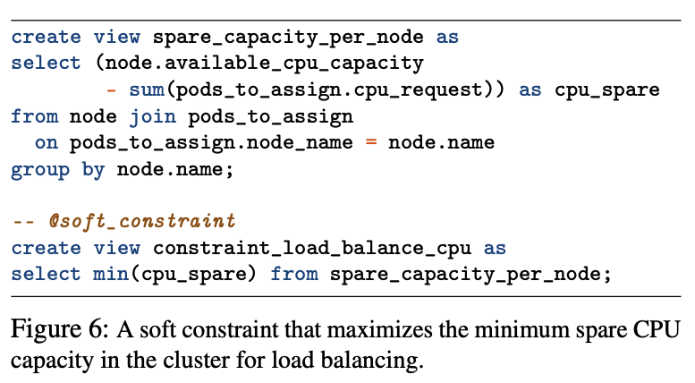
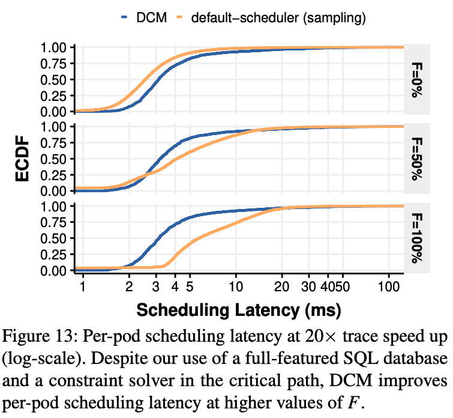

2020-12-29 [OSDI-2021] Building Scalable and Flexible Cluster Managers Using Declarative Programming

# Abstract && Introduction

## Problem: 

A cluster manager solves a challenging combinatorial optimization problem of finding configurations that satisfy hard constraints while minimizing violations of soft constraints.

But it is not easy to design dute to :

1. Heuristics design are hard to scale to cluster with thousands of nodes as the design require purpose built and pre-computing to remain tractable.
2. Naive heuristics is not efficiently when facing many schedule decision constraints. 
3. heuristics design leads to complex code and hard to extend.

the paper try to solve those problems by introducing a new system .

## Contributations

This paper propose a new method (*Declarative Cluster Managers* (DCM)) and developers only need to specify the constraint using high level declarative language like SQL to specify cluster management policies .

1. The DCM maintain cluster state in a relation database, and declaratively specify the constraints that the cluster manager should enforece using SQL.
2. With the specification, DCM generate a program which can pull the latest cluster state from database and encode the user's requests into a optimization problem.
3. DCM solve it and make changes to the cluster. 

Main propority of the system:

1. DCM significantly lowers the barrier to building cluster managers that achieve all three of *scalability*, *high decision quality*, and *extensibility* when adding new features and policies.
2. Scalability: reduce the P99 placement latency by 53% in 500 nodes over K8s cluster.
3. Decision quality: guarantees optimal solutions for specified problems. 
4. Extensibility:  whole architecture make it easy to add new constraints and new features. 

Experiemnts :

Build scheduler on top of Kubernetes.  And it mainly **measure pod placement latency** (time to find a pod placement, and time to preempts pods)

1. Testing on 500 nodes on AWS, DCM improves p95 **pod placement** latency upto 2x. 
2. The scheduler can also be extended to place VMS.

# Background &Motivation

Kubernetes supports hard(must be satisfied) and soft versions of **placement** constraints. 

k8s use greedy, best-effort heuristic to place one pod at a time, drawn from a pod queue.  It then select nodes with hard constraints and score the nodes with soft constraints and pick the best-scored node.

Limitiations:

1. To remain performant, the Kubernetes scheduler only considers a random subset of nodes when scheduling a pod, which might miss feasible nodes.
2. K8s doesn't support simultaneously reconfigure arbitrary groups of pods. Schedule one node may requires evict other node. 
3. K8s scheduler policy requires tracking making it very hard to scale and scheduler's data struct is not easy to change. 

# System Architecutre

## Workflow:

1. Scheduler stores cluster state in an SQL database.

2. Developer specified the **constraint sql** and the **schema sql**.

3. Compiler generates encoder based on **developer specified constraints and schema.**

4. The generated encoder pulls the required cluster state from the database, produces and solves an optimization model that is parameterized by that state, and outputs the required scheduling decisions.

   

## Cluster state database:

In k8s, all states of pods and nodes are stored in an etcd cluster, and k8s maintain a cache of relevant parts of stats locally. 

In DCM, they replace the cache with in-memory embedded SQL database to represent the cluster state. Specifically,  it uses 18 tables and 12 views to describe the set of pods, nodes, volumes, container images, pod labels, node labels, and other cluster state.

A placement decision of a pod on a node is represented by the table.

Schema.sql:

## Constraints.

Constraint.sql:

## Compiler and runtime

the model solve return a copy of pod_to_assign table with node_name reflecting the optimal placement. The scheduler then use this data to issue placement cmd for each pod via k8s scheduling API. 

It computes scheduling decisions for a batch of pods at a time.(the pods are specificed in the schema.sql)

# Challenges-DCM complier

## Complier work flow:

1. SQL parser first extracts all table and view definitions from the supplied database schema, and produces **syntax trees** for all the hard and soft constraints. It then decides which part should be evaluated in the database and which part should be left for solver. 
2. converts the query to an intermediate representation (IR)
3. Generate program that produces an optimization model by intereacting with interfaces exposed by ILP solver (eg, *OR-tools CP-SAT*)

## 

## How to make compile process faster

Rewrite to use fixed arity.

# Experiments:

## Implementation and steps:

User cases

1. Scheduler run as a pod within kubernetes cluster and uses the same API to get cluster status.
2. VM load balancer,
3. distributed transactional datastore 

Measurement: testing scalability, decision quality and extendibility. 

1. Scalability: 500 node cluster on AWS using workload fro Azure, and also they scale up tp 10k nodes 
2. Decision quality: test the k8s scheduler and load balancer's quality. 
3. Extensibility: express all cluster management policies in all three use cases. 

## Resules:

For scalability:

End-to-end latency: measure from when the workload generator issues a pod creation command to when the pod first changes its status to Running

