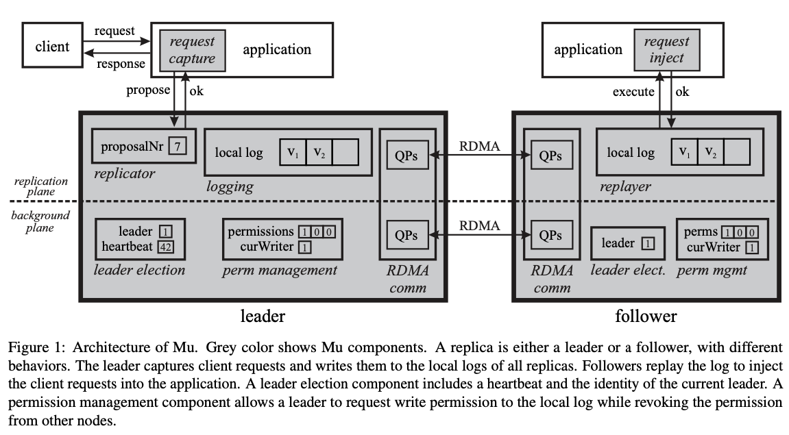
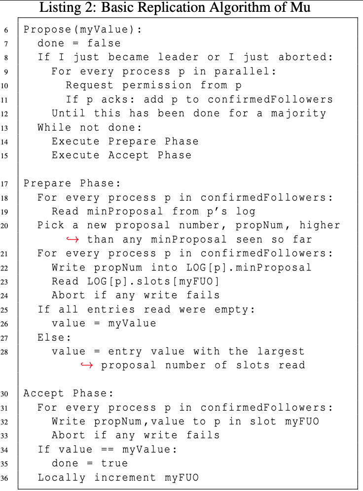
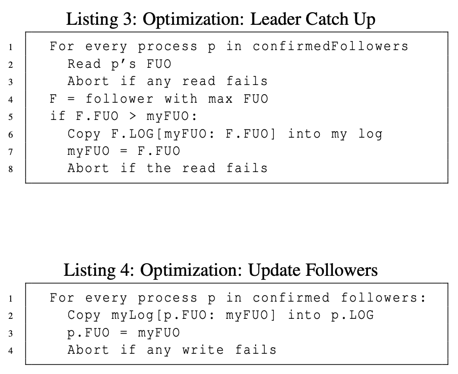
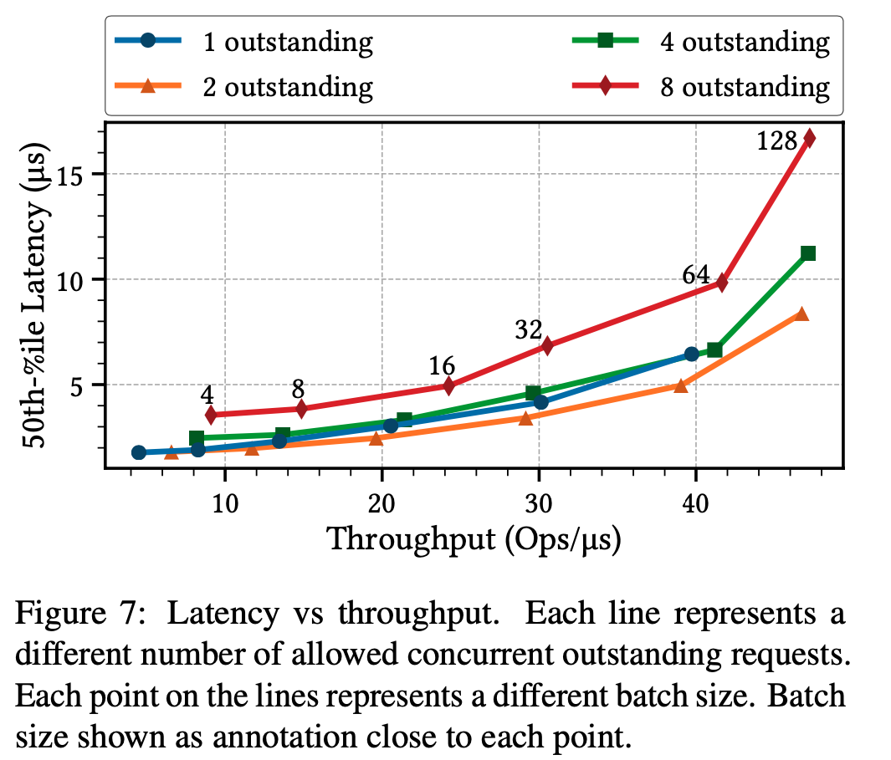

2020-1-7 [OSDI-2020] Microsecond Consensus for Microsecond Applications

Some questions about the paper.

1. Why the logs are in cache instead of the main memory? how could they control this?

# Abstract & introduction

## Background

It is desirable to replciate the microsecond apps  across many hosts to provide high availability. Especially for the **stateful services like kv store.**

Traditional State Machine Replication system add hundreds of microseconds of overhead on replication process.  

Recend work explores modern hardware to decrease the replication time to several microseconds. Eg Hermes, Dare, HovercRaft. But it's still to high for apps taking only few microsecond.

When above meet failure, it spends tens of milliseconds to recover. 

## Problems 

How to make microsecond apps fault-tolerant through replication which operates at microsecond scale?

## Contribution

The pape propose a system called MU,  it leverages RDMA to implement strong consistency for microsecond apps. 

Summary of contributations 

1. It significantly **reduce both replication and failover recover latency.** 
   Specifically, it spends less than 1.3 microseconds to replicate a app request and 873 microseconds to failure recover. 

   Roughly, leader replicates a request by simple writing it directly to the log of other replicas using RDMA in **parallel way and in one round**, without any additional communication.

2. Provides complete correctness proof of Mu

3. Evaluate its raw performance

Callenge of this system:  

1. Mechanism to protect against reces of concurrent leaders.
2. Change leaders and garbage collect logs, as described in the paper

Experiments: The system is evaluated on a financial exchange app, Redis, Memcached, HERD. 

# Backgrounds

## Microsecond services

Modern distributed systems are composed of hundreds of stateless and stateful microservices, such as key-value stores, web servers, load balancers, and ad services—each operating as an independent app whose latency requirements are gradually decreasing to the microsecond level as the number of composed services is increasing

## State machine replication

A common way to implement SMR is as follows: each replica has a copy of the service software and a log. The log stores client requests.

**A consensus protocol must ensure *safety* and *liveness*** 

## RDMA

Traditional communication process:

1. in sender party: data is copied from user space to kernel socker buffer
2. in sender party: data is added with tcp/ip headers
3. in sender party: data is copied from socker buffer to NIC buffer. 
4. in receiver party: data is copied from NIC buffer to socker buffer
5. in receiver party: data is read with header information
6. in receiver party: data is copied from socker buffer to user space buffer. 
7. Process trigger context switch. 

RDMA is based on Kernel bypass and zero copy technology.

1. CPU Offload: No need CPU. Process can access remote host's memory without bother either sender's or receiver;s CPU.
2. Kernel Bypass: RDMA provides a Verbs interface instead of traditional TCP/IP socket interface. User's process can communicate with other host without system call (no context switch. )
3. Zero Copy:  User's process can communicate with RNIC hardware directly. 

Programming model:

Applications make **local memory available for remote access** by registering **local virtual memory regions (MRs) with the RDMA driver.**

Queue pairs (QP):

1. includes send queue (SQ) and receive queue (RQ)
2. QP is mapped to the user defined process' virtual memory space. And the process can access RNIC directly with this memory space. 

Worker Request (WR):  

1. user can create Work request, WR includes operations sender want to send.  
2. WR is added to the QP. 
3. RDMA hardware will consume the WR. 
   1. read the message to be sent from buffer (specified in WR). 
   2. Performs the operation and posts a work completion to CQ. 

Complete Queue (CQ):  Infrom user that the specific WQ has been finished. one element in CQ can be corresponding to either SQ or RQ.

Both QPs and MRs can have different access modes (e.g., **read-only or read-write)**.

The **same memory can be registered multiple times,** yielding multiple MRs, each with its own access mode.In this way, different remote machines can have different access rights to the same memory

# System Overview

Replication plane: (A replica only has one of these components active, depending on its role in the system.)

1. Replicator: replicate a request from leader to followers
2. Replayer: replays entries from log

Background plane:

1. leader election: detect failure of leader and select other replicas to become leader
2. Premission management: grants or revokes write access. 

Logging:  Store client requests to be replicated. 

Leader: 

1. The leader captures a client request, uses an RDMA Write to append that request to the log of each follower,
2. Continues the application to process the request. 

Follower:

1. Each replica grants RDMA write premission to its log for its current leader only. 
2. Detect a new request in their log, they inject the request into the application, thereby updating the replicas.
3. Monitor leader state to check it is still active. 

Handle Leader Failures

1. Detect failures:

   leader periodically increments a local counter, and the follower perodically check the counter using RDMA Read.  if follower dont detect an increment of the counter after a few tries,  a new leader elected. 

2. New leader election

   New leader revokes a write premission by any old leader. such that old leader cannot interfere new leader. 

# Replication Plane

Safety: only a leader replica communicates over the network ensure safety. 

## Log Structure:

1. minProposal: Each replica publishes a minProposal, which represent the minimum proposal number it can accept. 
2. FUO: first undecided offset, represent lowest log index 
3. each slot is (propNr, value) tuple

## Basic Algorithm

## Extension Algorithm

After a replica becomes leader and establishes its confirmed followers, **but before attempting to replicate new value**, the leader brings itself and its follower **up to data by copying** the contents of more up-to-date log to less up-to-date log. 

### Omitting the prepare phase

Once a leader finds only empty slots at a given index at all of its confirmed followers at line 23, the leader may omit the prepare phase for higher indexes. With this optimization, the cost of a Propose call becomes a single RDMA write to a majority in the common case.

### Growing confirmed followers

Leader grows its confirmed followers set by briefly waiting for responses from all replicas during its initial request for permission.

### Replayer

Follower continually monitor the log for new entries and check the extra canary byte to make sure the data read is complete before executing.

Followers can monitor their local logs and commit all values up to (but excluding) the highest non-empty log index.

# Background  Plane

## Leader Election

Replica A decides that B is leader if B is the replica **with the lowest id**, among those that A considers to be alive.

To know whether a replica has failed, we employ a *pull- score* mechanism, based on a *local heartbeat* counter. A leader election thread **continually increments its own counter locally** and **uses RDMA Reads to read the counters (heart- beats) of other replicas and check whether they have been updated.**

Timeout Mechanism

A small timeout in our detection algorithm (scoring), and a longer timeout built into the RDMA connection mechanism.

Make sure both Replication and leader election threads works. 

Every X=10000 iterations, the leader election thread checks the replication thread for activity. if replication thread is stuck, new leader will be elected. 

## Permission Management

Each replica maintains the invariant that **only one replica at a time has write permission on its log**.

RDMA provides multiple mechanisms to grant and revoke write access. 

 However, changing a QPs access flags while RDMA operations to that QP are in flight sometimes causes the QP to go into an error state. Therefore, in Mu they use a fast- slow path approach: they first optimistically try to change permissions using the faster QP access flag method and, if that leads to an error, switch to the slower, but robust, QP state method.

## Log Recycling

Use limited memory to store logs.

1. the leader’s background plane reads the log heads of all followers and computes *minHead*,
2. Log entries up to the minHead can be reused
3. The leader zeroes all follower logs after the leader’s first undecided offset and before min- Head, using an RDMA Write per follower.

## Adding and removing replicas

Use consensus itself to inform replicas about the change.

Removing replica: it stops executing, while other replicas subsequently ignore any communication with it.

Adding replica: uses the standard approach of check-pointing state.

# Implementation

7k C++ code,   Ibverbs (RDMA library), modular, QP exchange layer

# Evaluation

Measurements:

1. Replication latency (change with payload size, compare with other? )
2. Fail-over time
3. Throughput

Evaluate on 4 nodes and compare with APUS, DARE, HERMES. 

Application: three key-value stores (Redis, Memcached, HERD) , order matching engine for financial exchange.

## Common case replication latency

### Standalone runs:

1. No leader failure
2. Standalone mode: run just replication layer without applications, leader generate random payload and use loop to propose. 

Analysis: 

Standalone outperforms other due to processor cache effects.

In standalone runs, logs and queue pairs are alwasys in cache, and requests need not be fetched from memory. 

### Attached runs:

1. with various appliactions

2. Mu supports two ways of attaching to an application, direct or handover

   1. direct mode: same thread to run both application and replication share L1 and L2 caches. 
   2. handover places application thread on separate core from replication thread, avoid shareing caches.

   Direct mode: used in large workloads applications.

   Handover places: used in lighter weight applications.

Analysis:  (why others are slow?)

APUS and Hermes:  the need to involve the CPU of many replicas in the critical path. 

DARE and APUS:  sequentializing several RDMA operations so that their variance aggregates.

## End to end latency

Includes the latency incurred by the application and by replication (if enabled).

## Failover time ( = detection time, premission switch time, )

Repeatedly introduce leader failures by delaying the leader, making it become unresponsive (1k times). This causes other replicas to observe that the leader’s heartbeat has stopped changing, and thus detect a failure.

Analysis:

Time to switch permissions (one to revoke write permission from the old leader and one to grant it to the new leader)  constitutes about 30% of the total fail-over time

The rest of the fail-over time is attributed to failure de- tection (≈600*μs*)

## Throughput

Run a standalone microbenchmark.

Increase workloads (throughputs) in two ways: 

1. by batching requests together before replicating, 
2. by allowing multiple out- standing requests at a time.

Latency and throughput both increase as the batch size increases

Increasing the number of outstanding requests allowed while keeping the batch size constant substantially increases throughput at a small latency cost.

