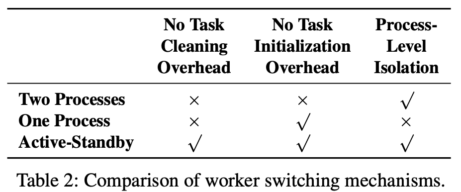

2020-01-12 [OSDI-2021] PipeSwitch: Fast Pipelined Context Switching for Deep Learning Applications

# Abstract & Introduction

## Background

GPU clusters are often over-provisioned based on the peak load of inference and the cluster has limited sharing between applications and task types. eg. 

1. Inference tasks cannot be served with training clusters under flash crowds, 
2. Training tasks cannot utilize inference clusters when the inference load is low.
3. Even for inference itself, production systems are typically provisioned to each application on per-GPU to limit the interference between applications

**challenge 1:**  GPU has high overhead when switching between tasks. eg. If a GPU switches to a DNN model (*e.g.,* ResNet) that has not been preloaded onto the GPU, it can take **multiple seconds** before serving the first inference request.

**challenge 2:** NVIDIA Multiple Process Sharing (MPS) and Salus allow multiple processes to use the same GPU, they require all processes’ data (e.g., DNN models) to be **preloaded into the GPU memory**. But GPU memory is limited. 

## Problems

How to quickly switch the contents on GPU memory such that each one of the applications (that can be multiplexed ) is able to use the entire GPU compute and memory resources during its time slice? 

## Contribution

Inspired by the OS scheduler and context switching in the CPU world, they present PipeSwitch, a system that enables **unused cycles of an inference application to be filled by training or other inference applications.**

1. They proposed PipeSwitch, a system that enables GPU- efficient fine-grained time-sharing for multiple DL applications, and achieves millisecond-scale context switching latencies and high throughput.
2. They introduce *pipelined context switching*, which exploits the characteristics of DL applications, and **leverages pipelined model transmission, unified memory management, and active-standby worker switching to minimize switching overhead and enforce process-level isolation**.
3. They implement a system prototype and integrate it with PyTorch. Experiments on a variety of DL models and GPU cards show that PipeSwitch only incurs a task startup over- head of 3.6–6.6 ms and a total overhead of 5.4–34.6 ms (10–50× better than NVIDIA MPS), and achieves near 100% GPU utilization.

# System Overview

Controller: contains two threads, TCP thread and scheduler thread ( together with memory daemon).  

Memory daemon: it manages the GPU memory and the DNN models. 

1. before starting a task, user register the model in scheduler.
2. It **allocates the GPU memory to the active worker,** 
3. It **transfers the model from the host memory(scheduler) to the GPU memory**.

Active worker: A process that executes a task on one GPU. it contains two threads. 

1. Termination thread: receive termination signal from controller and notifies main thread.
2. Main thread: manages DNN models and performs computation for inference or training
3. Worker only loads model structure (small), not the model parameters 

StandBy worker: idle process, is initializing a new task or cleaning its environment for previous task.

Execution rules:

1. inference task with strict latency SLO can preempt training task
2. controller wait current inference task to finish before starting a new task. 

Execution steps:

1. Active worker completes a task 
2. Controller notifies **memory daemon** and standby worker to load task to GPU to execute model trasmission
3. Memory daemon **allocates memory to standby worker, and trasmits the model from memory to GPU**
4. Standby worker become active worker to execute the new task
5. Active worker become standby worker and clean envs for previous task

# PipeSwitch Design

## Profiling task switching overhead

On scenario that typical scenario that a server stops a training task running on the GPU, and then starts an inference task.

model: ResNet152

Measure: time to start and execute it on GPU. 

All the components take considerable time compared to the inference time, so all those components should be optimized.

## Profiling model transmission

The PCIe bandwidth is the physical limit on how fast an arbitrary task can be loaded to the GPU.  In another words, transmitting a task from CPU to GPU is bounded by the PCIe bandwidth. 

In DNN,  a task does not need to wait for the entire model to be transmitted to the GPU before beginning the computation.  Instead, the task can start the computation of a layer as soon as the layer is loaded in the GPU and the input of the layer is ready (i.e., the previous layers have finished their computation), regardless of its following layers.

**Optimal model-aware grouping**

Why grouping layers for transmission?  (minimize these two sources of overhead.)

1. Transmission overhead of large amount of data is dominated by data size
2. Transmission overhead of layer-by-layer is dominated by too many PCIe calls. 

How to choose group size? two insights:

1. First group cannot be to large (F3.a).
2. other than first group, we can safely pack multiple layers in a group **based on progress of computation** without affecting pipeline efficiency (F3.b).

The algorithm runs *offline* to find the strategy, and the resulting strategy is used online by PipeSwitch for context switching.

## Unified Memory Management

By default:

1. NVIDIA provides **cudaMalloc** to allocate memory on GPU. 
2. NVIDIA also provides **CUDA unified memory** to automatically handle **memory movement between the host memory and the GPU memory for applications**

Two characteristics of DL applications:

1. The amount of memory allocated to the DNN model is fixed, and does not change during task execution.
   (structure is fixed, so parameter num is fixed = > memory is fixed. )
2. The intermediate results (output of each layer) change do not cause *memory fragmentation*. 
   1. In inference, after the next layer is computed, they are no longer needed and can be safely freed.
   2. In training, they cannot be immediately freed, because they are also used by the backward pass to update the weights. (but the intermediate results are consumed first-in-last-out style.)

**New design:**

**=> Minimize memory allocation overhead:**

The memory daemon uses cudaMalloc to obtain the GPU memory when the system starts, and then dynamically allocates the memory to the workers at runtime.

1. Eliminates the overhead for each worker to use cudaMalloc to get memory.
2. Memory daemon only pass memory pointers to workers.
3. Memory daemon ensure only one worker owns GPU memory to guarantee memory isolation between workers.

**=> Minimize memory allocation overhead:**

The memory daemon stores the models, and it can directly transfer model to GPU for task startup.

**=> Minimize IPC overhead:**

After model is transmitted to GPU, memory daemon needs to notify workers and **export GPU memory handler to workers**, which requires IPC APIs.  (cudaIpcOpenMemHandle for NVIDIA GPUs).

GPU IPC APIs incur high overhead, memory daemon uses the GPU IPC once to initialize the worker, and then uses cheap CPU IPCs to notify the worker which pipeline group has been transmitted.

**=> Pin memory**:

The OS would swap a memory page to disk if the page is inactive for a certain amount of time. We pin the pages of the memory daemon to the host memory, to eliminate this overhead

## Active-Standby worker Switching

Two process: Each process need to clean GPU envs and warm-up GPU.

One process: Although new task can reuse warm CUDA context, but current task has to clean its status and it does not provide process-level isolation between tasks.

Active-standby:

1. Each worker initializes its own GPU environment (i.e., CUDA context) when it is first created. eliminates the GPU environment initialization overhead when a new task is assigned to a worker
2. When a task is stopped, a major job is to clear asynchronous CUDA functions queued on GPU. The paper insert synchronization points into training tasks. So the number of queued function are limited and can be quickly cleared.
3. When a task is stopped, another job is to free memory, in this paper, they **only deletes the pointers** pointing to the tensor data rather than freeing the actual data. Therefore, it is **safe for the new task to transmit its model to the GPU memory at the same time**. In other words, we can parallelize the task cleaning of the current task and the pipelined model transmission of the new task, to hide the task cleaning overhead.

When task arrives, there sould be an idle worker waiting for the task, every standby worker needs to maintain its own CUDA context, which consumes a few hundred MB GPU memory.

Two standby workers are sufficient to ensure at least one idle worker, which eliminates the waiting time and has moderate GPU memory consumption.

# Implementation

3600 lines of code in C++ and Python, 

Integrated it with PyTorch including adding functions for allocating GPU memory, sharing the GPU memory to workers through CUDA IPC API and getting the shared GPU memory. 

# Evaluation

**Setup**

conducts on AWS, PCIe 3.0 ×8, and 32 GB memory. The software environment includes PyTorch-1.3.0, torchvision- 0.4.2, scipy-1.3.2, and CUDA-10.1.

**Workloads**

Models used: ResNet152, Incep- tion_v3, and Bert_base.

The default batch size for training is 32, and that for inference is 8.

**Training tasks periodically checkpoint their models to the host memory, and restart from the latest checkpoint after preemption**, and **checkpointing frequency** of training tasks is set **according to the scheduling cycle** to minimize checkpointing overhead

**Metrics**

Measure throughput and latency. 

## End-to-End Experiments

Experiment: A client sends an inference task to a GPU server, and the GPU server preempts the training task to execute the inference task and sends a reply back to the client.

Measure end to end latency and compare with :

1. Ready model: no training task, lowest latency for inference task. 
2. Stop-and-start: preempt the train task and start inference task .
3. NVIDIA MPS: multi-process support from NVIDIA which allows the inference process to share the GPU with the training process, and training task occupies the entire GPU memory and does not stop when inference tasks come. CUDA unified memory is used for memory swapping.

## Pipelined Model Transmission

## Unified Memory Management

## Active-Standby Worker Switching

# Related Work

