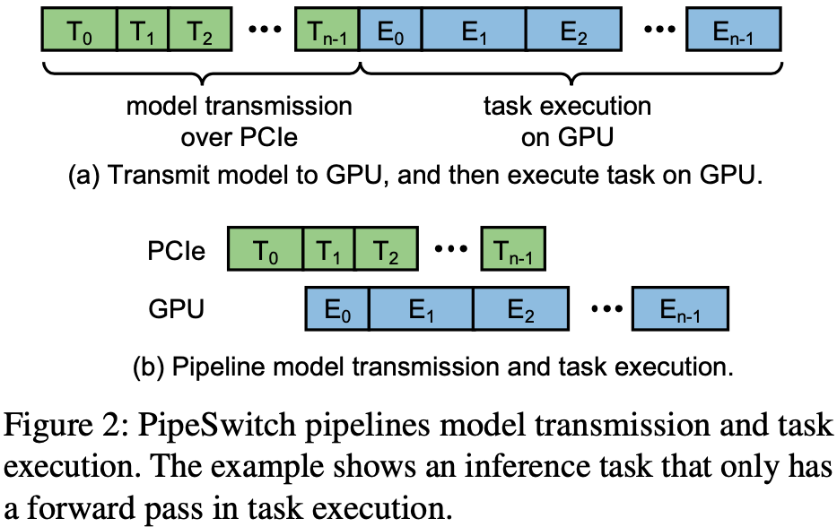
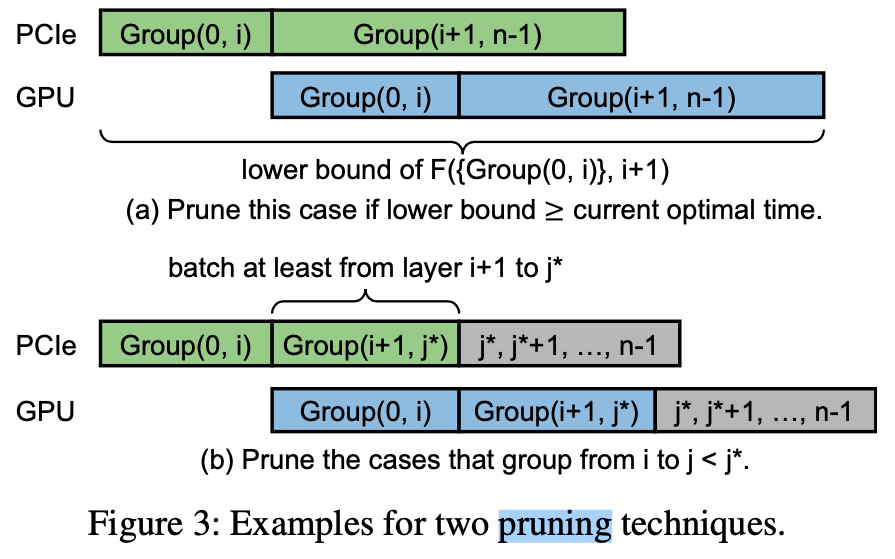

2020-01-12 [OSDI-2021] PipeSwitch: Fast Pipelined Context Switching for Deep Learning Applications

# Abstract & Introduction

## Background

GPU clusters are often over-provisioned based on the peak load of inference and the cluster has limited sharing between applications and task types. eg. 

1. Inference tasks cannot be served with training clusters under flash crowds, 
2. Training tasks cannot utilize inference clusters when the inference load is low.
3. Even for inference itself, production systems are typically provisioned to each application on per-GPU to limit the interference between applications

**challenge 1:**  GPU has high overhead when switching between tasks. eg. If a GPU switches to a DNN model (*e.g.,* ResNet) that has not been preloaded onto the GPU, it can take **multiple seconds** before serving the first inference request.

**challenge 2:** NVIDIA Multiple Process Sharing (MPS) and Salus allow multiple processes to use the same GPU, they require all processes’ data (e.g., DNN models) to be **preloaded into the GPU memory**. But GPU memory is limited. 

## Problems

How to quickly switch the contents on GPU memory such that each one of the applications (that can be multiplexed ) is able to use the entire GPU compute and memory resources during its time slice? 

## Contribution

Inspired by the OS scheduler and context switching in the CPU world, they present PipeSwitch, a system that enables **unused cycles of an inference application to be filled by training or other inference applications.**

1. They proposed PipeSwitch, a system that enables GPU- efficient fine-grained time-sharing for multiple DL applications, and achieves millisecond-scale context switching latencies and high throughput.
2. They introduce *pipelined context switching*, which exploits the characteristics of DL applications, and **leverages pipelined model transmission, unified memory management, and active-standby worker switching to minimize switching overhead and enforce process-level isolation**.
3. They implement a system prototype and integrate it with PyTorch. Experiments on a variety of DL models and GPU cards show that PipeSwitch only incurs a task startup over- head of 3.6–6.6 ms and a total overhead of 5.4–34.6 ms (10–50× better than NVIDIA MPS), and achieves near 100% GPU utilization.

# System Overview

Controller: It receives tasks from clients, and controls the memory daemon and the workers to execute the tasks.

Memory daemon: it manages the GPU memory and the DNN models. 

1. It **allocates the GPU memory to the active worker,** 
2. It **transfers the model from the host memory to the GPU memory**.

Active worker: A process that executes a task on one GPU.

StandBy worker: idle process, is initializing a new task or cleaning its environment for previous task.

Execution rules:

1. inference task with strict latency SLO can preempt training task
2. controller wait current inference task to finish before starting a new task. 

Execution steps:

1. active worker completes a task 
2. controller notifies **memory daemon** and standby worker to load task to GPU to execute model trasmission
3. memory daemon **allocates memory to standby worker, and trasmits the model from memory to GPU**
4. standby worker become active worker to execute the new task
5. active worker become standby worker and clean envs for previous task

# PipeSwitch Design

## Profiling task switching overhead

On scenario that typical scenario that a server stops a training task running on the GPU, and then starts an inference task.

model: ResNet152

Measure: time to start and execute it on GPU. 

All the components take considerable time compared to the inference time, so all those components should be optimized.

## Profiling model transmission

The PCIe bandwidth is the physical limit on how fast an arbitrary task can be loaded to the GPU.  In another words, transmitting a task from CPU to GPU is bounded by the PCIe bandwidth. 

In DNN,  a task does not need to wait for the entire model to be transmitted to the GPU before beginning the computation.  Instead, the task can start the computation of a layer as soon as the layer is loaded in the GPU and the input of the layer is ready (i.e., the previous layers have finished their computation), regardless of its following layers.

**Optimal model-aware grouping**

Why grouping layers for transmission?  (minimize these two sources of overhead.)

1. Transmission overhead of large amount of data is dominated by data size
2. Transmission overhead of layer-by-layer is dominated by too many PCIe calls. 

How to choose group size?

# Implementation

# Evaluation

# Related Work

