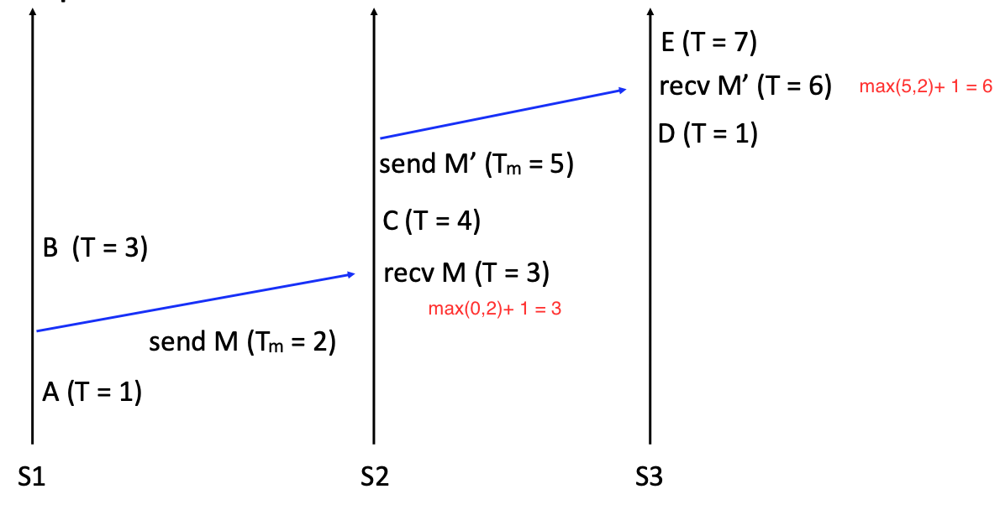

OrdTime, Clocks, and the Ordering of Events in a Distributed System

# Introduction

`Question`: Physical clock is not accurate and it's easy to synchronize across regions. So how do we order events without physical clocks? 

`Solution`:  Using logical clocks. 

# Partial Ordering

Define Happens-Before relationship:

- Within a process, a comes before b then a → b (if a → b and b → c then a → c)
- if a = send(M), and b = recv(M), then a → b

a → b and b → a: events are concurrent

# Logical Clocks

Define a way to assign timestamps to events. 

## Clock conditions:

- if *a* and *b* are on the same process *i*, and *a* comes before *b*, then Ci(a) < Ci(b)
- if *a* = process *i* sends *M*, and *b* = process *j* receives *M*, then Ci(a) < Cj(b)

## Implementation:

- Keep a local clock T
- Increment T whenever an event happens
- Each message carries a timestamp Tm
- On message receipt: T = max(T, Tm) + 1

# Order the events totally

## Total ordering.

Extends logical clock to total ordering

- if Ci(a) < Ci(b), then*a* => *b* 
- if Ci(a) = Cj(b), then the process with small process ID happends first. 

## Example (usage): 

Use of this total ordering of events can solve **mutual exclusion problem**.

### `Target`: 

Design an algorithm to grant resources to a process satisfies the following goals:

- Only one process has the resource at a time
- Grant the resource in request order
- Requesting processes eventually acquire the resource

### `Assumptions`:

- In-order point-to-point message delivery 
- No failures

### `Algorithms`:

#### Each node’s state:

- A queue of *request* messages, ordered by Tm
- the latest timestamp it has received from each node

#### Each node's action:

- On receiving a request:
  - Record message timestamp 
  - **Add request to queue** and send an acknowledgement
- On receiving a release:
  - Record message timestamp
  - **Remove corresponding request** from queue
- On receiving an acknowledge: 
  - Record message timestamp

#### Resource (Lock) status:

- To acquire the lock:
  - Send *request* to everyone, including self.
- To release the lock:
  - Send *release* to everyone, including self.
- The lock is acquired when:
  - **My request is at the head of my queue,** and I’ve received higher-timestamped messages from everyone So my request must be the earliest

#### Limitation:

 Induce some unnecessary ordering constraints.

# Vector Clock

## Basic algorithm

Clock is a vector *C*, length = # of nodes, e.g., (0, 0, 0) for a 3 node system.

For each node *i*:

1. increment *C[i]* on **each event**, eg., node 0 (3, 5, 2); after event: (4, 5, 2)

2. after receving message:

   - step1: Increment C[i]

   - step2: For each j != i : **C[ i ] = max(C[ i ], Cm[ i ])**

   - example:
     - node 0 (4, 5, 2) receives message (2, 7, 0) => (5, 7, 2).

## Happen before defination

If *C**x**[i] < C**y**[i]* and *C**x**[j] > C**y**[j]* for some *i*, *j* =>

​	*C**x***   and *C**y*** are concurrent

If *C**x**[i] <= C**y**[i]* for all *i*, and there exist *j* such that *C**x**[j] < C**y**[j]* =>

   *C**x*** happens before *C**y***.

