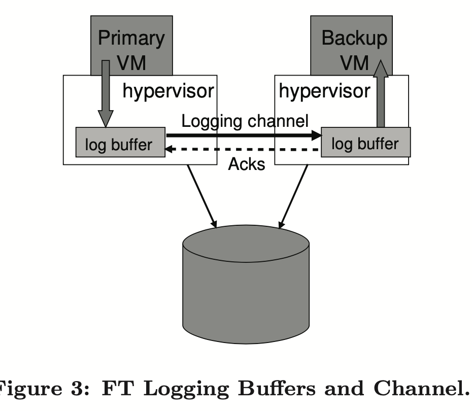

The design of a practical system for fault-tolerant virtual machines

# Introduction

## Current Problems

`Primary/backup approach` 

Requires keep the state of backup identical to the state of primary all the time. 

But shipping changes to all state of primary,CPU, memory and I/O devices, are very large and time-consuming since it requires much bandwidth.

`State-machine Approach`

Model the server as deterministic state machine which are kept in sync by starting from **same init state, and execute same request in same order.** 

But mose servers or services don't have deterministic operations, extra coordination must be used to keep the extra information. 

Implementing coordination to ensure deterministic execution of physical servers is difficult, as processor frequenceies increase. VM is excellent platform for `state-machine approach`, where the hypervisor play the role of coordinator.

## Solution

The paper implemented fault-tolerant system using primary/backup approach on VM.

1. The System has small time lag.
2. The System use `deterministic replay technology` to record the execution of primary and replay at backup server, such that the bandwidth usage is not high.  
3. The System automatically restores redundancy after failure by starting a new backup VM on new server. 
4. mainly deal with fail-stop failures. 

# Basic FT design

## Basic ideas

Only primary VM is accessable for client.

Primary sync the request to backup via network connection known as `logging channel`, and Backup VM return ack to primary VM explicitly. 

Output of backup VM is dropped by hypervisor and only primary VM return res to client.

Using `heartbeating between server` and `monitoring of traffic on logging channel` to detect VM failure.

## Determinsitic Replay Implementation

Input needs to be replicated

- determinstic events: Network packets, disk reads, input from devices
- No-eterminstic events: virtual interrupts, reading clock cycle counter. 

Challenge

- How to capture all deter/No-deter events correctly?
- How to apply those inputs to backup VM?
- Replication process doesn't degrade performance

Solution - Use `VMware determinsitic replay`

- It records events of VM in stream of log entries written to a log file.
- Other VMs can read the file and replay.
- It's efficient in recording and delivering by using various techniques like hardware performance counters. So the system can record and delivered events nearly realtime.
- The system use `VMware deterministic replay` but it send log entries via logging channel instead of writting log entires to disk. So the backup VM can replay in real time.

## FT Protocol

Goal/Challenge

- if the backup VM takes over after primary VM failure, the backup VM will continue **executing in a way that is entirely consistent with all outputs that the primary VM has sent to client.**

  (this requires no data is lost during VM switching if primary fails.)

Current problem

- Failure happens after primary VM write successfully and return to client and before this write operation is sent to backup VMs, backup VM can takes over and replay the execution. If client issues a read to backup, then client read an inconsistenct data.

Solution

- The primary VM may **not send an output to client** until **backup VM has received and ack the log entry** associated with the operation producing the output. With this even primary VM fails after replying to client, backup VMs can still handle read request.

  

Backup cannot determine if a primary crashed.

## 

## Detecting and Responding to Failure

**Failure detection**

`VMware FT` use UDP heartbeating between servers to detect when a server may have crashed. eg., `VMware FT`  monitor traffic sent from primary to backup and the ack sent from backup to primary. 

**Action**

Once a backup VM is switched to primary VM, `VMware FT` automatically advertises the MAC address of the new primary VM on the network, so the network swithes know what server the new primary VM is located. 

**Problems**

If the network has partition, brain-split happens.

**Solution**

To make sure only one primary exist in the system, the system introduce shared storage to provide the atomic operation.

# Practical Implementation of FT

To enhance usable, robust and automatic of system, some new components are needed to add.

## Starting and Restarting FT VMs

**Problem**

1. How to start a new backup VM or re-start failured VM as a backup in the same state as a primary VM?
2. How to choose a server for such VM?

**Solution**

1. Adopt the VMotion functionality of VMware vSphere, such that the origin VM is copped to a new server instead of migrating to new server.(migrating requires destory original VM)
2. All VMs can run on any server in the cluster with a shared storage. there is `clustering service` doing `resource mangement` and when a failure happens, backup VM become primary VM and then ask clustering service for a new backup VM, the clustering service determine best server based on resource usage and other constraints. 

## Managing the logging channel

Hypervisors maintain a large buffer for logging entries for the primary and backup VMs. So the `VMware FT` can monitor the logging channel. 

**Problem**

When primary VM encounters a full log buffer when it needs to write a log entry, it must stop execution until log entries can be flushed out. (pause) This pause could increase clients latency. So how to minimize the possibility that the primary log buffer fills up. 

**Solution**

Backup to slow => Primary log buffer fills up. Luckly, VMware deterministic replay guarantee the executing speed is the roughly the same.

**Problem**

Backup VM slow is inevitable when the server hosting backup VM is heavily loaded with other VM. If primary fails at this time and backup VM switch to primary VM, then backup VM must replaying all log entries. Which introduce more latency (`lag time`). How to reduce this?

**Solution** 

Additional mechanism to **slow down the primary VM to prevent the backup VM from getting too far behind.** eg,. when backup VM has significant execution lag (> 1 second), `VMware FT` starts slowing down the primary by informing the scheduler to give it smaller CPU. 

## Operation on FT VMs

## Implementation issues for Disk Ios

## Implementation issues for Network IO

## 

## 

# Design Alternatives

# Preformanace Evaluation

# Related Work

# Conclusion