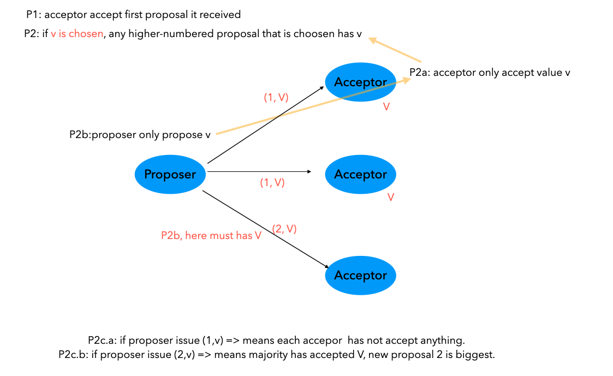

Paxos Made Simple

# Assumption

customary asynchronous, non-Byzantine model.

1. each agents operate at arbitrary speed, can fail and restart.
2. messages can be delayed, lost, duplicated, but cannot be corruptted. 

# Proposer's Action

A value is chosen only when it is accepted by a majority of acceptor =>

`P1. An acceptor must accept the first proposal that it receives.`

But multiple values can be proposed at the same time, one value is accepted by half of them and another value is accepted by another half of them, leading to no value being chosen. 

`The acceptor must be allowed to accept more than one proposal and the proposal is labeled with number <value, number> `

`P2. If a proposal with value v is chosen, then every higher-numbered proposal that is chosen has value v.` 

A proposal must be accepted by at least one acceptor =>

`P2a. If a proposal with value v is chosen, then every higher-numbered proposal accepted by any acceptor has value v` (if a new proposal don't have value V, it is ignored)

If the majority has accepted value v1, but the left agents have never accepted any value yet, according to P1, if a new proposal with v2 comes, the left agents accept it. Which is in conflict with P2a.=> 

`P2b. If a proposal with value v is chosen, then every higher-numbered proposal issued by any proposer has value v.` (in sending, it must has v since it is choose,)

## Discussion

If v1 is chosen by majority, then 

P2b(can only send v1) => P2a(can only accept v1) => P2( can only choose v1 )

`P2c. For any v and n, if a proposal with value v and number n is issued, then there is a set S consisting of a majority of acceptors such that either (a) no acceptor in S has accepted any proposal numbered less than n, or (b) v is the value of the highest-numbered proposal among all proposals numbered less than n accepted by the acceptors in S.`

## Discussion

P2c means if a proposal send (v,n), then either

1. the majority has not accepted any value yet. 
2. the majority has accepted value v, and the new proposal n is the latest proposal.

Proposer that wants to issue a proposal numbered n must learn the highest-numbered proposal with a number less than n.

the proposer requests that the acceptors not accept any more proposals numbered less than n.  =>

Algorithm:

`Prepare request`

`A proposer chooses a new proposal number n and sends a request to each member of some set of acceptors, asking it to respond with:`

`(a) A promise never again to accept a proposal numbered less than n, and`

`(b) The proposal with the highest number less than n that it has accepted, if any.`

`Accept request`

`If the proposer receives the requested responses from a majority of the acceptors, then it can issue a proposal with number n and value v, where v is the value of the highest-numbered proposal among the responses, or is any value selected by the proposer if the responders reported no proposals.`

# Acceptor Action

`P1a . An acceptor can accept a proposal numbered n iff it has not responded to a prepare request having a number greater than n.` 

(n prepare - accept ), (n+1 prepare - accept ), (n+2 prepare - accept )

- if n+1's prepare is accepted, n's accept `ignore` n's prepare request, 
- if n hasn't reply n+1's prepare request, it can still response n's accept request.
- `Optimization: if n+1's prepare is accepted, n's accept ignore n+1's duplicated prepare request`

Acceptor remember only 

1. the highest-numbered proposal that it has ever `accepted` 
2. the number of the highest-numbered `prepare` request to which it has responded.

# Algorithms

## Phase-1

(a) A proposer selects a proposal number n and sends a prepare request with number n to a majority of acceptors.

(b) If an acceptor receives a prepare request with number n greater than that of any prepare request to which it has already responded, then it responds to the request with a promise not to accept any more proposals numbered less than n and with the highest-numbered pro- posal (if any) that it has accepted.

## Phase-2

(a) If the proposer receives a response to its prepare requests (numbered n) from a majority of acceptors, then it sends an accept request to each of those acceptors for a proposal numbered n with a value v, where v is the value of the highest-numbered proposal among the responses, or is any value if the responses reported no proposals.

(b) If an acceptor receives an accept request for a proposal numbered n, it accepts the proposal unless it has already responded to a prepare request having a number greater than n.

`Optimization: It should probably inform the proposer, who should then abandon its proposal. This is a performance optimization that does not affect correctness.`

# Learner

More generally, the acceptors could respond with their acceptances to some set of distinguished learners, each of which can then inform all the learners when a value has been chosen.

# Progress

if p1 and p2 propse at the same time, p1 send prepare request n1, p2 send prepare request with n2. then acceptor ignore n1's accept after receiving n2's prepare, p1 then propose n3 prepare, acceptor refuse n2's accept and so on. 

To guarantee progress, a distinguished proposer must be selected as the only one to try issuing proposals

# Safety and Liveness

**`liveness can therefore be achieved by electing a single distinguished proposer`**

**`safety properties—assuming unique proposal numbers.`**

# Implementation

Collection of clients and servers.

Each server independently implements a `deterministic` state machine.

One server is the leader (distinguished proposer)

Client send cmd to leader.

