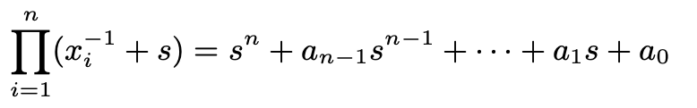
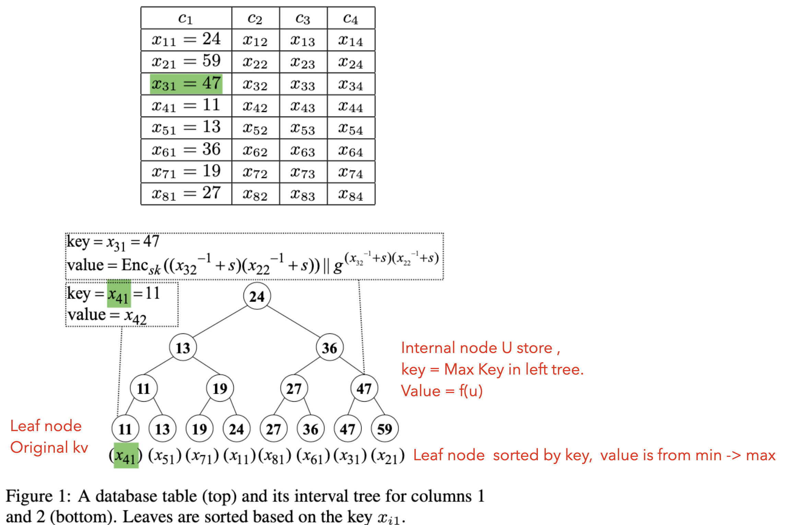

IntegriDB: Verifiable SQL for Outsourced Databases

# INTRODUCTION

## Problems

## 

An authenticated data structure (ADS) could be used to verify queried data.

`Prior work` used to construct ADS handling some subset of SQL queries `can be classified into two categories`:

1. Generic approaches:
   - Data owners first compile database into a program (circuit / RAM-model of computation.) which accepts query as input and return result.
   - Size of circuit is as large as database.
   - Circuit-based approach not allow efficient updates.
2. Specific approaches:
   - Tree-based (Merkel tree) / Signature-based (data in server is pre-signed by data owner)
   - Both of them only support single-dimensional range queries.
   - Both of them don't support updates.

Generic approach taks large memory space, Specific approach is limited in dimension. Both of them `don't support short proofs` for (join, sum, max, min, count)

## Contributaion

The paper designing an ADS and an associated system that supports *native SQL queries* over a relational database, Such a system would be suitable for integration into the most prevalent applications running in the cloud today, and could be offered as a software layer on top of any SQL implementation.

1. expressive: supports multidimensional range queries and nesting queries. 
2. efficient: `small proofs`(few kb), low verification time, feasible server computation.
3. scalable: can excuted on DB table with 6 million rows.
4. cryptographic assumptions: based on crypto-graphic assumptions

# PRELIMINARIES

## Authenticated Data Structure

Three roles, server, data owner, client

ADS for query Q and U consists of efficient algorithms `init, setup, prove, cerify, UpdateO, UpdateS`

D: data, D': encrypted data, R: Result, pi: Proof, Q: Query, lambda: secure parameter

1. `(data owner)` Init:  lambda => <pk, sk>
2. `(data owner)` Setup: ( D, sk ) => ( digest, D' ), and send D' to server, publish (digest, pk)
3. `(Server)` Prove: ( digest, D', Q) => (R, pi)
4. `(client)` Verify: ( digest, Q, R, pi) => 0 or 1
5. `UpdateO/UpdateS`: Interactive algorithm run by data owner and server. 
   - UpdateO: ( sk, digest, update ) => ( digest, 0/1 indicting accept or reject )
   - UpdateS:  D' => D'

## SQL queries supported by IntegriDB

**Multidimensional range query**

multiple columns and range filter for each column

```sql
SELECT * FROM A WHERE (age BETWEEN 22 AND 24) AND (student_ID > 10730)
```

Join, Sum, Max, Min, COunt, Like, Nested Query.

# BUILDING BLOCKS

two authenticated data structures used as building blocks in INTEGRIDB: 

one for set operations (that we call ASO), 

one for interval trees (that we call AIT )

## ADS for set operations with Summation

### set operations

includes: Union, Intersection, Sum.

### Authenticated data structure

Mainly use `bilnear accumulator primitive` as ADS.

Data owner firstly init (s, g:public key), and then use `bilnear accumulator primitive` to calculate digest for eac set. 


Data Owner can publish g and acc(s).

### Verify set operation

1. Client get above digest and g
2. server compute:



2. server then release a1 and a0, compute w1, w2 with g and then realse them also.

   

3. client check follows:

   

**Complexity**

Proofs are constant size. eg,. query involving d set operations, proof size is O(d)

## ADS for interval Trees

### Interval tree

Random function f, `binary tree T`

1. Leaf node stores element of dataset S = {(k1,v1)...(kn,vn)}
2. Internal node u stores kv pair, 
   1. k = maximum key stored at any node in the left subtree of u
   2. v = f(leftNode, rightNode)

Support queries: Search, RangeCover, Insert, Delete

### Authenticated data structure

Mainly use Merkle tree, where each leaf node is hashed using kv pair. And the root of Merkle tree is digest of the tree.

**Complexity**

The size of the minimal covering set output by RangeCover is O(log n)

RnageCover is O(logn), size of proof and complexity of verification for Search, RangeCover, Insert, Delete is O(n).

# OUR CONSTRUCTION

ADS used in IntegriDB for different queries

## Setup

For each table, each pair of columns in the table, `data owner` create an authenticated interval tree.


Leaf Node: store kv of Sij

Internal node U

- Key: minimum key stored at the leaves on the left.
- Value: 





The accumulation value in each node will be used to handle JOIN and multidimensional range queries.

**Complexity**


## Join Queries

s

## Multidimensional Range Queries

s

## SQL Functions

s

## Updates

s

## Nested Queries

s


# ADDITIONAL DISCUSSION

# IMPLEMENTATION

# EVALUATION

