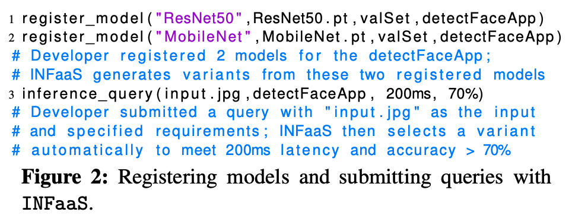
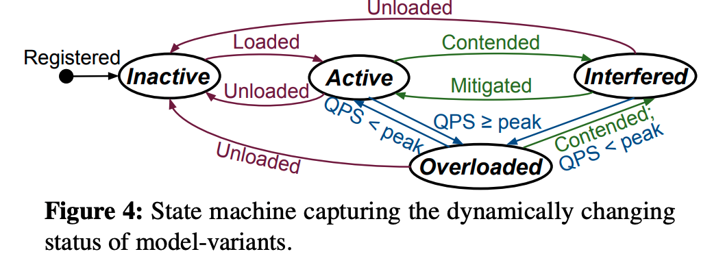

**INFaaS: Automated** **Model-less** Inference Serving

# Introduction

## Problems

### Model variance selection

Inference query various on service level objectives such as accuracy, latency, and cost.

To better answer the user's inference request, the ML platform has to select the 

1. `Right model`:  RestNet50, VGG16 (TensorFlow, PyTorch)
2. `Model optimizations `: TensorRT, TVM, XLA. 
3. `Hyper-parameters`:  batch-size
4. `Suitable hardware platforms`: Haswell / SkyLake CPU, GPU, TPU, NPU.
5. `Auto-scaling configurations`

But the search space is huge. For example, 21 already-trained image classification models can generate 4032 model-variants on AWS-EC2 platform by:

- Applying various model graph optimizers (TensorRT, TVM, etc)
- Optimizing for different batch sizes.
- Changing underlying hardware resources. (CPU, GPU)

The 4032 model variants vary across different dimensions:

- accuracies range from 56.6% to 82.5%
- model loading latencies range from 590ms to 11s 
- inference latencies for a single query range from 1.5ms to 5.7s 
- Computational requirements range from 0.48 to 24 GFLOPS 
- The hardware cost of hardware ranges m $0.096/hr for 2 vCPUs to $3.06/hr for a V100 GPU

`Problem1: How to dynamically choose the right model variant among 4032 search spaces`?

### Scaling

`Static provisioning` (Tensorflow Serving) is based on peak load, it wastes resources at low load.  => leading to high cost.

`Replica-only` suffers from

- High start-up latency and the right variant may change with load.  
- Replication statically-fixed cannot meet the new requirement
- Replication may have a large delay since new resource may not available,

`Problem2: How to scale to meet the load requirements while minimizing the cost?`

### Resource utilization.

When the load is low, idle model taking resources is a waste. 

`Problem3: how to improve resource utilization?`

## Contribution

The paper proposes INFaaS -  an automated model-less system for distributed inference serving. it can 

1. Selects the best model-invariant based on user-specified requirements like cost, accuracy, latency. 

2. Support `model-horizontal scaling, model-vertical scaling, and VM-autoscaling.`

   It can dynamically react to changing applications and request patterns `such that the total cost is the lowest`. eg, multiple model-variants to serve one type of request instead of replicating one model-variant many times. 

3. Support multi-tenancy by sharing resources across applications and models when the workload is low. When the load is low, the performance is almost the same. 

   The point when co-location starts affecting the performance varies across models and depends on both the load and the hardware architecture.

# INFaaS

**Design principles**

- Declarative API: developer only focuses on high-level `latency, cost, or accuracy` requirements.
-  INFaaS should automatically and efficiently select a model-variant for
  - Serve each query
  - Scale in reaction to changing application load (when the load is increasing?)
- Improve resource utilization.  resource sharing 
- the system is modular and extensible.

## User's interface

**Model Registration**

User register trained-models ( ONNX Format ) with a validation-dataset (eg,. ResNet50) and assigns AppID, ModelID, ModelName. One application can include many models for different subtask

Backend test accuracy using validation-dataset

**Query submission**

User submit query with latency, cost, accuracy (eg, . Latency = 200ms,  accuracy >=70%). And then the backend searches model variants and `scaling strategies.` 

## Architecture

### Model-variant selection policy

Triggered when 

1. The arrival of a new query.

   The controller's dispatcher will use the policy to select a variant.

2. On changes in query load.

   The worker will monitor the incomming query load and curernt throughput. 

   If a change is detected, it will use the policy in the background to determine `vertically scale or horizontally scale.`

### Metadata Store

Store:

1. stores model's profile (accuracy, latency), resource usage, load statistics
2. worker machines.

O(1) get complexity.

### Model repository

persistent storage, store serialized model.

# Selecting and Scaling Model Variants

Model selection policy consider both 

1. `static states (model's profiles etc)` 
2.  `dynamic states`: variant may in following states:
   - Have not be loaded, mainly consider loading latency (`Inactive`)
   - Loaded but serving at its peaking throughput. (`Overloaded`)
   - Loaded but experiencing resource contention. (`Interfered`)
   - Have not be loaded due to lack of resources required. (`Interfered`)

Dynamic states are stored at meteStore and maintain by worker's monitoring daemons.

## On arrival of query

**Mitigating variants**

The system mitigate `interfered` variants to 

- firstly check available resource in `same worker` in background thread.
- If not available, then ask controller dispatcher to dispatch the variant on the least loaded worker.

The model autoscaller assesses whether scale `overloaded` variants to different variant.

## On changes in query load

### Model-Autoscaler at each worker

# Implementation

# Evaluation

