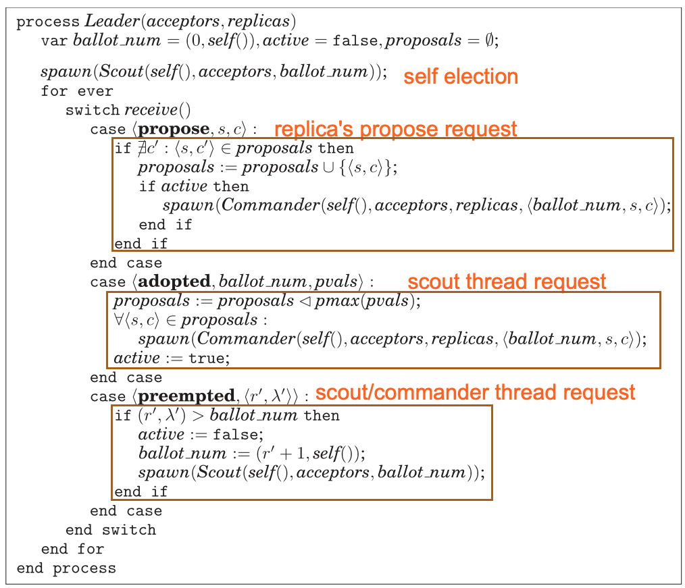
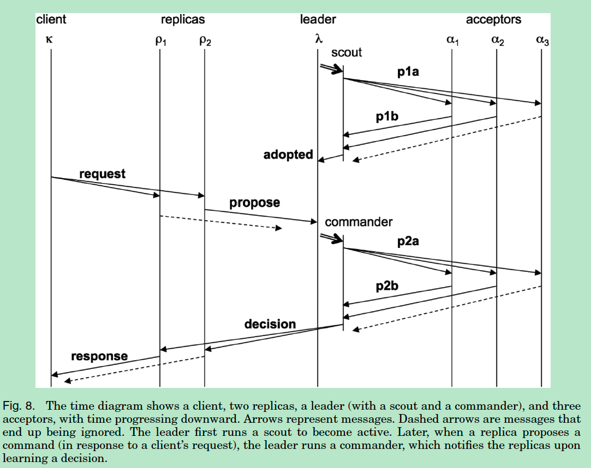

Paxos Made Moderately Complex

# Question of Implementation of Paxos

1. Each operation requires 2 rounds of communications
2. which proxy instance the client should send to 
3. The gap of the log, eg, many requests come to Paxos instance, each request will trigger 2 rounds of communications.  When the late request comes, the previous may still not reach consensus. 
4. How to elect a distinguished proposer.

# PMMC

# Introduction

This article gives an operational description of the reconfigurable version of the multi-Paxos. And briefly describes variants of the Paxos protocol.

The paper also stress `Paxos' invariants` for two reasons

# High-level idea

Leader elects itself by running Paxos Phase 1 for all instances. 

Once elected, only runs Paxos Phase 2 for each proposal

If the leader dies, other nodes repeat the process (elect themselves, etc.)

# Roles

## Client

the client talks to the  replica, sends leader messages.

## Leader

### States

leader maintains 

- `ballot_num`: Bollot number , init with (0, 0)
- `active`:  If I'm the leader or not
- `Proposals:`:  Map <slotId: proposal cmd >

Leader doing 

- Elected proposer
- One elected, start 2 phase communication.
- Each proposal is defined `ballots = (LeaderId, SeqNum)`, (0, 1) > (2, 0) > (1, 0) > (0, 0)

**Election time**

- Once the proposer starts
- When the current active leader seems to fail. (Not receive heartbeat)
- If a leader is preempted, don't immediately try for election again.

**Election process**

- Proposer broadcast the Prepare Message with the current ballot.
- Acceptor act as in Paxos.

### Code 

## Acceptor

### States

- The same as Paxos acceptor
- each acceptor maintains:
  - Ballot number
  - Accepted: a set of pvalues, 

### Invariants

- Only accept prepare request with `bigger ballots`
- `Only accept values from the current ballot. ballot_num = b`
- Acceptors cannot remove values from the accepted list.
- for any b and s, there is only one cmd that can be accepted by the majority of acceptors.
- if (S, C) is chosen by the majority.  then for any proposal with higher b, the proposal has (s, c) (same as Paxos p2)

### Code

Acceptor request = (b, s, c) where b is ballot number,  s is slot number c is operation.

## Replicas

### States

- `The client can talk to replica, and replica only tale to leaders.` 

- Like learners,  

- Maintains following variables

  - Each replica starts from the `same init state and keeps a copy of the application` (sequence of slots), each slot has a slot number (ballot).

  - `Maintain 2 pointers`, one is a slot-out pointer, another is a slot-in pointer.

    - `slot-out pointer: Point to the next message to be chosen.`

      `initially 1` 

    - `Slot-in pointer: Point to the position where the proposer wants to propose next. initially 1` 

  - `Maintain request set:` request the replica has received, and not yet proposed or decided.

  - `Maintain proposals set:` An initially empty set of proposals that are currently outstanding.

  - `Maintain decisions set:`:  A set of proposals that are known to have been decided (also

    initially empty).

  - `Maintain proposal leader set:`  The set of leaders in the current configuration. The leaders of the initial configuration are passed as an argument to the replica.

### Invariants

- The same slot must have the same cmd decided

- Slot-out ensure all operations before it is chosen.

- For all replicas, the same operation results in the same result state.

- A replica proposes commands only for slots for which it knows the configuration:

  ∀ρ : ρ.slot in < ρ.slot out + WINDOW.

### Code

# Progress

- leader election 

- The client sends an <request, c> where c = <κ, cid, op>  to `all replicas or one replica`, wait form <response, cid, result>

- The replica record the operation to a slot of the local log. and  assigns it's cmd with slot id, 

  Replica then sends the proposal = <s, c> to the leader. where s is the lowest unused slot. (slot_in)

  As shown in replicas code. 

- The leader sends the pvalue = <b, s, c> to acceptors to reach a consensus. where 

  ballot number b, a slot number s, and command c.

- Once the operation reaches consensus, the Leader broadcasts to all other replicas.

- And then the replica receives the operation and then the slot_out pointer moves in.

- Once slot_out moves in, it's safe to execute it. 

- client send out 

- replica receives the client's request and

## Implementation: 

1. The operation can be out of order. eg, Op4 is decided, but Op3 is still not decided.  `But in this situation, slot_out still stay at the current position`

2. In the face of concurrently operating clients, different replicas may end up proposing different commands for the same slot. 

   If the new decided value is not the same as the current value, propose the current value in the next proposal round. 

# Bugs

