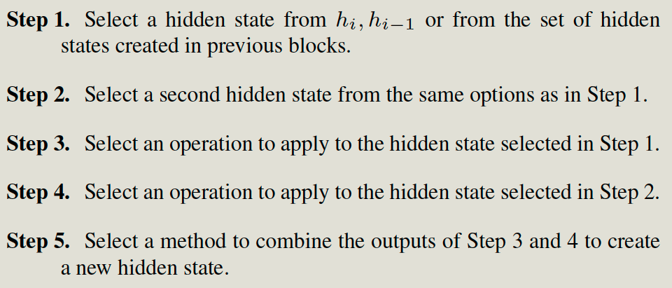
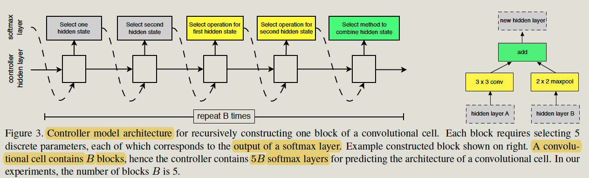

Learning Transferable Architectures for Scalable Image

# Introduction

## Problems

Previous work like RF for NAS has a huge search space and is hard to train on the large datasets since training each child architecture requires lots of time with large datasets. 

## Contributions

The main contribution of this work is the **design of a novel search space**, such that the best architecture found on the CIFAR-10 dataset would scale to larger, higher resolution image datasets like ImageNet across a range of computational settings.

## Key Feature of the search Space

**The overall architectures of the convolutional nets are manually predetermined. **with 

- Two kinds of cells

  Each cell has 5 blocks, and each block has a fixed architecture except:

  - Two inputs 
  - Operators for the 2 inputs, 
  - The combination method

- Each cell receives as input two initial hidden states hi and hi-1 which are the outputs of two cells in the previous two lower layers or the input image.

**Search Target:**

- Operation of blocks of 2 cells.
- Connections of blocks in one cell.

# Search Method

## Controller

The controller will predict the structure of the 2 cells (Normal cell & reduction cell ).

For each kind of cell, the block structure is fixed as Fig3, but we need to select two inputs and an operator for the 2 inputs, and the combination method. 

So the controller maintains 10B predictors. Each predictor will predict the probability of one of the search targets.

```mathematica
5(# Search target)  * B(# block) * 2 ( 2 kinds of cell )  = 10B
```

The predictor of the controller is one-layer LSTM with 100 hideen units.

Controller RNN uses joint probability ( product of all probabilities. ) to compute the gradients.






