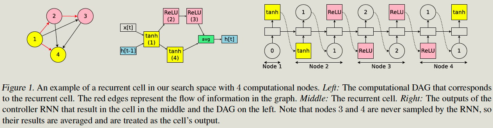
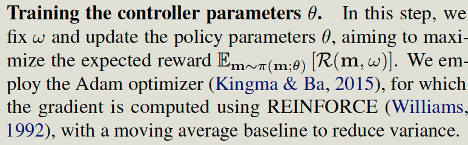
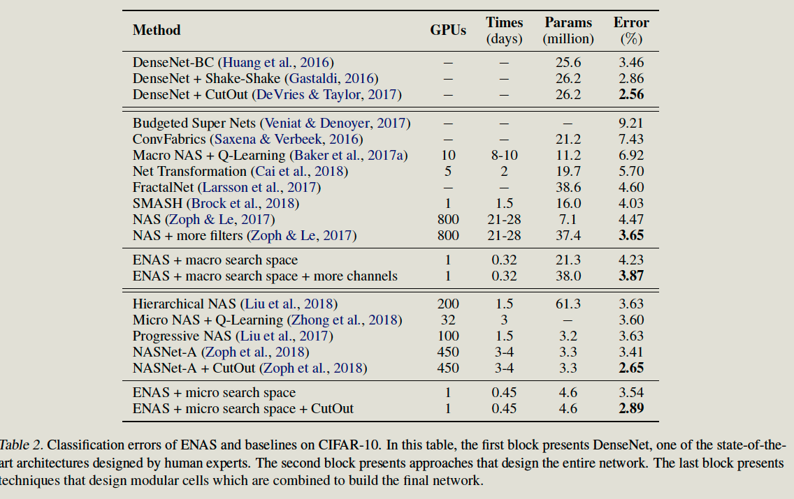

Efficient Neural Architecture Search via Parameter Sharing

# Introduction

## Current Problems

BoottleNet of NAS is the training of each child model to convergence

## Contribution

ENAS constructs a large computational graph, where each subgraph represents a neural network architecture.

The main contribution of this work is to improve the efficiency of NAS by forcing all child models to share weights to skip training each child model from scratch to convergence.

# Method

Represent NAS’s search space using a single directed acyclic graph (DAG), where each child architecture can be viewed as a sub-graph of the larger graph. Since the weight is in a large graph, Therefore, all sub-graph shared the same parameters.

Each node is an operation. 

## Controller

Take the RNN node, for example, Each Node is just an operation. 

Controller decides 

1. **Which edges are activated?**
2. **Which computations are performed at each node?**

RNN prediction step;

The controller is an LSTM with 100 hidden units. And the sample decision via softmax classifiers,

## Training Process

### Training of sampled architecture

Sampled architecture can be:

1. RNN for Penn Treebank:  400 steps, 64 examples. 
2. CNN for CIFAR-10:  minibatch 128

Overall

1. It fixes the controller, runs controller prediction M times, and gets M child models. 
2. The FInal loss function is the expected loss function, overall child models. The gradient is computed using a Monte Carlo estimate. 
3. The experiment shows M = 1 is just fine.** 

### Training of sampled architecture

2000 steps.

Overall

Fix the weight of large computational graph. And maximize the expected rewards.

## Predict CNN 

In predicting CNN, Each node can still be an operation. 

## Predict Small Model

Each cell has 4 nodes. A controller can predict the operation of each node in on cell. 

# Experiments

