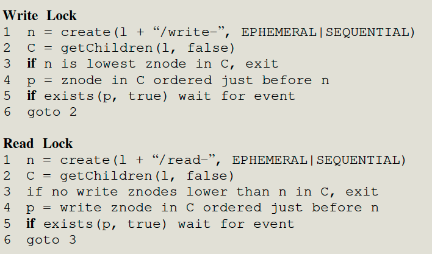

ZooKeeper: Wait-free coordination for Internet-scale systems

# Key Features

1. Maintain **wait-free data objects** organized hierarchically as in the file system.

   Zookeeper is wait-free because it processes one client's requests without needing to wait for other clients to take action. This is partially a consequence of the API: despite being designed to support client/client coordination and synchronization, no ZooKeeper API call is defined in a way that would require one client to wait for another. 

   In contrast, a system that supported a lock acquire operation that waited for the current lock holder to release the lock would not be wait-free.

2. **FIFO client order**: all requests from **a given client** are executed in the order that they were sent by the client.

   So each client can submit requests asynchronously and a client is able to have multiple outstanding operations at a time.

   **leader tracking for each client (really session) what number it should next expect. The leader has to keep state per session anyway, each client specifies an order for its operations (reads AND writes), and it increases monotonously. When followers receive a read request while the data in the position of order_id is empty, the follower will wait until there is data before replying to the client. In other words, the follower may block a read until the server has received (from the leader) all of the client's preceding writes** 

   - each read executes at a particular point in the write order
   - a client's successive reads execute at non-decreasing points in the order
   - a client's read executes after all previous writes by that client
   -  a server **may block a client's read to wait for previous write, or sync()**

3. **Linearizable writes**: all requests that update the state of ZooKeeper are serializable and respect precedence

   The linearizability is ensured with two condition

   - All writing operations of all clients will be sent to the leader
   - use ZAB protocol to replicate the internal status/data. ( clients send writes to the leader, the leader chooses an order, numbered by "zxid", the leader then sends to replicas, which all execute in zxid order)
   - The linearizability is async-linearizability, where each client can send multiple requests at the same time.

4. ZooKeeper can handle 10k~100K of transactions per second.

   - Fast read: It allows the client to read from a follower and read may return a stale value. The application which doesn't require precedence order can use it.  This allows the service to scale linearly as servers are added to the system.
   - Non-fast read: client call `sync` before send read operation. `FIFO + linearizability => read latest value` 
   - Fuzzy snapshots also help to improve the throughput.

5. Zookeeper uses a watch mechanism to enable clients to cache data without managing the client cache directly. 

   With this mechanism, a client can watch for an update to a given data object, and receive a notification upon an update

6. Zookeeper uses fuzzy snapshots

   A precise snapshot would correspond to a specific point in the log: the snapshot would include every write before that point, and no writes after that point, creation of a precise snapshot requires a way to prevent any writes from happening while the snapshot is being created and written to disk. Blocking writes for the duration of snapshot creation would decrease performance a lot.

   ```
   The point of ZooKeeper's fuzzy snapshots is that ZooKeeper creates the
   snapshot from its in-memory database while allowing writes to the
   database. This means that a snapshot does not correspond to a
   particular point in the log -- a snapshot includes a more or less
   random subset of the writes that were concurrent with snapshot
   creation. After reboot, ZooKeeper constructs a consistent snapshot by
   replaying all log entries from the point at which the snapshot
   started. Because updates in Zookeeper are idempotent and delivered in
   the same order, the application-state will be correct after reboot and
   replay---some messages may be applied twice (once to the state before
   recovery and once after recovery) but that is ok, because they are
   idempotent. The replay fixes the fuzzy snapshot to be a consistent
   snapshot of the application state.
   
   The Zookeeper leader turns the operations in the client API into
   idempotent transactions. For example, if a client issues a conditional
   setData and the version number in the request matches, the Zookeeper
   leader creates a setDataTXN that contains the new data, the new
   version number, and updated time stamps. This transaction (TXN) is
   idempotent: Zookeeper can execute it twice and it will result in the
   same state.
   ```

   

[Reference1](http://nil.csail.mit.edu/6.824/2020/notes/l-zookeeper.txt)

[Reference2](http://nil.csail.mit.edu/6.824/2020/papers/zookeeper-faq.txt)

[Reference3](https://pdos.csail.mit.edu/6.824/papers/zookeeper-faq.txt)

# Introduction

## Motivation

Many current services are used designed for a specific need. For example, chubby is a locking service with strong synchronization guarantees. ( R/W go-to leader. ) It is important to design a service for each of the different coordination needs. 

1. Zookeeper tries to expose users with high abstract APIs, and users can use them to implement their own primitives.

Besides, chubby only allows reading from the leader and has low throughput, while zookeeper relax consistency guarantees to allow read from a follower.

## Contribution

1. propose a wait-free coordination service with relaxed consistency guarantees for use in distributed systems.
2. provides some use cases about how to use zk to implement lock etc.
3. evaluation.

# Service overview

## Data Model

znode is an in-memory data node, and they are organized in a hierarchical namespace referred to as the data tree. There are 2 kinds of nodes

1. Regular: persistent znode
2. Ephemeral: temporal node, it is deleted automatically when the client connection terminates.  

## How to use Zk to guarantee strong consistency. 

In the case where we use zk for leader selection.

1. The new leader makes the configuration change by deleting ready, updating the various configuration nodes, and creating ready

   While there is still a problem, the client can see the ready node, and begin to read it while the new leader is updating it. 

2. The above problem is solved by ordering a guarantee for the notifications.

   if a client is watching for a change, the client will see the notification event before it sees the new state of the system after the change is made

But when two clients can communicate with each other, there is still a problem when client A update cfg at zk, tell client B, and B read from the replica. B may not read them as replication latency.

1. the solution is B can issue a write-request (sync API). 

   FIFO + linear => B see the A's update.

# Use cases

## Config Management

Starting processes obtain their configuration by reading zc with the watch flag set to true. zc store the latest cfgs.

## Rendezvous

master and multiple workers register their own information (address. status) to an ephemeral node in ZK. 

## Group Membership

Using ephemeral nodes to dynamic update group memberships and use watch mechanism to inform master of the updates. 

## Locks

### simple lock


Each client trying to acquire the lock will enter the queue, and be assigned an order number. 

Only the client standing at the top of the queue can get the lock. 

### read/write lock

Read lock need to make sure all write lock is dispear. 



## Double Barrier

processes firstly create their *ready* znodes, and enter the barrier together when the number of znodes exceeds the threshold; they delete their znodes when finishing their work, and exit altogether when all *ready* znodes are deleted

# Implementation


Important notes.

## Request processor

ZK transforms each write into a transaction. 

1. it calculates the state after applying the write, 
2. generate a transaction that captures the new state. ( the tx has new data, new version number, and updated time.)

## Atomic broadcast

1. Zab guarantees that changes broadcast by a leader are delivered in the order they were sent and all changes from previous leaders are delivered to an established leader before it broadcasts its own changes. In brief, the leader would never lose data and keep them in order.
2. WAL: we force writes to be on the disk media before they are applied to the in-memory database
3. write transaciton is idempotent.

## Replicated database

1. The replicated database is an in-memory database containing the entire data tree. And the system records the snapshot periodically. 
2. ZooKeeper uses periodic snapshots and only requires the redelivery of messages since the start of the snapshot.

# Evaluation

50 servers, 

## Throughput

1. 35 servers to simulate 250 simultaneous clients.

2. Each client has at least 100 requests outstanding.

3. Each request consists of reading or writing 1K of data.

ZooKeeper uses request throttling to keep servers from being overwhelmed


1. Read throughput is higher than write throughput because reads do not use atomic broadcast
2. The other reason for the longer processing of write requests is that servers must ensure that transactions are logged to a non-volatile store before sending acknowledgments back to the leader.

### Failure

run ZK in 5 machiens. kept the written percentage at a constant 30%. 

Periodically we killed some of the server processes. (follower or leader in ZK cluster.)


## Latency

Each worker/sender creates 50k nodes, We calculate the throughput by dividing the number of creating requests completed by the total time it took for all the workers to complete.

The throughput of the single ZooKeeper worker benchmark indicates that the average request latency is 1.2ms for three servers and 1:4ms for 9 servers.


## Performance of barriers

50, 100, and 200 clients entering a number b of barriers in succession, b in. [200; 400; 800; 1600]


our benchmark code uses is much lower compared to the raw throughput ZooKeeper can achieve  This is due to clients waiting on other clients.