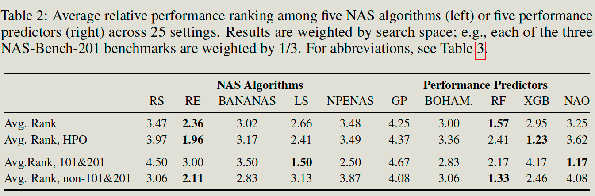

NAS-BENCH-SUITE: NAS EVALUATION IS (NOW) SURPRISINGLY EASY

# Introduction

## Problem

A search space in NAS is the set of all architectures that the NAS algorithm is allowed to select. 

1. Some of them are defined by cell-based structure and a macrostructure. The macrostructure is completely fixed, and the structure inside each cell has many neural network operations to select.
2. Other macro structures can have variable lengths, widths, and a number of channels. 

Each Benchmark consists of the dataset, search space, and fixed evaluation pipeline with predefined hyperparameters for training the architecture.

1. The tabular NAS benchmark also provides pre-computed evaluations for all architectures.
2. Surrogate NAS benchmark provides a fixed surrogate model to predict the performance of each architecture.

Most existing work only draws conclusions on a small subset of benchmarks. But They may not be generalized across diverse datasets and tasks. 

Many early NAS search algorithm has a strong couple with search space ( eg. weight sharing. ).

## Contribution

1. Conduct some analysis of the generalizability of NAS algorithms and their hyperparameters across 25 settings, finding that the controller's hypermeters tuned on a subset of benchmarks cannot be used in other benchmarks.
2. Propose a system composing many queryable NAS benchmarks ( 25 different combinations of search spaces and datasets.). So others can evaluate the new NAS algorithm quickly.

The system basically re-implementing each new NAS algorithm on serval search spaces.

## Conclusion of the paper

1. there is no single best NAS method: which method performs best very much depends on the benchmark (search space)
2. Along similar lines, if a NAS method performs well on the popular NAS benchmarks NAS-Bench-101 and all three datasets of NAS-Bench-201, in contrast to what one might have expected, this does not imply that it will also perform well on other NAS benchmarks.
3. tuning a NAS algorithm’s hyperparameters can make it dramatically better, but transferring such hyperparameters across benchmarks often fails.

# Nas BenchMark Statistics

## Validation accuracy

The paper firstly tests the minimum and maximum accuracy of each setting ( benchmark + dataset. ).

It shows diversity is important to keep in context when comparing many different NAS benchmarks

Then The paper run 3 types of search algorithms on above different settings to prove following:

1. If NAS does well on NAS benchmarks NAS-Bench-101 and all three datasets of NAS-Bench-201, It probably not generalize to other NAS benchmarks.
2. NAS algorithms needs tunning when using at different benchmarks.

### Search Algorithms

1. Black-box NAS 
   - Random search
   - Regularized evolution
   - local search
   - BANANAS
   - NPENAS
2. Model-based performance prediction methods.
   - BOHAMIANN
   - gaussian process
   - Random forest
   - Neural architecture optimization
   - XGBoost

## Generalizability of NAS Algorithms

The paper firstly conduct some experiments to show the algorthm suitable for one search space (benchmark) may not still that good at another search space.

### Experiments

Run algorithms w/o hyperparameter optimization.

Then the paper gives summary by computing the **average rank** of each black-box algorithm or performance prediction method across all 25 NAS benchmarks.

### Founds

1. No algorithm performs well across all search spaces
2. Best predictor with default parameters is RF, and the best predictor when tuned on each individual benchmark is XGBoost

## Generalizability of HYPERPARAMETERS

While the previous section assessed the generalizability of NAS methods, now we assess the generalizability of the hyperparameters within NAS methods. 

### Experiments

For a given NAS method, we can tune it on NAS benchmark A, and then evaluate the performance of the tuned method on NAS benchmark B, compared to the performance of the best hyperparameters from NAS benchmark B.

### Founds

1. no search space achieves strong regret (smaller is better) across most search spaces.
2. it is not sufficient to tune hyperparameters on one NAS benchmark and deploy on other benchmarks, as this can often make the performance worse.

## One-shot algorithm

One-shot NAS algorithms, in which a single supernetwork representing the entire search space is trained

The paper compare the performance of three one-shot algorithms: 

1. DARTS
2. GDAS
3. DrNAS

across several different NAS benchmarks

# Some graph

