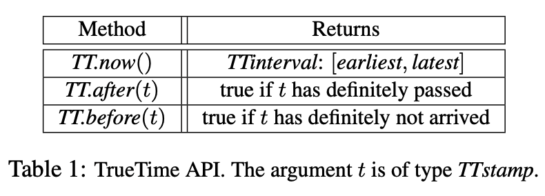
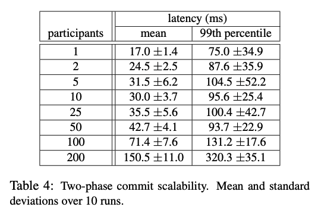
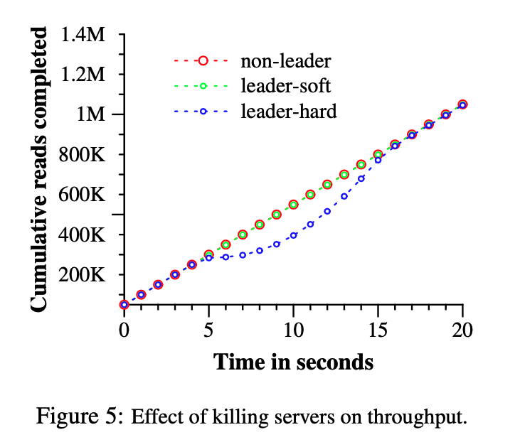

2021-10-01 [NSDI-2012] Spanner Google’s Globally distributed database

# **Questions still not solved**

1. The coordinator leader ensures that clients cannot see any data committed by Ti until *TT.after*(si) is true. Commit wait ensures that si is less than the absolute commit time of Ti,  or si < t_abs (e_*commit*).

   But what if a read request arrives after si but before absolute commit time of Ti? could it see the latest update?

2. In 4.1.2, it says *"For a given transaction, Spanner assigns it the timestamp that Paxos assigns to the Paxos write that represents the transaction commit*."

   But in 4.2.1, it says "*Before allowing any coordinator replica to apply the commit record, the coordinator leader waits until TT.after(s), so as to obey the commit-wait rule described in Section 4.1.2. Because the coordinator leader chose s based on TT.now().latest, and now waits until that time- stamp is guaranteed to be in the past"* .

   Which means si is picked before Paxos write that represents the transaction commit happens. 

   **This is contradict with 4.1.2!!!**

# 1. Introduction

Mysql: shard data is complex and requires efforts in business logic. Resharding is costly. 

Nosql system: no transactional semantics

BigTable: difficult to use for applications requires complex, evolving schemas, or those that want strong consistency in the presence of wide-area replication.

Spanner provides:

1. replication configurations can be controlled,eg which data to replicate, how far data is from user etc
2. Provides **externally consitent** read and writes **in global scale**
3. Provides **global consistent reads acorss database at a timestamp.** 
4. Upgrade **2PC** to make it more efficient


# 2. Implementation

in tegration of concurrency control, replication, and 2pc.

**Universe**: a spanner depliyment 

**Zone:** Zones are the unit of administrative deployment, phsical isolation, dynamically add or remove

**ZoneMaster**: assigns data to spanservers

**Spanservers**: serve data to clients. 

**Location proxies**: used by **clients** to locate the spanservers which can server client's data. 

**placement driver**: handels automated movement of data across **zones**. It **periodically** communicates with the spanservers to **find data that needs to be moved**, either to **meet updated replication constraints or to balance load**


## Spanserver Software Stack


**Tablet:** Each server is responsible for between 100 and 1000 instances of data struct, called **tablet**, which is the kv pair as follow, Where spanner assigns **timestamp to data**, which is more like a **multi-version database**.

Spanner tablet is a container that may encapsulate **multiple partitions of the row space**

```python
(key:string, timestamp:int64) → string
```

Table's state is stored in **B-tree-like files** and **write-ahead log**, all on DFS **Colossus**

Log each Paxos write twice, onece in tablet's log, and once in Paxos log. Write applied by Paxis in order. The implementation of Paxos is **pipelined**, so as to improve Spanner’s throughput in the presence of WAN latencies, <u>(sequential write?)</u>

Write must go to leader, but read can access from underlying tablet at any replica that is **sufficiently up-to-data** <u>(prefix consistency?)</u>

Each raplica leader has a **lock table** to implement concurrency control (**2PL**). It maps ranges of keys to lock states.  Each replica leader also has a **transaction manager** to support distributed transaction (**2pc**)

If only use **one** **Paxos** **group**, **it bypass the transaction manage**r because the lock table and Paxos together provide A.

**State of each transaction manager** is **also stored in underlying Paxos group and is replicated.**

## Directories and Placement


**Directory:** **a set** of contiguous **keys** with same prefix. 

​	It enable user to control locality of their data more carefully.

​	All data in same diectory has same replication configuration

**Move data**

​	between Paxos groups, directory by directory, one zone to another zone

​	To shed load from a Paxos group, eg, put directories that are frequently accessed together into the same group(<u>why?)</u>

​	To move a directory into a group that closer to accessors

​	50MB directory can be moved in a few seconds.

​	"Movedir" task run on background and it will use a single transaction to aotmically update related metadata after moving all data.

Spanner will shard a directory into multiple *fragments* if it grows too large. Fragments may be served from different Paxos groups	

## Data model 


Spanner exposes chematized semi-relational tables, query languages, and general purpose transactions.

Running 2pc over Paxos mitigates the availability problems.(<u>why</u>?)

Each dataset must be partitioned by clients into one ore more hierarchies of tables. The table at the **top of it is directory table**. 

**directory = Each row in directory table with key K + rows in descendant tables which starts with K**. unit of data movement

# 3. True Time



TrueTime is implemented by a set of *time master* machines per datacenter and a *timeslave daemon* per machine. All masters’ time references are regularly compared against each other.

**Time Master** has GPS receivers and it will advertise a slowly increasing time uncertainty

**timesalve daemon** polls a variety of master (of different data center) to reduce vulnerability to errors from any one master. 

# 4. Concurrency Control


True time is used to guarantee the correctness on concurrency control.

## Timestamp Management

### Paxos Leader Leases

When a replica receives quorm of votes, it becomes a leader and each spanner's leader can live 10 seconds.

Paxos leader extends it's lease on a successful write and leader requests lease-vote extension if it is near expiration

**A Paxos leader's lease interval:** the time duration when a replica is a leader. 

For **each Paxos group**, each Paxos leader’s lease interval is disjoint from every other leader’s.

A leader can also abdicate, but it must make sure TT.after(S_max)= True, where the S_max is maximum **timestamp** used by a leader. 

### Assigning Timestamps to RW Transactions

**Isolaton** of RW is guranted by using **2PL**.

Spanner assigns it the timestamp that **Paxos assigns to the Paxos write that represents the transaction commit.** (use the time when the Paxos write happens triggered by commit.)

**monotonicity invariant**: In each Paxos group, spanner leader assigns timestamps to Paxos write in **monotonically increasing order**. Since the lease interval is disjointness, the timestamp is in monotonically increasing order even across leaders. 

When a timestamp is assigned to a transaction, S_max is updated. 

**External consistency invariant**: If **start of T2** occurs after **commit of T1,** then **commit timestamp of T2** must be greater than **commit timestamp of T1**.

**Proof of External consistency :** (trueTime, start, commit-wait)

**e_start:**  transaction is started, probably counted on client side.

**e_commit:** transaction is commited

**e_server:** transaction is sent to coordinator leader (server )


1. **start**

   The coordinator leader for a write tx T_i will assign a **commit timestamp >= *TT.now().latest* and so >= e_server**

2. **commit wait**

   The coordinator leader ensures that clients cannot see any data committed by Ti until *TT.after*(si) is true. Commit wait ensures that si is less than the absolute commit time of Ti,  or si < t_abs (e_*commit*).


### Serving Reads at a Timestamp

The **monotonicity invariant** described in Section 4.1.2 **allows Spanner** to correctly **determine whether a replica’s state is sufficiently up-to-date to satisfy a read**. 

Each replica tracks a value called safe time T_safe, **which is maximum timestamp at which a replica is up-to-date**. (It promises T_safe is up-to-date). **Replica can satisfy read if T(read) <= T_safe**

T_safe = min(T_safe_Paxos,  T_safe_TM)

**T_safe_Paxos:** Timestamp of highest applied Paxos write

**T_safe_TM:** = min_i(s_i_g_prepare-1) (if there are many uncommitd txs in each server, the server will pick the smallest value of s_i_prepare-1, where s_i_prepare is provided by transaction participants for group g)

### Assign Timestamp to read only Tx

Two phase: assign a timestamp **s_read** and then execute the read as **snapshot read** at s_read, which can run at any sufficiently up-to-date replica.

For simple, s_read = TT.now().latest. But this may block because t_safe could less than s_read. 

## Details

### Read-Write transaction

Spanner executes a set of *reads* and writes atomically at a single logical point in time.


**Client**, **Transaction Coordiantor** and **Transaction Participants**

#### For Read:

client issues reads to leader replica of a Paxos group, whihc acquires a **read locks**. Client send keepalive message to prevent participant leader from timing out the transaciton. 

#### For Write

After client finish all read and **buffer all write at client side**, it can start **2pc**

**Client**:

1. Choose a server as TC and Send commit message to each TP with TC's address.
2.  

**TC**:

1. once receive commit message from client, get *TT.now*()

2. Acquires write locks

   ...

3. skip the prepare phase, wait until getting all prepare message from all TPs

4. choose a **timestamp for the entire transaction s**, 

   1. s >= All prepare timestamps (to make sure each TP can calculate T_safe more precisely , T_safe = min(T_prepare-1))
   2. *s > TT.now*().*latest* (commit time > time of receving the request at server side. )
   3. s > Any timestamps the leader has assigned to previous transactions (to preserve monotonicity)

5. wait until ***TT.after(s)*=True**, (commit-wait rules)

6. send commit timestamp to **client and all TPs**

7. realease locks

**TP**:

1. Acquires write locks

2. choose prepare timestamp >=  any timestamps it has assigned to pre- vious transactions  (to preserve monotonicity)

3. logs a prepare record.

4.  notifies the coordinator of its prepare timestamp.

   ...

5. Wait until receive TC's commit timestamp,

6. Log transactions' output

7. apply tx and release locks

### Read-Only transaction 

**Reads in a read-only transaction execute at a system-chosen timestamp without locking, so that incoming writes are not blocked.**

can proceed on any replica that is sufficiently up-to-date 

**Scope**: sumarizes the keys that will be read by entire transaction. 

If using single Paxos group, Paxos leader assigns s_*read* = *LastTS*()  and execute read. The *LastTS*() is the last committed write at a Paxos group

If using many Paxos groups, Spanner use s_read = TT.now().latest. Which may wait for safe time to advance

### Snapshot read transaction

Similarly to read only transaction, lock free,  execution of a snapshot read proceeds at any replica that is sufficiently up-to-date.

The difference is a client can either specify a timestamp for a snapshot read, or provide an upper bound on the desired timestamp’s staleness and let Spanner choose a timestamp. While in read only transaction, the client don't need to provide timestamp. 

### Schema-Change transaction

TrueTime enables Spanner to support atomic schema changes

A Spanner schema-change transaction is a generally non-blocking variant of 

### Refinements transaction

t_tm__safe as defined above has a weakness, in that a single prepared transaction prevents t_*safe* from advancing.

T_Paxos_safe has weakness: if the last write happens before time t, then the read request with timestamp t cannot read. (because T_Paxos_safe is the safe time, read is allowed when t<T_Paxos_safe)

# 5. Evaluation

## MicroBenchmarks



## Availability



# 6. Conclusion

Spanner combines and extends on ideas from two research communities: 

from the database com- munity, **a familiar, easy-to-use, semi-relational interface, transactions, and an SQL-based query language**; 

from the systems community, 

1. scalability, automatic sharding, 
2. **fault tolerance, consistent replication**,wide-area distribution (raft)
3. external consistency, (truetime and timestamp)

