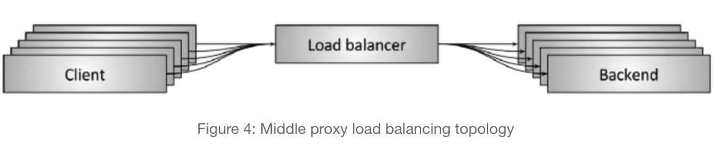
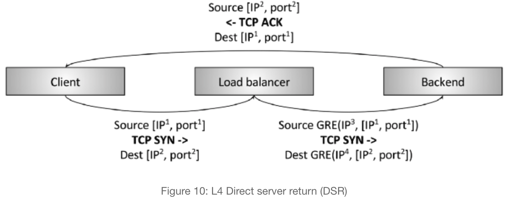
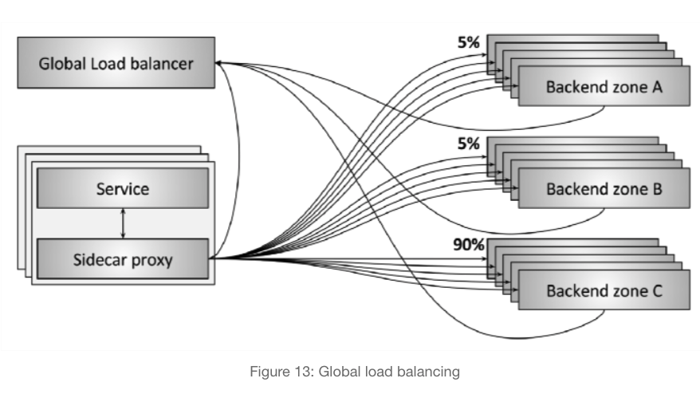

# Load balancing and proxying

Load balancing improves the distribution of workloads across multiple computing resources, 

It aims to **maximize throughput, minimize response time, and avoid overload of any single resource.** and provides:

1. Service discovery:
   1. static configuration file
   2. DNS
   3. Zookeeper, Etcd, Consul etc
   4. Envoy universal data plane API
2. Fault tolerance, Health checking
   1. Active: load balancer sends a ping on regular interval.
   2. Passive: load balancer detects health status from the primary data flow. e.g., an L4 load balancer might decide a backend is unhealthy if there have been **three connection errors** in a row. An L7 load balancer might decide a backend is unhealthy if there have been **three HTTP 503 response codes** in a row.
3. Cost and performacne benefits. Load balancing
   1. Algorithms like random selection, round robin, power of 2, least request load, hash. Etc
4. Sticky sessions (PCC)
   1. it is important that requests for the same *session* reach the same backend
5. Observability:
   1. logging something to help operators monitor the status
6. Security and DoS mitigation
   1. rate limiting, authentication, DoS mitigation. 
7. Configuration and control plane
   1. Load balancer need to be configured. 
   2. the system that confiures the load balancer is known as control plane. eg service mesh data plane.

Load balancing usually involves dedicated software or hardware, such as a **multilayer switch** or a **Domain Name System server process**.

**Responsible:**

1. Service discovery: knows all backend addresses. 
2. Health checking: knows which backend is available
3. Load balancing: distribute the workload more uniformly.
4. Persistent per connection:

# Design Layers

When discussing load balancing across the industry today, solutions are often bucketed into two categories: **L4 (Transfer Layer) and L7 (Application Layer)**

## L4 (Transfer Layer)

**L4 Limitations:**

For each client, it connect to LB and LB connect to a backend server.

After the connection is estiblished, the client seems only talk to one backend server. 

Under such situation, the imbalance of request rate between different clients could cause the imbalance of workload of corresponding backend servers. 

This defeats the purpose of load balancing where the load is required to balanced distributed across servers. The problem can be fixed by L7 load balancer. 

## L7 (Application Layer)

# Architectures

## Middle proxy

This category encompasses hardware devices from Cisco, Juniper, F5, etc.; cloud software solutions such as Amazon’s [ALB and NLB](https://aws.amazon.com/elasticloadbalancing/) and Google’s [Cloud Load Balancer](https://cloud.google.com/load-balancing/); and pure software self-hosted solutions such as [HAProxy](https://www.haproxy.com/), [NGINX](https://www.nginx.com/), and [Envoy](https://www.envoyproxy.io/).

**Benifits**

The pro of a middle proxy solution is user simplicity. In general, users connect to the load balancer via DNS and don’t need to worry about anything else

**Limits:**

single point of failure and scaling bottleneck

## Edge proxy

The edge proxy topology shown in **figure 5** is really just a variant of the middle proxy topology in which the load balancer is accessible via the **Internet** (the Load balancer has public IP)

## Embedded client library

To avoid the single point of failure and scaling issues inherent in middle proxy topologies, more sophisticated infrastructures have moved towards embedding the load balancer directly into services via a library. eg  [Finagle](https://twitter.github.io/finagle/), [Eureka/Ribbon/Hystrix](https://netflix.github.io/), and [gRPC](https://grpc.io/) (loosely based on an internal Google system called Stubby)

**Benifits**

The main pro of a library based solution is that it fully distributes all of the functionality of the load balancer to each client, thus removing the single point of failure and scaling issues previously described

**Limits:**

Implementation and deploy library is painful. 

## Sidecar proxy

A variant of the embedded client library load balancer topology is the sidecar proxy topology shown in **figure 7**. In recent years, this topology has been popularized as the “service mesh.” The idea behind the sidecar proxy is that at the cost of a slight latency penalty via hopping to a different process,eg  [Envoy](https://www.envoyproxy.io/), [NGINX](https://www.nginx.com/), [HAProxy](https://www.haproxy.com/), and [Linkerd](https://linkerd.io/), [blog post introducing Envoy](https://eng.lyft.com/announcing-envoy-c-l7-proxy-and-communication-bus-92520b6c8191) as well as  [post on the service mesh data plane vs. control plane](https://medium.com/@mattklein123/service-mesh-data-plane-vs-control-plane-2774e720f7fc).

**Benifits**

All of the benefits of the embedded library approach can be obtained without any programming language lock-in

**Limits:**

cost of a slight latency penalty

# Compare result

Overall, I think the sidecar proxy topology (service mesh) is gradually going to replace all other topologies for service-to-service communication. The edge proxy topology will always be required prior to traffic entering the service mesh.

# Current state of the art in L4 load balancing

Although in my opinion L7 load balancers will ultimately completely replace L4 load balancers *for service-to-service communication*, L4 load balancers are still extremely relevant *at the edge* because **almost all modern large distributed architectures use a two-tiered L4/L7 load balancing architecture for Internet traffic**

The benefits of placing dedicated L4 load balancers before L7 load balancers in an edge deployment are:

1.  L7 load balancers perform substantially more sophisticated analysis, transformation, and routing of application traffic, they can handle a relatively small fraction of the raw traffic load (measured in packets per second and bytes per second) than an optimized L4 load balancer can. This fact generally makes L4 load balancers a better location to handle certain types of DoS attacks (e.g., SYN floods, generic packet flood attacks, etc.).
2. L7 load balancers tend to be more actively developed, are deployed more often, and have more bugs than L4 load balancers. Having an L4 load balancer in front that can do health checking and draining during L7 load balancer deploys is substantially easier than the deployment mechanisms used with modern L4 load balancers, which typically use BGP and ECMP (more on this below). 

# Classical design of middle/edge proxy L4 load balancers. 

## TCP/UDP termination load balancers

## TCP/UDP passthrough load balancers

**Benefits**

1. **Performance and resource usage**: Because passthrough load balancers are not terminating TCP connections, they do not need to buffer any TCP connection window. The amount of state stored per connection is quite small and is generally accessed via efficient hash table lookups. Because of this, passthrough load balancers can typically handle a substantially larger number of active connections and packets per second (PPS) than a terminating load balancer.
2. **Allows backends to perform customized congestion control**: [TCP congestion control](https://en.wikipedia.org/wiki/TCP_congestion_control) is the mechanism by which endpoints on the Internet throttle sending data so as to not overwhelm available bandwidth and buffers. Since a passthrough load balancer is not terminating the TCP connection, it does not participate in congestion control. This fact allows backends to use different congestion control algorithms depending on their application use case. It also allows easier experimentation on congestion control changes (e.g., the recent [BBR](https://queue.acm.org/detail.cfm?id=3022184) rollout).

## Direct server return (DSR)

DSR builds on the passthrough load balancer described in the previous section. DSR is an optimization in which only *ingress/request* packets traverse the load balancer. *Egress/response* packets travel around the load balancer directly back to the client

Implementation:

1. The load balancer still typically performs *partial* connection tracking. Since response packets do not traverse the load balancer, the load balancer will not be aware of the complete TCP connection state. However, the load balancer can strongly infer the state by looking at the client packets and using various types of idle timeouts.
2. Instead of NAT, the load balancer will typically use Generic Routing Encapsulation ([GRE](https://en.wikipedia.org/wiki/Generic_Routing_Encapsulation)) to encapsulate the IP packets being sent from the load balancer to the backend. Thus, when the backend receives the encapsulated packet, it can decapsulate it and know the original IP address and TCP port of the client. This allows the backend to respond directly to the client without the response packets flowing through the load balancer.
3. An important part of the DSR load balancer is that the *backend participates in the load balancing*. The backend needs to have a properly configured GRE tunnel and depending on the low level details of the network setup may need its own connection tracking, NAT, etc

**Benefits**

Response traffic is greater than requesting traffic. 

this type of optimization can have substantial implications on system cost and reliability

## Fault tolerance via high availability pairs

## Fault tolerance and scaling via clusters with distributed consistent hashing

Equal-cost multi-path routing ([ECMP](https://en.wikipedia.org/wiki/Equal-cost_multi-path_routing)) is used to ensure that in general, all packets from a single *flow* arrive at the same edge router.

# Current state of the art in L7 load balancing

Istio， Envoy

# Global load balancing and the centralized control plane

1. Each sidecar proxy is communicating with backends in three different zones (A, B, and C).
2. As illustrated, 90% of traffic is being sent to zone C while 5% of traffic is being sent to both zone A and B.
3. The sidecar proxy and the backends are all reporting **periodic** state to the global load balancer. This allows the global load balancer to make decisions that take into account latency, cost, load, current failures, etc.
4. The global load balancer **periodically configures each sidecar proxy with current routing information.**

e g [Envoy’s universal data plane API](https://link.zhihu.com/?target=https%3A//medium.com/%40mattklein123/the-universal-data-plane-api-d15cec7a) and [service mesh data plane vs. control plane](https://link.zhihu.com/?target=https%3A//medium.com/%40mattklein123/service-mesh-data-plane-vs-control-plane-2774e720f7fc)

