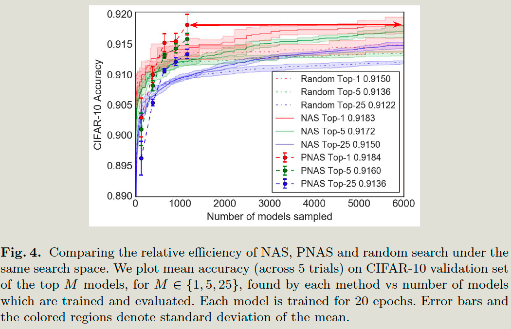
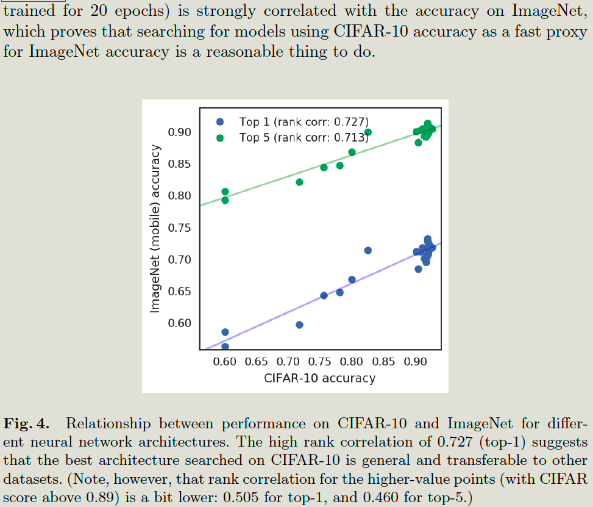

# Introduction

## Problem

The current search strategy has two categories:

**Search from fully-specified graph structures:**

1. Evolutionary algorithms.
   - Each NN structure is encoded as a string
   - Random mutations and recombinations of strings are performed during the search process.
   - Sample string is a new architecture, and it is then trained and evaluated using SGD. 
2. Reinforcement learning-based algorithm.
   - RNN controller generates new architecture.
   - The new architecture is trained and evaluated, 
   - The validation performance is returned as the reward, and it is used to update the RNN controller's weight. 

**Search from heuristic search space. Search form simple to complex.**

1. Monto Carlo Tree Search: at each node in the search space, it randomly selects one to expand.
2. Sequential Model-Based Optimization: use a prediction model to decide which nodes to expand. 

Both are slow, For example, the RL method in trains and evaluates 20,000 neural networks across 500 P100 GPUs over 4 days

## Contribution

The paper proposes a new algorithm for a sequential model-based optimization strategy. Which is **5 times more efficient than RL and 8 times faster in terms of total compute.**

# Introduction

## Basic idea

1. List K' candidates,
2. hire surrogate functions to predict the performance of the structure without needing to train all of them.
3. pick top K candidates. train and evaluate them, 
4. continue until b = B.

# Architectuer Search Space

**The paper uses a heuristic search rather than a fully-specified model search space.**

## Cell And CNN Network

The cell is a fully convolutional network

The cell can be represented by a DAG consisting of B blocks. Each block is a mapping from 2 input tensors to 1 output tensor.

Each block b in cell c as a 5-tuple, (I1; I2; O1; O2; C), 

- Input I1 and I2 are chosen from the previous block in this cell + the output of the previous cell + the output of the previous-previous cell,

- Operator:

  

- Combination:  both elementwise addition and concatenation.  (Only use )

In 5 blocks, the total search space 10**14.

But the total number of unique cells is 10**12.

# Search Method

## Progressive NN search

B1 is list of cells, each cell has only one block. The total unique block number is 2*2 * 8*8 = 256. So there are 256 cells. 

## cell Predictor

Since it needs to handle variable-sized strings, so it mainly uses RNN,(LSTM) to do the prediction.

1. LSTM inputs: reads a sequence of length 4b <I1, I2, O1,  O2 > for each block. And the input at each step is a one-hot vector of size.
2. LSTM's hidden state size and embedding size are both 100

# Experiments and Results

