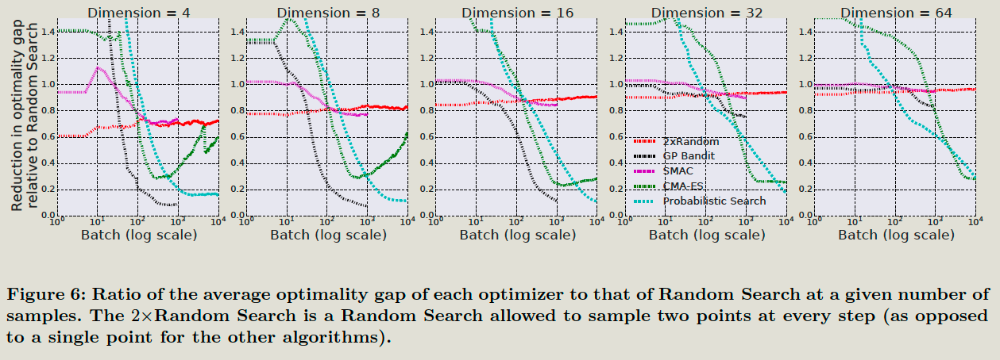

# Introduction

## Contributions

The paper proposes a black-box optimization system and targets the following property.

1. ease to use: low code, less config, and setup.
2. integrate state-of-art existing algorithms
3. **high availability.**
4. high scalability: 
   - Millions of trails per the study
   - **Thousands of parallel trails per study**
   - billions of studies.

# The system

## Definition

A trail:  A trail is one list of parameters, and this parameter will have a result f(x). The trail can be complete or pending. 

A study: single optimization run over many trails. f(x) does not change during a study.

## Algorithms

Studies with < 1k trails, use batched Gaussian process bandits and expected improvement acquisition function

Studies with > 10K trails, use randomSearch/ gridSearch.

## Automated early stopping

1. Performance Curve Stopping Rule: 

   performs regression on the performance curves to make a prediction of the final objective value of a Trial given a set of Trials that are already Completed,

2. Median Stopping Rule:

   if the trial’s best objective value by step 𝑠 is strictly worse than the median value of the running averages

## Transfer learning

Tune the hyperparameter of the same model on a new dataset based on the picked hyperparameter of the same model on the previous dataset.

For instance, one might tune the learning rate and regularization of a machine learning system, then use that Study as a prior to tuning the same ML system on a different data set.

# Performance

