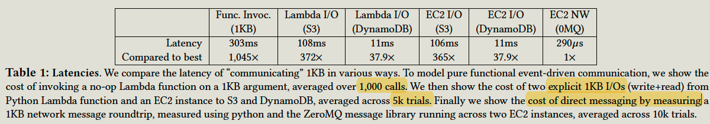

# Introduction

In a serverless platform, the application is composed of functions. Users can define functions and **declare events that trigger each function.** The FaaS monitors each triggering event and allocate a runtime for the function, and then executes it. 

Benefits:

**PayAsYouGo:** The user is billed only for computing resources used during function invocation. 

**Autoscaling**: The workload automatically drives the allocations and deallocation of resources. 

**ManageFree**: Users don't need to manage the infrastructure.

However, it is not suitable for some applications:

1. **Data-intensive application**

1.  **Application with distributed protocol**

# Suitable use cases

Current FaaS are attractive for **simple** workloads of **independent** tasks, 

1. Serverless computing is suitable for functions with fewer communications and requires high parallelism, eg, image pre-processing.
2. Also, it is suitable for applications requiring autoscaling, eg. autoscaling dataflow service.
3. Applications with functions chain. SQS or S3 can be used as middleware.

# Limitations

## Limits

The serverless has the following limitations, and it is not suitable for some applications. 

1. **Short-live** Limited lifetimes and cannot ensure statefully. ( one function can cach states in the hosting VM to support warm start, but subsequent invocations cannot be ensured to run on the same VM. )
2. **Not-Addressable**: Functions are not network-addressable while running and cannot communicate directly. So they have to maintain states in S3, and communicate through slow storage,
3. Each VM has **limited I/O bandwidth**. AWS appears to attempt to pack Lambda functions from the same user together on a single VM, leading to many functions sharing the limited bandwidth.
4. No specialized hardware: No API to access **specific hardware**, and FaaS only allow users to use timeslice of CPU hyper-thread and some RAM.

In serverless, it runs as a "ship data to computation" pattern instead of a "ship computation to data" pattern.

Unfeasible applications:

1. **Data-intensive application with more I/O**: Shiping data into computation incurs latency and cost. 
2. **Distributed protocols:** Communication through slow storage is not suitable for distributed protocols with fine-grained communication patterns.
3. **Hardware required applications**: GPU

## Case studies

### Model Training

The paper conducts a model training task on both lambda and EC2, and it found algorithm on Lambda is 21X **slower** and 7.3X more **expensive** than running on EC2.

This is because EC2 fetch data is much faster than in Lambda, (0.04s vs 0.14s)

### Model Inference

Using SQS to batch 10 messages at a time, and measure average latency over 1000 batch invocations.

1. Retrieve the model and write the result back to S3: Lambda is 559ms per batch.
2. Complied model into function and wrote result back to SQS: Lambda is 447ms per batch
3. EC2: 13ms per batch, 27X faster than Lambda. 2.8ms per batch if retrieve the message locally. 

As for pricing, if we scale the service to handle 1000 K messages a second, 

1. SQS request rage costs $1584 per hour. 
2. 290 EC2 instances cost $27.84 per hour

### Distributed Computing

Measure latency of retrieving 1kb data.

# Some key challenges for Cloud provider

1. infrastructure should physically colocate code and data. partition data to match code needs.

2. FaaS offerings should enable upfront SLOs that are priced accordingly

3. Functions should be addressable and can long run.

4. Security: Allowing code to move fluidly toward shared data storage is potentially tricky: rogue code can gather signals across customers.

   SGX's enclave can help to protect running code. 

# Cloud-Native programming

1. Communication should asynchronous and flow-based.

   The sequential metaphor of procedural programming will not scale to the cloud, the code should work in small, granular units. 

