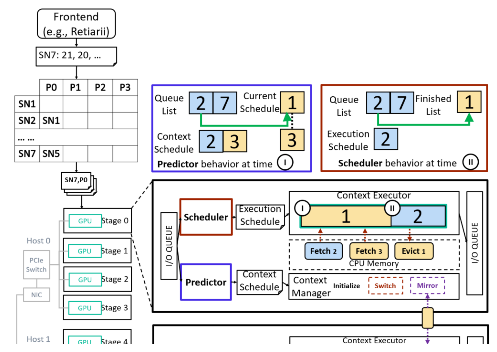

[TOC]

# Questions

1. Why one-to-one train the supernet?

   Because it can reduce the interpretation of bad subnet. 

   One-to-one training is to train each subnet of the supernet for only one batch and then train another subnet. 

   The training has a fixed number of total steps.

2. How to partition the network?

   Partitioning super-net == partitioning sub-net since the super-net is composed of layers. 

# Introduction

## Background & Motivation

The supernet paradigm is the most widely adopted NAS paradigm due to its low cost and high quality. And a key determinant of the quality of a NAS-discovered DNN is the size of the search space. 

Thus, efficiently training large supernet in parallel is essential, which includes two perspectives:

- It needs reproducible training to reduce the non-trivial accuracy loss. It also has the following features.
  - It can facilitate knowledge transferability.
  - The supernet training is much easier to inspect, analyze, and debug.
  - Deterministic execution has constantly been a desirable feature.
- For high performance, it needs efficiently parallelize subnets' training executions. 

So this paper mainly considers those two properties:

- **Training reproducibility.**

  It refers to training results being bitwise equivalent when the training is repeated with the same dataset, random seeds.

- **High-performance distributed supernet training.**

  It is to manage the extra-large supernet context among GPUs efficiently.

## Challenge

**Training reproducibility**

- Efficient training requires training sub-net in parallel, but it's challenging to resolve the dependencies between subnets activated in parallel deterministically.

**High-performance distributed supernet training.**

- It's challenging to switch subnets between GPU and CPU memory efficiently; this is because the exploration schedule is generated at runtime and cannot overlap execution and upcoming model loading. 

  E,g. It's the desire to keep only active subnet in GPU for training and leave other memory for large-batch data, but it's hard to precisely **pre-fetching** subnets from CPU to GPU.

## Gap

- Retiarii: don't capture the casual dependency of subnets, thus cannot guarantee **training reproducibility.**  
- PipeSwitch etc.: reply on a pre-defined execution plan. With such an execution plan, they overlap the DNN context switch and DNN execution to reduce the overhead. 

## Goal

Provide a parallel supernet training system with **Training reproducibility** and **high training efficiency.** 

- **Training reproducibility.**

  The paper trains n subnets (for n GPUs cluster) at the same time; each subnet is partitioned into n stages (each GPU processes one stage)

  The paper uses **casual synchronous parallel pipelining (CSP)** techniques to provide the correlation between subnets.

  - benefit1: pipeline parallelism can provide causal dependencies.
  - benefit2: pipeline parallelism can handle ample model training, while simple data-distributed training cannot do it. 

- **High-performance distributed supernet training.**

  - Predict the upcoming subnets with the highest chance.  

One example of CSP;

# Architecture

## Pipeline schedule with dependency preservation

This mainly includes two algorithms, Runtime, and scheduler. 

- **Scheduler's basic idea:** 

  Each GPU has a stage of one subnet (e.g., stage K). Before training this subnet, the scheduler will check the following:

  - If all previous subnet has finished backward, just schedule and run this subnet.
  - If some previous subnet (ps) has not been finished, then the scheduler traverses all of the ps' layers under the current GPU/stage K. If some layer also belongs to the present subnet, then don't schedule it and wait. 

- Runtime defines the whole training process.
  - If one subnet at stage K cannot be scheduled, the runtime algorithm retries the scheduler until all previous subnets at stage K are finished. 

## Context prediction

Context switch overlaps the copy with DNN operator execution. But in supernet training, the subnet generation is unknown.

The paper tries to forecasts the upcoming executed tasks by observing the status of the current stage and the whole pipeline. Once the prediction finishes, the predicted subnet can be async fetched to GPU memory.

The basic idea:

- it firstly assumes the current subnet already finish, and then runs the scheduler and gets the output, which is the prediction subnet.

# Evaluation

The paper conducts experiments to show the following:

- (Macro-benchmarks) end-2-end performance.
  - training convergence comparison: performance vs. time usage
  - throughput: trained samples per second.
- (Macro-benchmarks) reproducibility.
  - Run the system over different GPU numbers (2,4,8) to measure the reproducibility.
- (Micro-benchmarks) effective of each component.
  - Mainly illustrate the influences of the scheduler, predictor, and layer mirroring. 
  - Compare throughput using three settings: NASPipe w/o scheduler, NASPipe w/o predictor, and NASPipe w/o monitor. 
- (Micro-benchmarks) scalability over GPU.
  - GPU utilization vs GPU number(4, 8, 12, 16)

