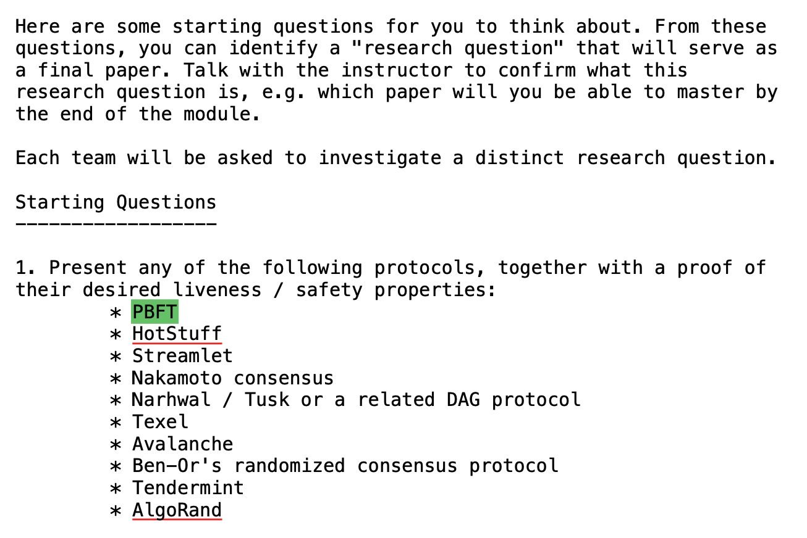

# Questions

1. How many replicas and what should be the quorum size of BFT.
2. What if primary is faulty.
   1. Send wrong to other backups, 
   2. Send different result to client 
   3. Ignore clients
3. What if backup is faulty. 
4. What if faulty primary or faulty backup impersonate each other.
5. Basic protocols, 
   1. pre-prepare
   2. prepare certificate, 
      1. why need 2f+1
      2. can we commit now?
   3. commit certificate, why need 2f+1

6. View Change
7. Garbage collection
8. Safety and Liveness
9. **From PBFT to HotStuff, async => sync.**

 