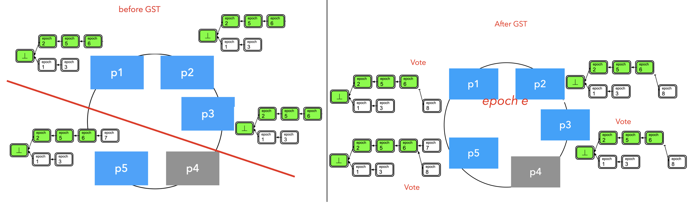
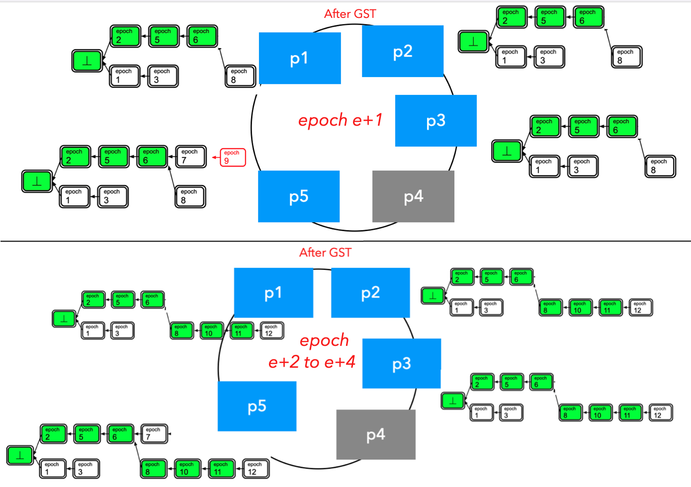

# Introduction

Many works (RAFT, Zyzzyva, The ABCDs of Paxos, etc ) aims to simplify the PBFT/Paxos family of protocols, but they have complicated recovery path when there is malicious behavior.

The paper tries to propose a simple, permissioned consensus protocol - Streamlet. 

# Execution Model

## Assumptions

1. All processes/participants' public keys are well-known (i.e., the classical “permissioned” setting).
2. Processes/participants have local clocks and run in synchronized monotonic epochs of 1 second each. ( 1 sec > 1 roundtrip).
3. Each epoch has a random leader. 
4. Each epoch = 2Δ.
5. Honest participants are at least 2n/3, and malicious participants are less than 1n/3. (n is total number of participants)
6. Liveness requires periods of synchrony while consistency doesn't need this. 
   - Periods of synchrony are modeled with the standard Global Stabilization Time (GST) approach: When an honest participant sends a message in round r, then an honest recipient is guaranteed to receive it by the beginning of round $max(GST, r+\\theta)$

## Definition

**Notarized**: When a block gain votes from at least 2n/3 distinct participants, it becomes notarized. A chain is notarized if its constituent blocks are all notarized. 

**Finalize**: If in a notarized chain, there are **three adjacent blocks** with **consecutive epoch numbers**, the prefix of the chain up to the second of the three blocks is considered final. When a block becomes final, all of its prefixes must be final too.

## Provable guarantees

1. **Consistency:** 
   - For any two blockchains considered final by honest participants, then one chain must be either the same as another or is a prefix of another.
   - Consistency is guaranteed no matter what network delays or partitioning.
2. **Liveness:** 
   - If an honest participant receives some transactions in round r, those transactions will be **eventually** included in all honest participant's finalized chains. 
   - With expected constant confirmation delay during the period of synchrony.

## Protocol

Protocol run in rounds, At the beginning of epoch e:

1. Each epoch has a designated leader chosen at random by a publicly hash function. 
2. Each leader proposes a new block extending from the **longest notarized chain** it has seen.
3. Each participant votes for ( sign with private key ) the proposed block iff
   - It is extended from one of the longest notarized chains that the participant has seen. 
   - It is the first proposal received at epoch e. 
   - After voting, the participant then sends it to everyone. 

On seeing three adjacent blocks in a notarized blockchain with consecutive epoch numbers, a participant can finalize the second of the three blocks and its entire prefix chain. 

# Consistency

The consistencies prove it relies on two Lemmas.

**Lemma 1** proves that at each epoch, there is only one notarized block in the honest view. Further, it shows the conflicting block notarized at the same length as block N must have an epoch number either greater than N+1 or smaller than N-1. 

**Lemma 2** proves that if one honest participant sees a notarized chain with three adjacent blocks with consecutive epoch numbers, then the middle block doesn't have a conflicting version which is also notarized in the honest view. 

Finally, the **consistency theorem** (theorem 3) is satisfied. 

Note: consistency doesn't need a synchronization model. As long as the system can make progress, then consistency can be eventually achieved. While the system requires a period of synchrony to make progress, thus liveness requires a partial synchronization model.

# Liveness

## Theorem

The liveness prove is replies on three facts and one Lemma. 

Below we record the block proposed at epoch e+i as Bi.

**Fact 1**: 

- It emphasizes that if a message is observed by one honest participant at round r, then it will be observed by all honest nodes will observe it at the beginning of $max(GST, r+\\theta)$.

**Fact 2:** 

- It emphasizes if **a notarization block** is observed by some honest participant at the beginning of round r, then **a notarized blockchain ending at that block** will be observed by all honest participants at the beginning of $max(GST, r+\\theta)$.

**Fact 3:** 

- It emphasizes that if there are **two honest consecutive leaders** after GST, the proposed height must grow. $Hight(Bi+1) >=Hight(Bi) + 1$.
- Proof: In epoch e (after GST), one block can be proposed at high l1. No matter if it conflicts with the current one at l1, the later proposed block must be at length l1+1 or greater.

**Lemma 5:** 

- After GST, if there are **three consecutive epochs** (e, e+1, e+2) all with an honest leader, then 

  - Each honest participant can observe a notarized chain ending at the B2 (block proposed at epoch e+2) at the beginning of the e+3.
  - No conflicting block with the same length as B2 can get notarized in honest view. 

- Proof: The proof follows the assume-contradiction method. 

  ```
  Suppose at the length of B2 is l2, and B2' is conflicting with B2 => B2' must be proposed before e (Fact3) 
  => B2' parent chain must have length l2-1 and every honest participant has seen it (by Fact1).
  => At epoch e+1, the leader must propose a block at hight greater than l2 
  => Block proposed at epoch e+1 is smaller than the hight of e+2 ( l2 in other words) 
  => contradiction !
  ```

  Then the B2 cannot have a conflict version.  

Finally, Liveness Theorem 6 is proposed: 

- **After GST**, if there are **5 consecutive epochs** (e to e+4) with the honest leader, then by the beginning of the **5-th epoch**, all honest participants must observe a **new final block** which is **not final at the beginning of the first epoch e**. 

Theorem 6 can be proved by the fact that for every 5 blocks, the **last 3 are consecutive and unique**. Specifically:

1. At the beginning of epoch e+5, B2, B3, and B4 are notarized in the honest participant's view. 
2. B2, B3, and B4 **cannot** have been notarized in honest view before the beginning of epoch e
3. No conflicting blocks can be notarized in honest view at the same length as B2, B3, and B4.
4. B3 must extend from B2, similarly, B4 must extend from B3. 
5. Finalize rule makes sure the blockchain ending at B3 is a new final chain. 

According to the paper, an intuitive understanding is that the honest leader will undo the damage caused by the previous corrupt leader, and then use three epochs to finalize the chain ending at the block notarized at the second epoch. 

## Example illustration

Even after GST, if an honest leader proposes a block, that block cannot be guaranteed to be accepted by all honest participants, this is because participants may think it is not extended from the longest chain they have seen. 

Below we use Bi to represent block i and use pj to represent participant j

Consider the following example:

1. After p5 notarized B7, the network was partitioned. Now, p5 extends B7 to the blockchain while others have not added it. 



2. After GST, p2 becomes a leader at epoch 8, and then proposes B8, after accepting 4 votes, B8 is notarized. 



3. Now p5 becomes a leader at epoch 9, and then proposes a new B9, but B9 cannot be notarized since cannot get the 2n/3 votes

4. Then from epoch 10, everything goes normal. 

   Finally, each participant has B10, B11, and B12 all extending from the lone chain. 

   Then according to the finalized rule, a new blockchain is generated. Previous we only blockchain up to B6, now it is up to B11.

## Analysis

In the above example, the protocol becomes live and can make progress (finalize new blockchain up to B11) after 5 constant epochs (8,9,10,11,12). 

B8 and B9 may have some problems, while from B10 everything goes the norm. Finally B10, B11, and B12 help to finalize the new blockchain.

Thus, in at least 5 consecutive epochs all with honest leaders after GST, the protocol can make progress. 
