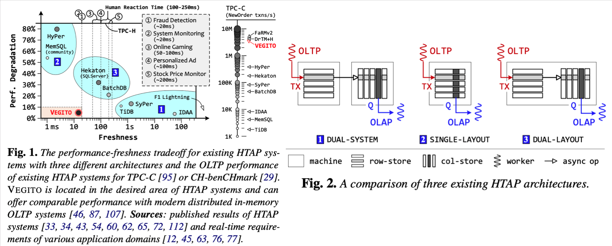

# Introduction

## Background & Motivation

HTAP has to make a trade-off between data freshness and performance degradation.

There is a need to design an HTP with less delay of data freshness and less performance degradation when concurrently executing AP and TP.

## GAP

There are three design patterns for HTAP:

1. Dual System[1]: connect OLAP and OLTP together => large data transfer delay.
2. Single Layout[2]: derive one from another, e,g. HTAP based on OLTP => row store incur high-performance degradation (50%) in AP workloads. 
3. Dual Layout[3]: Combine OLAP and OLTP in a single system. 

## Goal

It achieves high performance when concurrently executing TP and AP workloads (10% degradation) and freshness (maximum delay of 20 ms) simultaneously. 

# Challenges & Solutions

