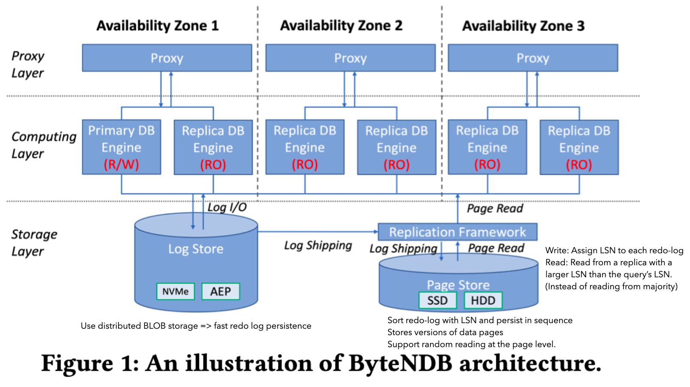
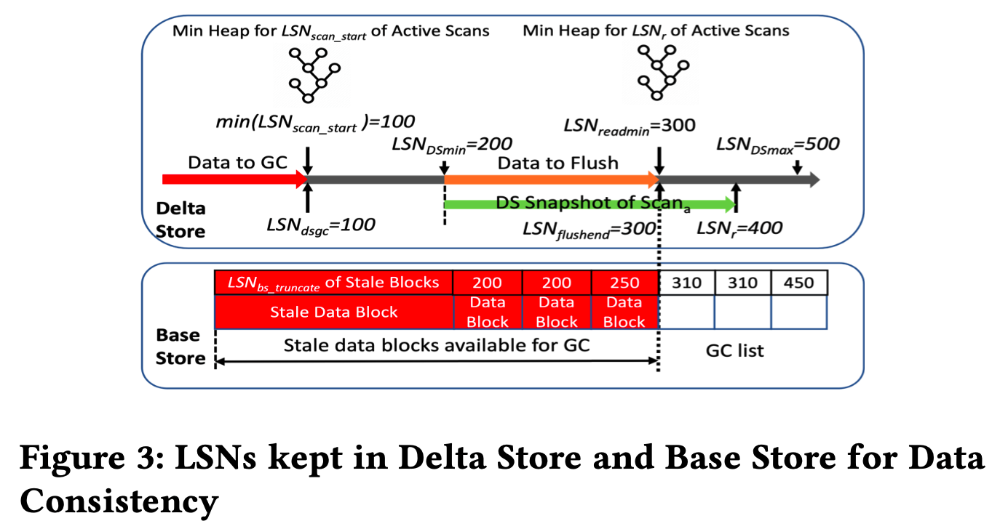

# Introduction

## Background & Motivation

Complex OLAP query requires strong data consistency and sub-second delay. 

## Gap

OLAP database may read stale data. OLTP database lack the massive parallel processing capability. 

## Goal

To build large-scale real-time HTAP supporting fresh data changes and strong data consistency. 

- Scale up to petabytes of data.
- Low performance degradation on either OLAP and OLTP.
- Fresh delay: < 1s
- Strong data consistency: consistent global snapshot.

# Method Overview & main idea

High Data freshness

- Log replication: 
  - Quorum-based consensus protocol => good performance and high availability. 
- **Fast LogApply and Flush to column store:**
  - transfer update => delete + insert => fast upadte in memory
  - soft delete in disk => no change of existing data => fast append in disk.
  - the binLog is valid and can skip the verify process. 
- Efficient memory management:
  - Vector of arenas. 

Strong data consistency: The OLAP may read multiple partitions, **and those partitions are in consistent state.** 

- Consistent data snapshot read.
  - Cache stores history of recent versions.
  - Disk only store latest version. 
  - Each query get a stable LSN from meta service. => read the corresponding snapshot.
- 

# Details

## ByteNDB Engine

## System Overviview

### Design choices

- Single Engine: SAP HANA, MEMSQL
- Seperate Engine: 
  - separate storage
  - shared storage

The paper use seperate engine and shared storage with 

- Seperate Engine
  - OLAP: Flink
  - OLTP: ByteNDB
- Shared storage

### System

Logical Logs: eg,. MySql BinLog.

MetaData service: 

- Provide global committed LSN for OLAP query. (Any lsn before this LSN is guaranteed to be committed or persistented by OLAP columnar store)
- Built on top of Zookeeper for high availability.

Olap Engine

- Flink reads data from columnar store in parallel.

## Columnar store

Columnar store has Delta Store and Base Store

### Delta Store (Cache)

It is to provide high fresh data to OLAP engine for quering. 

- Consist of
  - insertation list.
  - deletion list. 
  - delete hash map: record all deletionsf or fast OLAP lookup. 
  - maintains a limited history of recent versions, and some version number for manage the version and reading.
- Functions
  - LogApply: apply logical logs to insertation list, deletion list and del hash-map
  - Flush: periodically transfer accumulated row-format data to column-format, and store them in same storage node.
    - find the data to be flushed with LSN
    - sort them and transfer to columnar based
    - store as **data blocks**. (exlude the rows that are deleted) If the data is already at the base-store and now it is deleted, then the delat store will update the Bitmap o the data blocks in base store. 
  - Garbase Collection:clear the flushed data to release mmemory. 
  - Scan
    - OLAP will scan both Delta store and base store and then union the result. 
    - Delta stores multiple versions of each reocrds and provide snapshot reads.

### Base Store

It is to store columnar data for each partition replica, and store then as data blocks. It is **immutable**.

Each block

- 32MB
- Data is ordered by table's primary key (PK).
- Contains the block-level metadata such as number of rows, key range, bloom filter for pk, statistics like min/max.

In order to apply delete ops from delta store, base-store mark the data in each block as delete using a Bitmap, and store the Bitmap to RocksDB.

Compaction and Garbage Collection to reduce the disk usage. 

## 