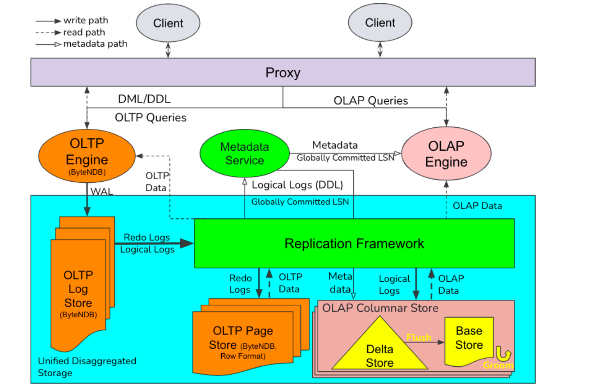

# Introduction

## Background & Motivation

Complex OLAP query requires strong data consistency and sub-second delay. 

## Gap

OLAP database may read stale data. OLTP databases lack massive parallel processing capability. 

## Goal

To build large-scale real-time HTAP supporting fresh data changes and strong data consistency. 

- Scale up to petabytes of data.
- Low-performance degradation on either OLAP and OLTP.
- Fresh delay: < 1s
- Strong data consistency: a consistent global snapshot.

# Method Overview & main idea

High Data freshness

- Log replication: 
  - Quorum-based consensus protocol => good performance and high availability. 
- **Fast LogApply and Flush to column store:**
  - transfer update => delete + insert => fast update in memory
  - soft delete in disk => no change of existing data => fast append in disk.
  - the Bin-Log is valid and can skip the verification process. 
- Efficient memory management:
  - Vector of arenas. 

Strong data consistency: The OLAP may read multiple partitions, **and those partitions are in a consistent state.** 

- Consistent data snapshot read.
  - The cache stores the history of recent versions.
  - The disk only stores the latest version. 
  - Each query gets a stable LSN from the meta service. => read the corresponding snapshot **while guaranteeing the concurrent running task is running correctly.**

# Details

## ByteNDB Engine

## System Overview

### Design choices

- Single Engine: SAP HANA, MEMSQL
- Separate Engine: 
  - separate storage
  - shared storage

The paper used a separate engine and shared storage with 

- Separate Engine
  - OLAP: Flink
  - OLTP: ByteNDB
- Shared storage

### System

Logical Logs: e.g., MySql BinLog.

MetaData service: 

- Provide global committed LSN for OLAP query. (Any lsn before this LSN is guaranteed to be committed or persistent by OLAP columnar store)
- Built on top of Zookeeper for high availability.

OLAP Engine

- Flink reads data from a columnar store in parallel.

## Columnar store

The columnar store has Delta Store and Base Store

### Delta Store (Cache)

It is to provide high fresh data to the OLAP engine for querying. 

- Consist of
  - Insertation list.
  - Deletion list. 
  - Delete hash map: record all deletions or fast OLAP lookup. 
  - Maintains a limited history of recent versions and some version numbers for managing the version and reading.
- Functions
  - LogApply: apply logical logs to the insertion list, deletion list, and del hash-map
  - Flush: periodically transfer accumulated row-format data to column-format, and store them in the same storage node.
    - find the data to be flushed with LSN,
    - sort them and transfer them to columnar-based
    - store as **data blocks**. (exclude the rows that are deleted) If the data is already at the base store and now is deleted, then the delta store will update the Bitmap o the data blocks in the base store. 
  - Garbage Collection: clear the flushed data to release memory. 
  - Scan
    - OLAP will scan the Delta and base stores and then union the result. 
    - Delta stores multiple versions of each record and provides snapshot reads.

### Base Store

It is to store columnar data for each partition replica and store them as data blocks. It is **immutable**.

Each block

- 32MB
- Data is ordered by the table's primary key (PK).
- Contains block-level metadata such as the number of rows, key range, bloom filter for pk, and statistics like min/max.

To apply delete ops from the delta store, the base-store mark the data in each block as deleted using a Bitmap and store the Bitmap to RocksDB.

Compaction and Garbage Collection to reduce disk usage. 

## Optimizations

### Delete handling (Soft delete).

- Lazy delte:
  - Scan the base store to get **primary key**, then use it to check the hash map in the delta store to check if it is deleted. 
- Eager delete: 
  - Read all deleted keys from the delta store first, then for each delete, it looks up the base store. 
  - Suitable for less delete in the delta store and large delete in the base store.

### Computation pushdown 

=> reduce the data transfer.

- Split the query into a local question on the partition level. 
- Execute the query locally and aggregate the overall queries. 

Statistics collection => collect statistics to help flink cost-based optimization.

- Compute the statistics of tables and store the results in Meta service.

### Asynchronous read 

=> reduce Flink io time.

- The Flink connector is a single thread and takes significant **I/O wait time**, so the paper separates the read and process threads. They communicate through an adjustable buffer. 

### Parallelism optimization 

=> adjust parallelism based on data statistics. 

- By default, Flink uses pre-configured task parallelism, which wastes resources in simple queries while reducing the parallelism degree for the complex question.

  So the paper adjusts parallelism based on some rules, e,g. resource parallelism. 

# Evaluation

Hybrid OLAP/OLTP workloads

- I am using mixed workloads.

- Fix AP client, increase TP client => linearly TP throughput => TP increase linearly.
- Fix TP clinet, increase AP client => stable TP throughput => AP cannot influence TP.

Data freshness

- I am using SysBench workloads. 

- Measure the data freshness latency when increasing throughput. 

OLAP compatibility and performance.

- I am using OLAP workloads. 
- Measure the latency.

Performance optimization

- Scan optimized: Cost-based to adjust between Lazy and Eager.
- Computation pushdown: 
- Compaction: Reduce the reading overhead. Less access data blocks.

