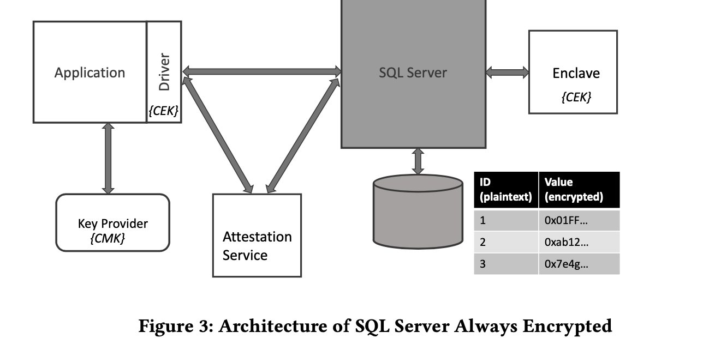

Questions

# Introduction

## Background & Motivation

Cloud has advantages like pay-as-you-go, high availability, and fast time-to-market with provisioning resources in minutes.

Security and compliance are also important. However, the cloud can expose additional attacks, and users cannot control it.  

## Gap

Existing database systems do not protect data against the untrusted administrator, e,g. attackers with administrative privileges on the database.

## Challenge

Computation over ciphertext while providing rich funcs.

- Use specialized encryption schemes, 
  - Deterministic encryption ( same cipher for given plaintext) => only allow equality.=> poor usability. 
  - Randomized (RND)
- Use SGX => perform computations on plaintext data => rich functionality => good usability. 
  - Need attestation service to attest the trustworthiness of the enclave code.
  - Splitting query processing into trusted and untrusted.
  - Handle failures within the enclave, and debug customer errors while preserving confidentiality requirements. 

## Goal

Present cloud database to provide confidentiality controls for data in untrusted administrator, where the information that an adversary learns is a function of data operations performed when evaluating client-authorized queries.

- Support general comparisons and pattern-matching operations.
- Initial encryption and key rotations go through the TEE, avoiding roundtrips to the client.
- Designed for sensitive columns. It encrypts data at a column granularity. And encrypted all the time.

### Threat model - Strong adversary

- SQL servers can view the contents of memory/disk/communications and can tamper with communications.
- It cannot access the enclave.
- exclude side-channel attacks.

### Data Confidentiality

- It cannot provide confidentiality for meta, table column names, number of tables, column numbers, primary key properties.
- It cannot provide semantic security for encrypted data.  (communication leaks information and breaks semantic security.)

# Overall

## Encryption Keys

Two-level key hierarchy to encrypt the data. And all key info is stored in the database.

- Data is encrypted using symmetric encryption based on a column encryption key (CEK).

- CEK is stored in a database encrypted using a second-level key called CMK.

- CMK is stored in a separate key provider, and SQL servers only have reference to it without having access to its contents.

  Key providers can be Azure Key Vault, Windows Certificate store, Java Key Store, etc.

Enclave computations can be configured at the granularity of CMK.

- enclave-enabled:
- enclave-disabled: This prevents the SQL server from misusing CEK in the enclave. And this is achieved by signature.

## Data Encryption & Functionality

The system supports random and deterministic encryption.

### Encryption

The system maintains encryption end-to-end. encrypted queries, and get encrypted results.

The client can encrypt the database using an altered table statement.

### Functionality

- enclave-disabled keys: only equality operations on DET columns.
- enclave enabled keys: run in the enclave.

# Architecture

## Steps

Trusted party: client, enclave, and attestation service.

1. The driver needs to encrypt the query parameters, and the driver requires an SQL parser, etc., which is hard to implement on the driver side. So the system provides an API for the client to return encrypted CEK for each parameter( different CEK for different columns) and CMK metadata.
2. If the query requires an enclave, the driver will establish a shared secret with the enclave and send CEK to it.
3. The driver uses CMK metadata to get CMK from the key provider, decrypts CEKs, encrypts query params, and issues the query.
4. Enclave decrypts necessary data and executes it, encrypts it to the client.

On the server side, the SQL server gets the data of each row and runs a filter in the enclave.

## Indexing

It supports equality and range index.

- Equality indexing: implemented on DET columns by building B tree, the index is ordered in B tree with ciphertext.

- Range Indexing: range indexing is supported on RND columns using B tree and enclave for comparisons. 

  When building a B tree, values are routed to the enclave and return comparison results; the B tree still stores ciphertext.

