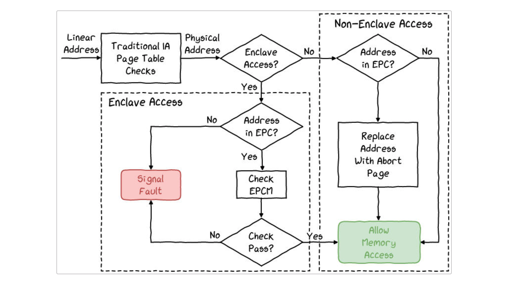
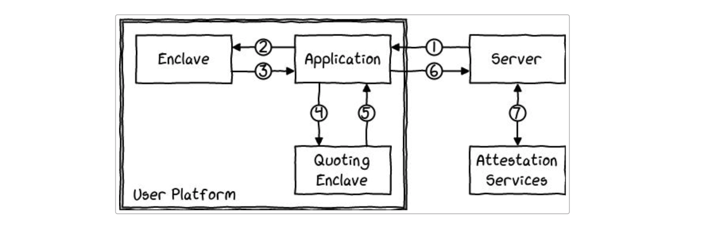

This is from this [post](https://blog.quarkslab.com/overview-of-intel-sgx-part-1-sgx-internals.html)

The application can be split into two parts, a secure one and a non-secure one. 

When an enclave function is called, only the code within the enclave can see its data and the enclave return data in protected memory. 

SGX protects the confidentiality and integrity of the enclave code and data.

The host initializes the enclave by loading a compiled dynamically linked library (DLL) and invokes the enclave code using a function call. 

The enclave can access the memory outside, while the outside cannot access the memory in the enclave. 

## Memory

The code and data are placed in a particular memory area called **Enclave Page Cache (EPC)**. They are encrypted using a new and dedicated chip - Memory Encryption Engine (MEE)

External reads on memory can only observe encrypted data. And the encrypted pages can only be decrypted inside the physical processor core. Keys for decryption are generated at boot time and are stored within the CPU.

Enclave Page Cache Map (EPCM) is to store the page state. It is inside the protected memory, and its size limits the size of EPC (128MB in max).

## Features

### Sealing

When an enclave is instantiated, its code and data are protected from external access. But when it stops, all of its data is lost. Sealing is a way of securely saving the data outside of an enclave, on a hard drive for example. The enclave must retrieve its *Seal Key* using the `EGETKEY` instruction. It uses this key to encrypt and ensure its data integrity. The algorithm used is chosen by the enclave author.

It can be done using. 

- Enclave identity
- Signer Identity
- Security Version Number

### attestation

Secrets have to come from the outside; might they be keys and sensitive data? The enclave must prove to a third party that it can be trusted (has not been tampered with) and is executing on a legitimate platform.

- Local attestation: an attestation process between two enclaves of the same platform;

  

- Remote attestation: an attestation process between an enclave and a third party not on the platform.
  e,g. The client can verify the authenticity of the initial code and data in an enclave. THis relies on a thrust external service called attestation service. 

  

