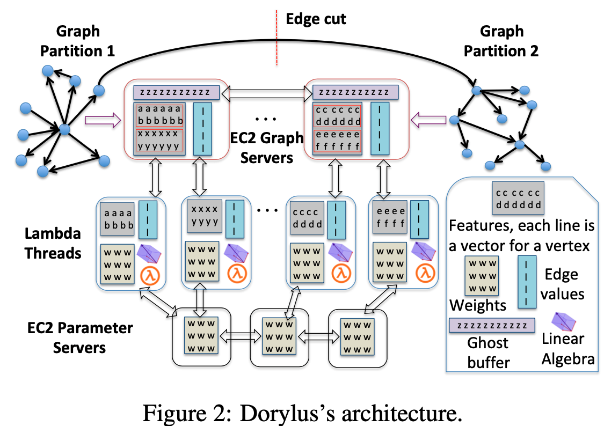

- index
{:toc #markdown-toc}

# Question

1. Why is using serverless cheaper than using a cluster of CPU?

   => Users not only pay for computing but also pay for unneeded resources. (storage)

   Note that Lambdas are a perfect fit to GNNs’ tensor computations. While one could also employ regular CPU instances for compute, using such instances would incur a **much higher monetary cost to provide the same level of burst parallelism** (e.g., 2.2× in our experiments) since users not only pay for the compute but also other unneeded resources (e.g., storage).

2. The system update the weight and gather graph in a bounded asynchrony manner, and thus maintains multiple version for weight. When sync the weights?

   => Perodically broadcast.

# Introduction

## Background & Motivation

GNN family (e,g. GCN) has gained lots of success. It's essential to train GNN in an affordable, scalable, and accurate manner.

## Gap

Training GNN requires lots of GPUs, but:

- Using GPU in the cloud is costly. 
- GPU has limited memory, hindering scalability. 

CPU-based training and graph sampling are used to solve those two issues (high cost and poor scalability.)  But:

- CPU has poor parallelism computation and thus has poor efficiency. 
- Graph sampling incurs time overheads and reduces the accuracy of trained GNN.

## Challenge

Using serverless can scale with low cost, but it's challenging to adopt it to DNN training:

- How to make computation fit into lambda's limited compute resources: 

  - A lambda thread is too weak to execute a tensor kernel on large data. (large data => high FLOPs => longer time)
  - Breaking data into tiny mini-batches incurs high-data transfer overhead.

- How to minimize the negative impact of Lambda's network latency. 

  - One-thrid of time on communication. 

    Eg, When the number of Lambdas it launches reaches 100, the per-Lambda bandwidth drops to 200Mbps

## Goal

This paper proposes **affordable, scalable, and accurate** GNN training. 

- Affordable: low-cost.
- Scalable: billion-edge graphs.
- Accurate: higher than the sampling-based method.

Details:

- Use serverless computing and CPU servers. 
  - It overcomes the above challenges by **dividing** the training pipeline into tasks and executing them with suitable resources. 
  - Graph operations => CPU
  - Tensor computation => Lambdas.
- Use the bounded pipeline asynchronous communication (BPAC) model to reduce communication overhead. 
  - Different tasks overlap each other.
  - Allow **asynchrony** in parameter update and data gathering process. And also bounds the degree of asynchrony.

# System Design and Contribution

GNN forward can be divided into four computation stages: **Gather, ApplyVertex, Scatter, and ApplyEdge.** 

The graph is partitioned intqo the edge-cut algorithm.

## Tasks and pipelining

**Goal:** This is about how to decompose tasks into fine-grained tasks such that 

- The computation can be fit in Lambda.
- Tasks can be **Overlap** .

1. Fine-grained tasks => fix task into lambda.

- Graph computation (adjacency matrics) => on graph sever.
- Tensor data computation => on Lambda to benefit massive parallelism.
- Weight-update => on PSs.

2. Pipelining enables **overlapping** such that the communication cost can be hidden. 

- Vertices are partitioned into groups called intervals. 
- Each interval computes GA using one thread in GSs. Once the GA is done, the results are pushed into Lambda for AV.
- **Overlap** the graph-parallel of **one interval** and tensor-parallel computations of **another interval**.  

## Bounded Asynchrony

**Goal:** Async training may uses more epoch to reach one acc, but each epoch uses less time. Exp shows the total efficiency is higher. 

Two kinds of asynchrony

- Asynchrony weight Updates (using weight stashing technique)
  - Each Lambda send local gradient to PS, and then fetch new weight from PS. PS update directly without waiting for other worker's gradient. It requires multiple versions for each vertical group/interval.
  - Fully replicate the latest weight over all PS server to enable load balancing. 
  - Partition versions to mulitple PS to reduce the memory usage of each PS.
  - PS periodically broadcast their latest weight to do the **weight aggragation?**
- Asynchrony Gather
  - Vertex intervals to progress independently using **stale** vertex values of its neighbors without waiting for their update.
  - Fast-moving vertex interval is allowed to be at most S epoches away from the slowest-moving interval. Otherwise, the fast-moving vertex will stop GA and wait for slow-moving vertex to update

The paper also discusses their converge guarantee. 

- As for the proof of converge of Weight Update, it mainly cites the previous paper. 
- As for the convergence of asynchronous Gather with bounded staleness S, it proposes a new algorithm and assumes N (iteration) => infinite.

## Lambda Management

Each Graph server maintains a lambda controller. 

**Optimizations:**

- Task Fusion: 
  - merge ApplyVertex and gradient calculating of the laster layer together. 
  - Save the communication between Lambda and GS.
- rematerialization
  - Re-calculate AHW ?
- Lambda-internal streaming:
  - Overlaps computation with communications.
  - Retrieve the first half of the data to compute, and fetch another part simultaneously. 

**Autotuning Lambda nums**

- Autotuner auto-adjusts the number of Lambdas by monitoring the CPU's task queue. 

# Evaluation

Measure Metrics:

- **Value** == Performance-per-dollar, V = 1/(T+C), T == Training time, C == Cost

Exp:

- Measure the instance types to determine the cloud resources yielding optimal **value** for each backend. 
  - Compare 2 CPU instance over two datasets and indiciting C5n is always better than another CPU in instance, 
  - Compare one dataset over 2 GPU instances, indiciting P3 give the best value. 
- Measure synchronous and asynchronous.
  - Async training requires more epoch to converge to same accuracy compared with sync training, but each epoch uses less time. Overall, async can improve the efficiency. 
  - Experimentally decide staleness values S (When the qucikler will wait for slower. )
- Measure **value, performance and scalability** on effects of Lambdas and compare with CPU and GPU-only implementations.
  - GPU-only, CPU-only, 

- Compare with existing system 
  - Compare accuracy with sampling based.
  - Compare speed to reach a test accuracy. 
  - Performance-per-dollar. 