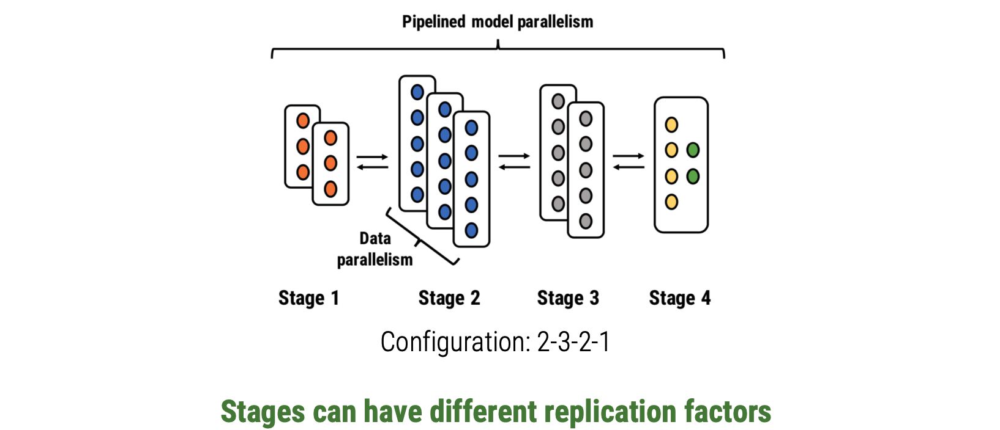
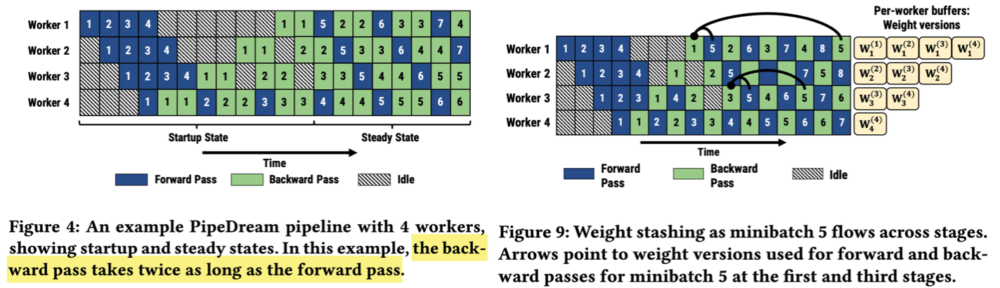

- index
{:toc #markdown-toc}

# Question

1. Why it can reduce the communication cost?

# Introduction

## Background & Motivations

DNNs are getting larger and computationally expensive to train, thus requires parallel execution acorss multiple accelerators. 

Intra-batch parallelization: 

- Data parallelism with BSP/ASP. Where the worker receive the gradients. Limitations is mianly on communinication. 
- Model parallelism: limitations: under-utilizations of GPUs and unconvenience of the manually partitioning. 

Inter-batch parallelism:

- Pipeline parallelism. E,g. GPipe.

## Gap

Data-parallelization training suffer from high communication cost at large scale. E,g. when workers == 32, the communication cost takes 90% of total training time. 

## Goal

Propose an system using pipeline parallelism to enable faster DNN training by combining intra-batch parallelism with inter-batch parallelization.

- Overlaps the computations and communications of different inputs in a pipelined fasion. 
- Achieve **high hardware efficiency** with no ppeline stalls in steady state. 
- **High statistical efficiency** (number of iterations needed to reach a particular target accuracy) comparable to data parallelism using the same number of workers.
- Low communication overahead.

## Challenges

DNN training is bi-directional thus incurs some challenges for using pipelining. 

- Inject all minibatches in an epoch 
  - => cannot reach desired target accuracy since gradients are averages over all training samples. 
- Inject m minibatches and update weight every m minibatches. (GPipe) 
  - => reduce the hardware efficiency (many unused time unit for each hardware. )

### Worker Partitioning

**Obj**:

- high hardware efficiency. 

Problem defination:

- Each stage has euqal time usage and less idel time => better hardware efficiency. 
- Less communication => better hardware efficiency.
- Each operator have different stage, thus uniformally split the model may not the optimal.

**Solution:**

- Replicate the slow stage (data parallelism) to reduce increase the throughput. 
- Propose a partition algorithm to ensure each stage completes at roughly the same rate, while trying to minimize communication across workers in a topology-aware way. It computes
  - **partition** of layer into each stage, 
  - **replication** factor for each stage, 
  - optimal **number of mini-batches to kee**p training pipeline bust. 

- The partition algorithm replies on a profiler to measure time of F/B pass, size the layer outputs, size of parameters.

### Worker scheduling

**Obj**:

- High resource utilization.

**Problems**:

- determine whether it should perform forward/backward/ tasks.
- determine how the minibatches be routed with replicated stages.

**Solution**:

- 1F1B scheduling. Worker alternate between F/B pass
- Gradients are used to update model wieght immediately. (GPipe need to wait for gradient aggregation, thus slows the resource utilization. )

### Effective Learning

**Obj:**

- Effective learning.

**Problem**:

- Forward on one minibatch using w0, and backward may updates on w1 (w0 is already updated by another mini-batch.). Which chould reduce the effectivness. 

**Solution**:

- Use **weight stashing** to avoid the mismatch between weights of a single stage/GPU.
  - Weight stashing cannot guarantee the consistency across stages. 
- Vertical Sync:
  - Eliminates the potential inconsistency across stages.

​	Multiple version of weights are averaged together perofidically? 

# Evaluation

Macro-bechmarks

1. Speedups in Time-to-target-accuracy.
   - compared with data parallelism
   - compared with model parallelism, and hybrid parallelism
2. Reduce the overheads of communications without increasing memory usage.
   - compared with GPipe. 

Microbenchmarks

1. Optimizer

2. Memory Footprint. 

3. Communication overhead. 

4. Effect of pipeline depth

   
