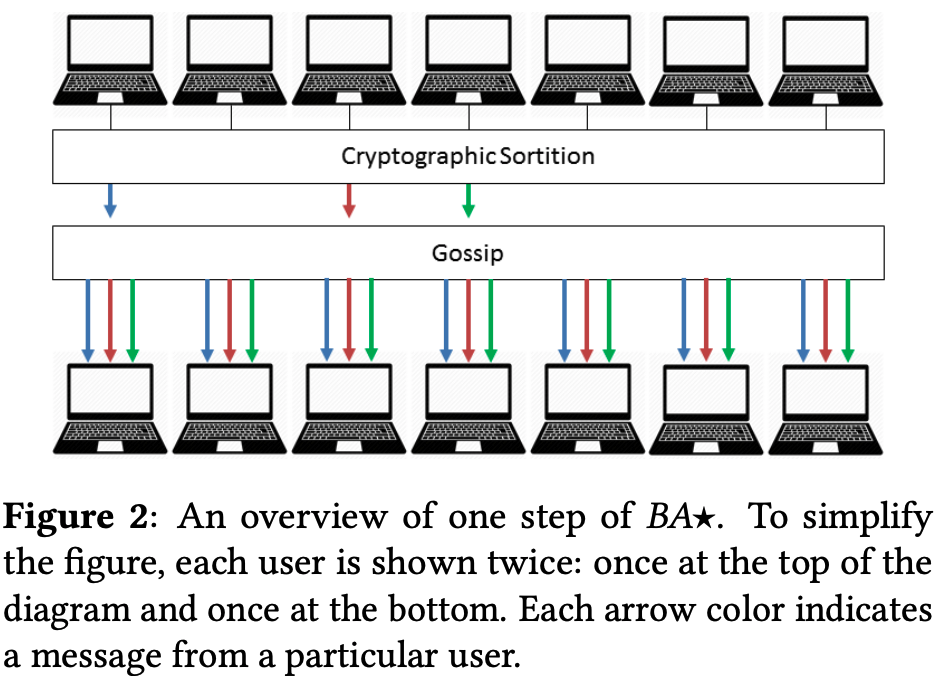
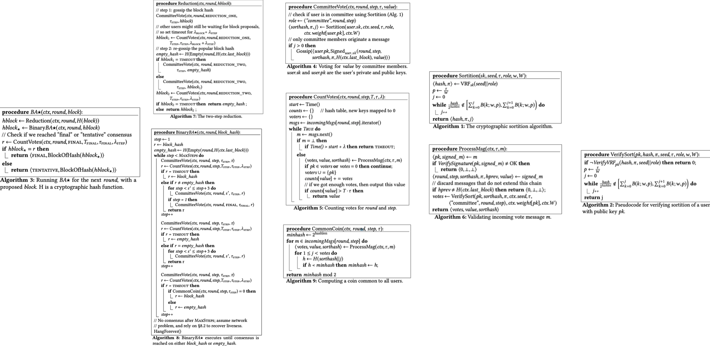

- index
{:toc #markdown-toc}

# Questions

1. Why the user has sub-users j?
2. When is the block chosen? 
3. Vote for the user of the vote for value. Why does the user receive a vote? 
4. Why P = tal/W
5. Does every run the r run select Protocol?
6. Why are there sub-user? Users and sub-users? 
6. If only the committee could vote, how to make sure the committee has honest? How many dishonest members were used? 
6. Reduction already reaches a consensus on some value. Why still need Binary BA?
6. Some users' xs are quickly committed, while others' TXs are not committed soon. 
6. Only the committee votes or all users count votes. 
6. Is it possible for some users whose local TXs may always be preempted by others?

# How to handle various threats

- Sybil attacks => are addressed by using weighted users. 

- Cryptographic sortition => select committee in a private and non-interactive manner => attacker doesn't know who to attack until the user starts participating in BAstar. 

- Each committee member only speaks once (in other words, replace a new committee in each step ) => the user becomes relevant to BAstar, attacker targets on committee member once the member sends a message in BAstar.

In short, the attacker doesn't know who to attack, and once he knows, the committee may not be the committee anymore. 

- Replacing committee members => Reduce Dos attacks. 

- Avoiding fork => 
  - Two kinds of consensus, namely, final and tentative consensus. 
  - Periodically invokes BAstar to reach a consensus on which fork should be used going forward. 

# Liveness and Safety

## Liveness

- Assume strong synchrony.

## Safety

- Assume weak synchrony. 

# Introduction

## Background & Motivation

Cryptographic currencies enable new applications such as smart contracts and fair protocols. It also avoids trusted centralized authorities.

## Gap

However, current proposals suffer from a **trade-off between latency and confidence.** 

- Achieving high confidence requires an hour-long wait ( An hour to confirm a transaction in Bitcoin, wait for six bocks; Otherwise, there are double-spending problems. )
- It achieves 1 MByte block of transactions in 22 seconds with 50,000 users.

## Goal

This paper presents Algorand, a new cryptocurrency designed to confirm **transactions on the order of one minute.** It mainly relies on the BA protocol, BASTAR, to reach a consensus on a new block with low latency and without the possibility of forks. 

**Highlights**

- Proof of Stake based Cryptocurrency 
- High throughput: ~1 min to confirm transactions vs. an hour in Bitcoin
- Public ledger with **low probability of forks**
- Assumes 2/3-honest stake majority

## Challenge

- Avoid Sybil attacks
- Be able to scale to millions of users.
- Be resilient to denial-of-service attacks. 

## Solutions Overview

- **Weighted users:** 
  - Assign a weight to each user; As long as the majority weighted fraction of the users is honest, consensus can be reached. (avoid fork and double-spending)
  - **To prevent Sybil's attacks.**
- **Consensus by committee** 
  - Select a subset of users as committee
  - **Ensure good scalability.** 
- **Cryptographic sortition:** 
  - Each system user independently determines if they are chosen to be on the committee by computing a function VRF. 
  - **Non-interactive  => to prevent an adversary from targeting committee members.** 
- **Participant replacement**
  - Each user only speaks once.

# Protocol summary

**POW**

- Wait for six blocks to confirm one tx due to the possibility of forks.

**Byzantine consensus**

- Requires a fixed set of servers to be determined ahead of time; allowing anyone to join could open up to Sybil's attacks. 
- It cannot scale to a large set of users.
- Some optimization protocols: BFT2F, Honey Badger, Bitcoin-NG, Hybrid consensus, ByzCoin, and Stellar.

**POS**

- Avoid the computation overhead of POW.
- Hard to realize. Since no work is involved in generating blocks, a malicious leader can attack. 
- Some optimization protocols: Ouroboros, 

**Trees and DAGs**

- Replace the underlying chain structured ledger with a tree or DAG.

- GHOST, SPECTRE, Meshcash 

# Technique details

## Goal and Assumptions

**Assumptions:**

- Public-key signatures and hash functions. 
- Honest users run bug-free software.
- The fraction of money held by honest users is above some threshold **(a constant greater than 2/3)**
- An adversary can corrupt targeted users, but an adversary cannot corrupt many users that hold a significant fraction of the money.

**Goals:**

- Liveness: Make progress under various network reachability.
  - Achieved by assuming strong synchrony; 95% of honest users can communicate with time-bound; no network partition. 
- Safety: If an honest user accepts one tx A, then all tx accepted by others will be in the log containing A
  - Achieved by assuming weak synchrony; the network can be asynchronous in a long bound time; 

## Overview

Each user submits a tx to **gossip protocol** and then collects a **block of pending Txs** they hear about.

- Gossip protocol: Each user selects a small random set of peers to gossip messages to. And the message is signed using PK to prevent it from being forged.

Then it uses BASTAR to reach a consensus on **one of those blocks.** 

BASTAR can produce two kinds of consensus:

- Final consensus: Once a block reaches the final consensus, all Txs are confirmed. 
- Tentative consensus:
  - When the network is strongly synchronous, one successor block will eventually reach a final consensus.
  - When the network is weakly synchronous, the fork may happen. Algorand periodically invokes BASTAR to reach a consensus on which fork should be used.

## CRYPTOGRAPHIC SORTITION

This is to choose a random **subset of users** according to per-user **weights** in each round. And the randomness comes from seeds.

**Sortition**

The Algorand mainly uses VRF to choose users randomly. 
$$
hash,  proof = VRF_{sk}(x)
$$

- **Hash** is to decide how many sub-users under this user are selected. 

- **Proof** is verifying if the user is selected; this is achieved by verifying that the hash corresponds to x using the public key. And verify the number of chosen sub-users is publicly verifiable.

**Choose Seed**

Sortition requires a seed chosen at random and publicly known in each round, and the seed is determined using VRF with the source of the previous round r-1.

**Choose SK**

Choose SK before generating the seed, such that even selected user is malicious, the resulting source is random. 

## BLOCK PROPOSAL

This is to choose a subset of users as proposers, such that there exists some block in each round. The paper decides on 26 proposers in practice. 

**Reduce communication cost**

The block with the highest priority will reach a consensus among users. The sortition hash is used to prioritize block proposals to reduce the communication costs caused by sending local leagues to others for each user.
$$
priority = Max(Hash(hash_{sortition} + Index_{subuser0})...Hash(hash_{sortition} + Index_{subuserJ}))
$$
Algorand gossips two kinds of messages

- Msg1: It only contains priority and is proofs and sent to all users. Each user uses it to discard blocks with low priority.
- Msg2: It contains the entire block

**Waiting for block proposals**

Waiting too short will result in an empty block, and waiting for too long will increase confirmation latency. 
$$
WaitingTime = \lambda_{stepvar} + \lambda_{priority}
$$

## BASTAR

### Two phases

- Phsae1 - Reduction (2 steps):
  - Reduce the problem of reaching a consensus on a block into an agreement on one of two options.
  - This is to ensure at most; one non-empty block hash is passed to BinaryBAstart by all honest users. 
- Phsae2 - BinaryBAstart (2-11 steps): 
  - Reaches agreement on one of these options: either agreeing on a proposed block or an empty block.
  - Two steps if the highest-priority block proposer was honest (sent the same block to all users) and expected 11 degrees when facing a malicious proposer. 
  - When it's an honest proposer, firstly, each committer votes for some value, and then all user count votes. 

# Evaluation

Measure latency 

- Vary the user from 5K to 50K.
- Vary the bandwidth ( scale-out.)

Mesure throughput

- Vary block size .

Resource costs

- Measure CPU, network, and storage usage. 

Misbehaving users

- Latency over increasing malicious users. 

