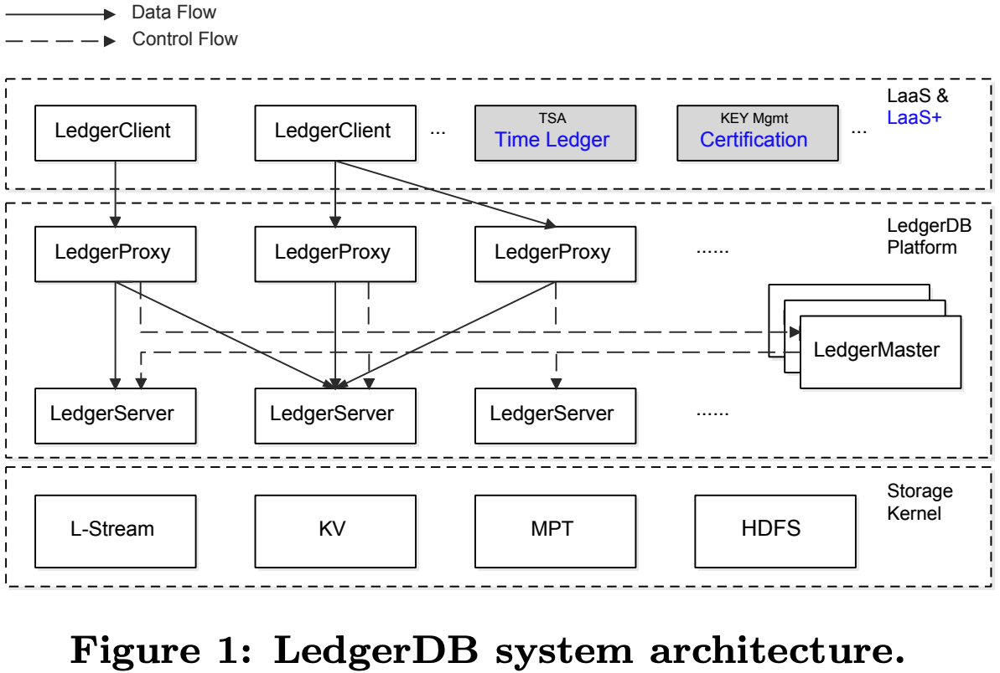
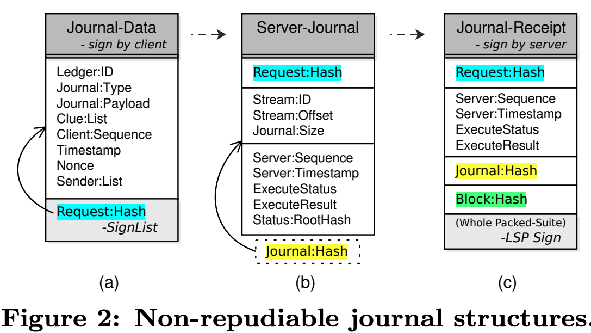
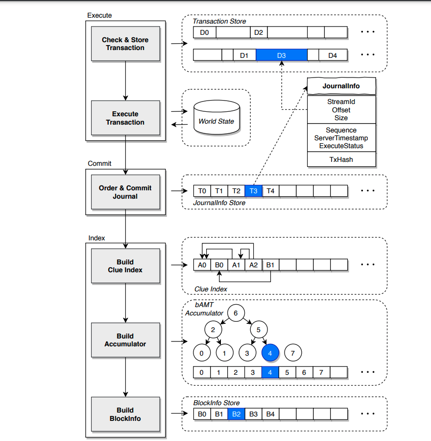

- index
{:toc #markdown-toc}
# Questions

1. Does one journal include many transactions? 

# Introduction

## Background & Motivation

Decentralization is a fundamental basis for blockchain systems, including permissionless (Bitcoin, Eth) and permissioned systems (Hypeledget Fabric, Corda). However, the decentralized architecture reduces the system performance in low throughput, high latency, and significant storage overhead. 

Moreover, many applications deploy their permissioned blockchain node in a single service provider, leading to a centralized infrastructure. 

Thus, the necessity of decentralization property needs to be re-examined.

## Goal

This paper proposes a **centralized ledger database** to provide **tamper-evidence and non-repudiation features**. And with the following properties:

- Strong auditability.
- Broad verification coverage.
- High throughput (write/read)
- Low storage cost.

## Gap

1. Most existing ledger and blockchain systems only support internal audits, and fewer provide external audits. 
2. Permissioned blockchains are significantly limited by their decentralized architecture. 
3. Most existing systems don't support data removal operations and incur high storage costs. 

## Challenge

1. **Centralized Required:** Many permissioned blockchains only seek tamper resistance from cryptography-protected structures, such as hashed chains and Merkle trees. And decentralization and smart contracts are not used.
2. **Threat Model**: The permissioned blockchains have limited auditability since consensus protocols are deceptive for external auditors.
3. **LSP Dependent**: Existing centralized ledger databases (QLDB and Oracle) assume a trustful ledger service provider (LSP), which is hard to achieve. 
4. **High Storage Cost**: Immutability provided in the existing system requires storing data permanently and disclose, leading to increased storage overhead and cost. 

# Technique details

## Design Goals

The paper tries to provide strong audibility (internal and external), high write performance, and data removal support. 

- **Auditability**: The capability of observing user actions and operation trails. For example,g. the auditor should confirm that the **data content has not been tampered and the issuer is authentic.**
  - Internal audit: internal users can observe and verify the authenticity of all actions conducted by all participants.
  - External audit: the third party can observe and verify the authenticity of all transactions conducted by all participants.
- **Threat Model**: 
  - Assume users' and LSPs' identities are trusted; third-party timestamp authority is trusted; honest majority;
  - Tolerate two attacks: server-side malicious tampering and LSP-user collusion tampering. And there are three threat models derived from those two attacks. 
    - Threat-A: server-side attackers tamper with incoming transactions when the user's request arrives.
    - Threat-B: server-side attackers tamper (update, delete, insert) historical transactions to cheat users.
    - Threat-C: LSP-user attackers tamper (update, delete, insert) historical transactions to cheat users. 

## System Overview

LedgerServer and LedgerProxy are stateless services. Storage replicated using raft protocol.

Each transaction is saved in one journal; multiple journals are grouped into a block, and multiple blocks are grouped into a ledger. 

Multiple APIs are supported, such as append, retrieve, verify, purge, occult, recall, and delete. 

## Journal management

Committed transactions are tamper-resistant, non-repudiable, and persistent. 

**Journal Structure:**

Client sign with PK => resolves the threat-A. Journal-receipt => resolves threat-B.

**Tx processing**

The order-and-execute approach has low throughput, while the execute-order-validate (Hyperledger Fabric) approach has high declines when the conflict rate is high in validation.

The paper uses an **execute-commit-index** transaction management approach.

## Verification

s

## Native Provenance

s

## LedgerDB in Production

s

# Evaluation

