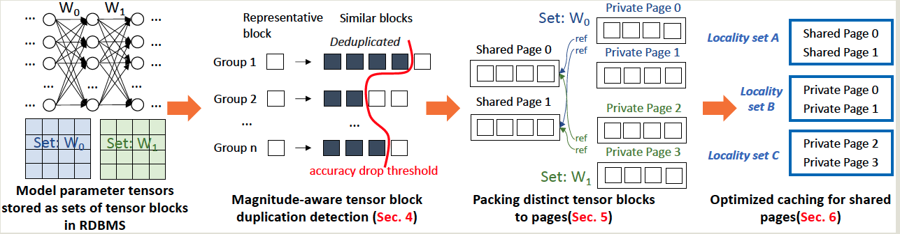

- index
{:toc #markdown-toc}

# Summary
This work is sutiable when the model are too large to fit in the memory, and the imput feature are large in size and the overheads for transmitting input features from DB to deep learning framework are unacceptable.

1. For the deplication detection, there are un-countable combinations of the deduplication. The current paper deduplicate one tensor block one time, but doesn't consider more complciated combinations.
1. The paper mentioned the memory locality optimization, data independence, views and fine-grained authorization can significantly reduce the operational costs and simplify system management. But this paper doesn't use any of those, and propose a new algorithm for each component. So why not just design a seperate system?
1. Is it important to improve the storage efficiency in ML scenario?

# Introduction
## Background & Motivation
Model serving has some operational costs due to the **decoupling** between data management and model serving systems. For example

- Model serving requires loading each tensor into memory. => **high memory cost**
- Transferring data features from DB to the model serving framework incurs **high latency.** 

The DB query has integrated with storage and memory hierarchy, thus cann handle large working set even exceed the overall memory.

Thus, it's essential to investigate the **serving DNN model from RDBMS natively**.

Specifically, **tensor deduplication by using RDBMS** in multi-model serving systems can reduce **memory usage and inference latency** and thus must be resolved immediately. 

## Gap

Existing de-deduplication techniques used in RDBM, files, and tensors are not applicable to model serving from RDBMS since

- Lacking consideration of **model inference accuracy** (deplication may reduce the accuracy)
- Lack consideration of database techniques such as indexing, page packing, and caching.

## Challenge

1. How to leverage indexing to detect similar parameters that can be **deduplicated without hurting the inference accuracy**?
2. A database page can contain multiple tensor blocks. How do we **pack tensor blocks into pages to maximize page sharing across multiple models** and **minimize the number of needed pages representing all tensors**?
3. How to augment the **caching policy** to i**ncrease the data locality** for deduplicated model parameters so that **pages that multiple models need** have a **higher priority** to be kept in memory.

## Goal

The paper proposes a novel **RDBMS storage design** optimized for tensor and DNN inference workload.

Performance metrics:
- Reduction in storage size, 
- Speed-up in inference.
- Improved cache hit ratio. 

## Solutions Overview

- Tensor block index for fast duplication detection
- Packing distinct tensors to pages to minimize storage size.
- Deduplication-aware buffer pool: It designs a cost model for locality-aware page eviction; it gives each item priority.

# Technique details

Deduplication progress overall:

1. **LSH-based Index:** Duplication detection.
   Similar tensor blocks can be replaced by one representative tensor block, with limited impacts on the model inference accuracy.
   1. tensor => tensor blocks
   2. estimate impacts of the tensor block on the final accuracy using **aggregated magnitude value.**
   3. pick all tensor blocks with low magnitude values (less impact), compute their index using LSH, and then replace it with exisitng tensor block.
   4. testing the real accuracy of the deduplicated model.
   5. stop the procedure if the accuracy blow a threshold.
2. Store the tensor blocks.
   1. page is the **smallest unit of data for I/O read/write** and cache load/evict operations.
   2. store the block into disk such that each tensor is **exactly** covered by a set of pages, and the number of pages to store all models are **minimized**.
   3. The paper formate it to a optimization problem and use Two-Stage Page Packing Strategy to solve it.
      1. group shared tensor block together, use devide-and-conquer to parallelly pack few tensor block in the same group into few page. One page is allowed to mxi blocks of different group. This may cause non-full page exist.
      2. repacking blocks from non-full pages.

3. Cache the shared page to improve cache hit rate.
   1. LRU/MRU/LFU don't consider shared or private data access.
   2. It uses queueing theory to model the page access.

# Evaluation

## Macro benchmark

Measure latency over workloads running many models at the same time.

- Latency 
  - Compare on HDD, SDD, optimization. vs model number
  - Compare on HDD, SDD, optimization. vs buffer pool size: 
    - large buffer pool caches more tensor blocks, thus reducing the latency.		
    - dedpulication + caching + SSD outperform all other configurations.

  - Compare with TF-CPU, TF-GPU => the system can serve more models.

- Accuracy drop
- 

## Micro benchmark

- Eval of deuplicated block detection
  - measure accuracy on various duplicate ratio.
- Eval  of Page Packing Algorithms
  - measure total required pages to store modesl on two-stage vs basic 
- Eval of caching optimization
  - measure cache hit rate.
