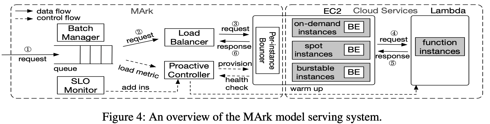
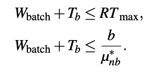

# Questions

# Introduction

## Background & Motivation

Model Training, Model Inference.

Model inference requires 

- SLO (98% of inference queries must be served in 200 ms)
- Minimizing the cost of provisioning the serving instances in the cloud

## Challenge

It's challenging to be low-latency and cost-effective.

1. How to choose cloud services?

## Gap

No general guidelines targeting cloud services comparison for model inference.

## Goal

1. The paper first performs extensive measurement studies of inference serving in AWS and GOOGLE Cloud and focuses on IaaS (VMS), CaaS (Containers), and FaaS (Functions). 
   - IaaS offers the **best performance-cost ratio** for inference serving but cannot quickly adapt to the changing workload due to long instance provisioning latency.
   - Inference can benefit from batching when using GPU/TPU with a well-defined batching scheduler. Serving low-load inference queries may not be so economical when using GPU. Thus it needs a scheduler to define when to scale up from CPU to GPU.
   - Stateless computational properties open the door to even-more efficient resources.
2. Based on the findings, the paper proposes a low-latency and cost-effective inference service system. 
   - Based on IaaS and uses FaaS to fill the SLO gap quickly.

# Technique details

## Characterizing model serving in cloud

The paper first characterizes ML serving performance with IaaS, CaaS, and FaaS, as well as their configuration space.

1. The paper firstly illustrates that the IaaS have poor scalability, but it's more cost-effective.
2. Then the paper conducts experiments to find 
   - Which type of IaaS to use?
   - How large is the IaaS instance to use?
   - Use CPU or GPU IaaS instance?
3. The paper also measures the above configuration in Google Cloud.

## MArk-System

SLO requirements:

- Response Time Threshold: A request is deemed fulfilled only if its response time is below $*RT_{max}$. 
- Service Level: The service is considered satisfactory only if at least $*SL*_{min}$ percent of requests are fulfilled.

Design:

- EC2 is used as primary and uses Lambda to quickly cover the service gap when there is a need to scale out.

- Periodically measure the workload and send it to the Proactive Controller, which predicts (based on LSTM) and plans instances to reduce over-provisioning by sending launching and destroying requests.

- The scheduler does two things:

  - Determines the time used for batching and inferencing with following:

    

  - Greedily find the most cost-effective instances

- Uses of spot instance and strategical concurrency warm-up to further reduce the cost and latency.

# Evaluation

## MacroBechmark

Compare the overall latency with the baseline - SegaMaker.

Compare the latency over different models with baseline - SegaMaker.

## Microbenchmarks

Robustness: (Constant workload, latency VS online-running time.)

- Measure the latency under different surge rates.  
- Measure the latency over on-spot instances. 

