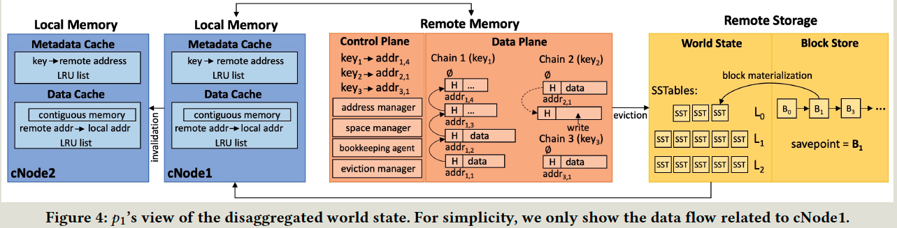

- index
{:toc #markdown-toc}
# Questions

# Introduction

## Background & Motivation

Blockchain as a service (BaaS) requires ` compute-intensive` or `memory-intensive ` smart contracts at different times. Autoscaling can increase the throughput but cannot improve the resource utilization of each component, E,g.

- Compute-intensive: AI-driven blockchains, Blockchain safeguards the integrity of the data.

Resource disaggregation is the recent trend where resources are reorganized from servers to physically distinct pools that are dedicated to processing, memory, or storage; those are connected to a fast network such as RDMA.

It has benefits:

- Independent scalability. (Upgrade and expand each resource independently.)
- Efficient resource utilization.

## Challenge

Achieving memory and compute elasticity.

- Memory: read/write and buffer eviction need careful design. 
- Sequential conflict checks and world state updates in the validation stage require concurrency control.

## Gap

Existing BaaS need to achieve high resource efficiency. 

## Goal

This paper proposes a disaggregated permissioned blockchain service. 

Key Insights:

- XOV (simulation and validation) in Hyperledger Fabric is naturally disaggregation and can be parallelizable.
- Blockchain state resides in the KV store and thus can be stored in a remote memory pool.

Contributions:

- Redesign Blockchain in disaggregated architecture.
- Designed a tiered KV stored
- Designed dependency-graph-based concurrency control.

Measure:

- Resource utilization with minimal performance overhead.

# Technique details

## Comparison

Traditional XOV blockchain:

- Each peer updates the local copy without synchronization with others.
- Store local data (intermediate results) in the main memory, while user data is stored in the KV store.
- Ordering service nodes (OSN) are used to establish consensus.

FlexChain:

- Pear disaggregation: 
  - Each pear runs in multiple nodes with disaggregated compute, memory, and storage nodes.
-  Uses 3-tier storage instead of simple one KV storage.
  - Tmp data => local memory, 

## Architecture

LoadBalancer

Compute Pool: perform smart contract(X), endorsement policy evaluation (v1), conflict check (v2), and world state update (v3)

Memory Pool: storing each peer's own copy of the world state.

Storage Pool: store blockchain ledger and world state evicted from the Memory pool

Order service nodes: dependency graph for each block. 

## Process

## Disaggregated Word State

