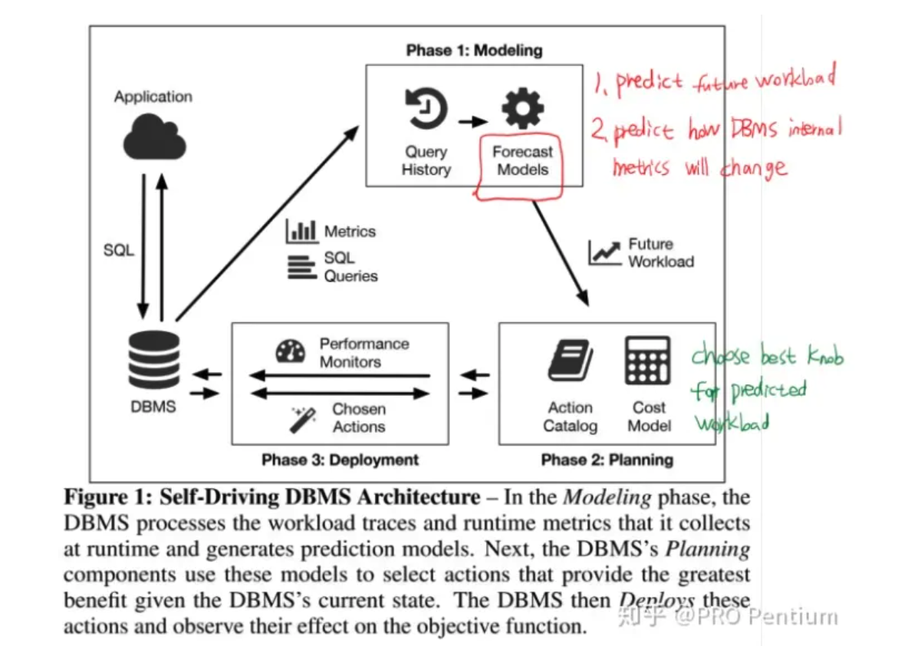

# Questions

1. Does the data collection be counted as part of training time?

# Introduction

## Background & Motivation

Self-driving DBMS seeks to automate the tuning and optimization tasks for the database to fit an objective target function.**(throughput & latency. )**. It includes

- Forecasting system: Predicts the future workloads based on existing workloads
- Behavior model: With the forecasted workloads, it predicts runtime behavior relative to the target object.
- planning system: Select the actions which improve the target object

And it mainly controls 

- physical design
- knob configurations
- Hardware resources.

e,g. add a index => behavior model => CPU/Memory usgae => affect the queries.

While the behavior model needs to be trained with DBMS data, including 

- Several tuples a query will consume. 
- hardware metrics (CPU instructions, memory allocations)

## Gap

An offline method has some limitations, such as copying whole DB data and conducting the training.

- It requires significant time and computational resources to train.
- You cannot try all combinations of physical design and knob configurations. 

## Challenge

Online training data collection can quickly fit the model to the new behavior.

- Online data collection is bespoke and imposes runtime overhead.

It takes work to efficiently and accurately conduct online data collection.

## Goal

The paper presents the TS framework for efficient and accurate training data generation in self-driving DBMSs.

- Collects metrics using hardware-level performance counters, kernel-level observations, and application-level counters.
- Combine those to form training data.

# Technique details

