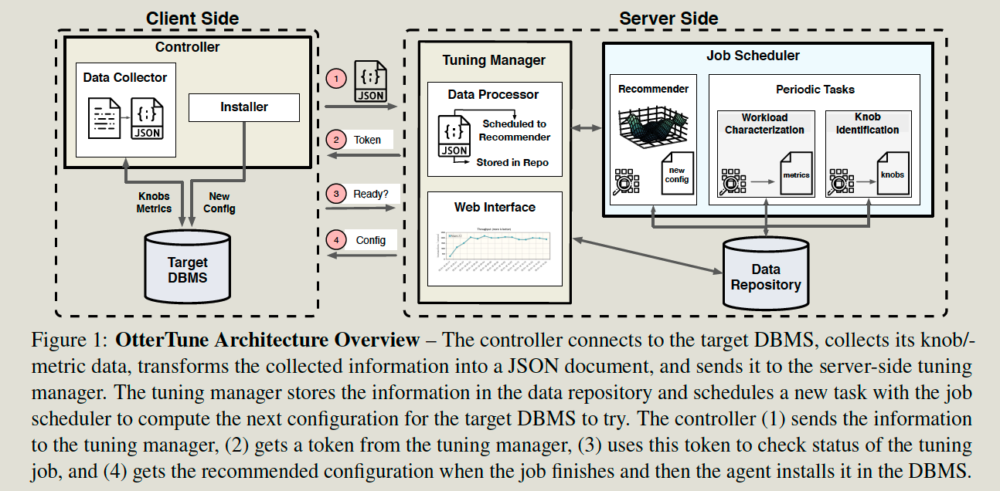
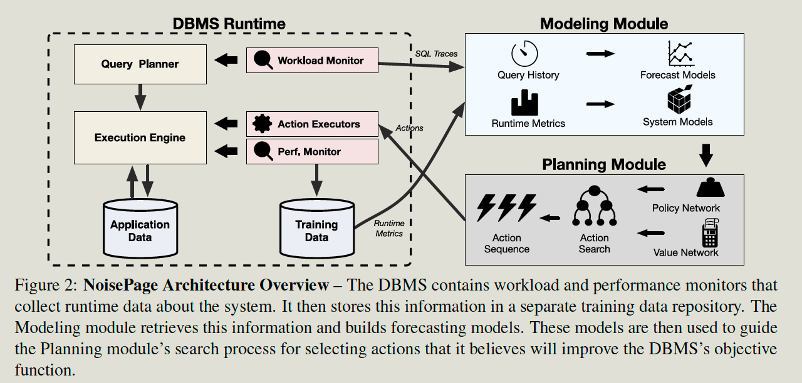

- index
{:toc #markdown-toc}
# Questions

1. Does the data collection be counted as part of training time?

# Introduction

## Background & Motivation

The goal of this tuning is to improve a DBMS’s operations based on some **objective function (e.g., faster execution, lower costs, better availability)**

Existing DBMS provide APIs to tune their

- **Physical design**: E,g. index, data structures, and partitions. 
- **Knob confi**g: E,g.  caching policies.
- **Hardware resource allocation**: How to use the resource, provision (adding disks, memory, or machines), or redistribute existing resources. (partitioning tables across disks)
- **Query plan hits** to force the DBMS optimizer to make certain decisions for individual queries. (join orderings)

The ML-based method has the following steps:

- Tunning agents predict the benefits of each action (add index etc.)
- Tunning agents choose one with the most significant expected rewards.
- Tunning agents observe the effects of deployed actions.
- Tunning agents integrate the new data to improve the model.

## Challenge

How to automate this process and reduce the burden on humans

## Goal

The paper discusses two engineering approaches for integrating ML agents in DBMS. And discuss their trade-off.

- external tunning controller 
- Integrate ML agents natively in the DBMS architecture.

# Discussion

ML-based automated DBMS requires an agent, which responsible for the following: 

- Acquire data
  - Workloads or data distribution => for the tunning query optimizer.
  - low-level metrics => knob configuration
- Train a model: 
  - Offline training: replays a sample workload trace and trains offline.
  - Online training: observe the workload and apply on-the-fly
- Model category:
  - Supervised: It predicts the cardinality of the query plan operators. ( cardinality:  the number of unique values in a relational table column relative to the total number of rows in the table)
  - Unsupervised: It predicts the workload categories by clustering.
  - Reinforcement learning: agent trains a policy that selects actions to improve the objective target function. 

## External Agents

It is to reuse the DBMS’s existing APIs and environment data collection infrastructure (e.g., query traces, performance metrics)

It needs a controller running on the same machine with DBMS to install changes not accessible by the original API.

Challenges:

- Unavailability time during the restart of the Database for new cogs.
- It can only collect data that the system already exposes.
- It requires a human introduction to illustrate if some action is applicable, e.g., turn off the WAL.

## Internal Agents

Natively supporting autonomous operations in DBMS has benefits:

Benefits:

- Expose more information about the system's runtime.
- Can enable more low-level control of the DBMS

Challenges:

- It's hard to capture the dependence; each tuning agent operates assuming that other agents/components are fixed, which would not hold in production. E,g. memory allocation agent assigns memory between **query result caching and buffer pool for index and data pages.**

Solutions:

- Use single agents rather than separated agents.

# System examples

## OtterTune

Knob Tunning services

- Selects the target objective for tunning and optional configurations. (query API / monitoring service, benchmarking framework)
- Run a simple workload as a baseline.
- The tuning manager then tries different combinations until the user is satisfied.

## NoisePage

It can **tune and optimzie itself automatically** without any human intervention other than selecting the objective target function on start-up.

It's based on a Postgres-compatible HTAP system.

It uses HyPer-style MVCC over Apache Arrow in-memory columnar storage.

Supports actions:

- In physical database design (add/drop indexes)
- knob configuration (e.g., memory allocation)
- hardware resources (e.g., scaling up/down)

Modeling steps:

- Workload traces and database statistics => train model => predict future workloads and the database state.
- Internal metrics => train model => predict how the DB internal sub-systems will respond to configuration changes.

Planning steps:

- Predict the future workloads.
- Search for an action achieving the best **reward (for the pre-defined objective)** without violating human-defined constraints. (SLO, hardware budgets). It uses tree-based optimization methods, MC search tree, or RL methods.
- **Challenge** here is: how to represent the dynamic action in the DBMS's model fixed-length feature vectors.

Deployment steps:

- Efficiently execute the action's sub-tasks, and observe its effect on its performance both during and after the deployment.
- Update the model using the collected data.

