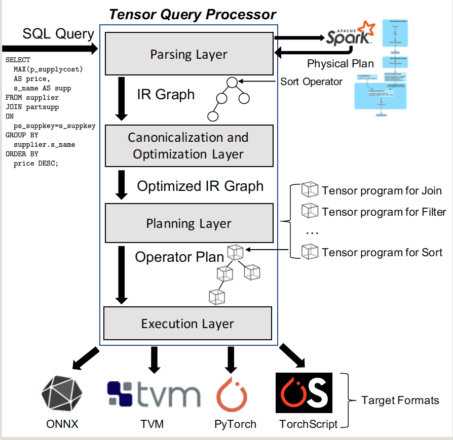

- index
{:toc #markdown-toc}
# Summary

This paper claims that the DB should use GPU to power thier computation ability, and translate the SQL into tensor computations. 

Questions:

1. The experiments shows the database is less-efficient fot the traiditon TPC-H workloads in CPU, so is there a switch between CPU and GPU for various worklaods? How to decide when to use CPU or GPU?
2. How to provide other properities into this database? Only optimize on read but not insert?
3. How to store the load the data? Since the overall progress will translate the data into tensor, but how to maintain such tensor? translate each time when the query executing?

# Introduction

## Background & Motivation

### Tensor Computation Runtimes

The paper refer the runtimes, compilers and ML framewords as tensor computation runtimes. And the paper mainly uses some important operators such as creating, indexing and slicing etc.

### Query processing on TCR

This is about support SQL query using TCR operators.

## Gap

The database can use multi-core and SIMD instructions, but cannot use more computational hardware such as GPU.

## Challenge

Implementing a query processor on TCRs requires overcoming several challenges.

- **Expressivity**: Many DB expressions such as LIKE, IN are too complex for the TCR.
- **Performance**: Using tensor to implement relational operator could lead to good performance.
- **Data Representation**: Translate the tables into tensor representation is not easy,  and TCRs cannot support strings or data types.
- **Extensibility**: Run relation queries over TCR make running a query on GPU etc possible.

## Goal

The paper solve above challenges and  propose a system which run relational queries on top of TCRs b such as Pytorch, TVM, and ONNX. It could:

- deliver significant **performance** improvements over CPU based data systems
- **portabilitlity** over various hardware and software
- **parsimonious** enginner efforts.

# Details

## Tensor query processor

The system mainly compiled relational operators and ML models into the tensor programs using a unified infrastructure.

**Compilation**: 

- Input query => intermediate representation (IR), where each node is an operator and each edge is data (tensor)
- **Optimization**: eliminate any database-related in the IR graph, then rewrite the IR graph for better performance.
- **Planning layer**: It transforms IR graph into operator plan with PyTorch tensor  programs.
- **Execution Layer**: Generate the program and compile it into various target formats .

**Execution**: 

- data => tensor format
- data movements to/from device memory
- scheduling of the operators in the device.
- execute the operator sequentially.

## Implementation

- provides tensor based operator for many SQL operators such as select, sort group-by.
- Implement the **sorted-join and hase-based join** algorithms. 

# Evaluation

Datasets: TPC-H

Measurement metrics:

- Compare **latency** with:
  - CPU database on single core
  - GPU database

- Scalability: compare the time used when
  - increasing cores 
  - increasing datasets size.
- Cost/performance trade-off on GPU
- Which operator is most costly.

Baseline: 

- CPU: spark, DuckDB
- GPU: BlazingSQL and OmnisciDB
