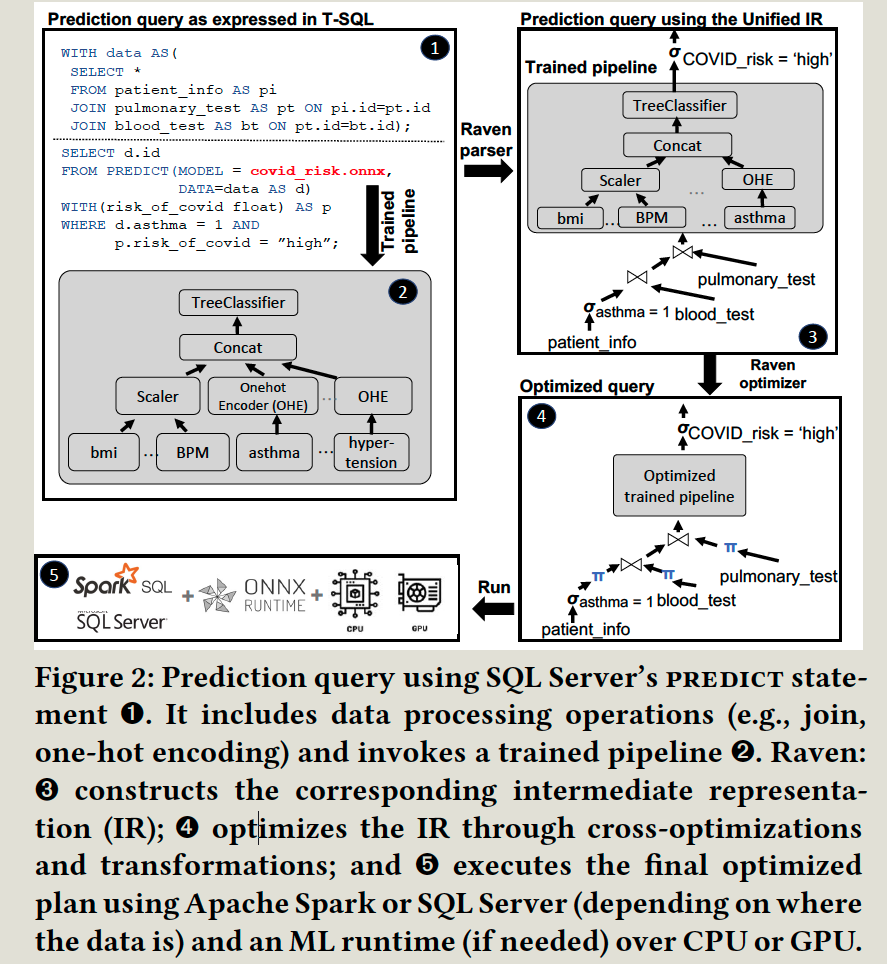
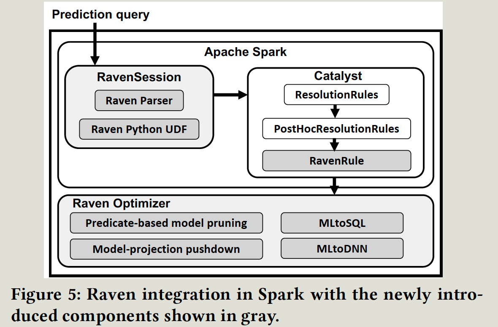

- index
{:toc #markdown-toc}

# Summary
Questions:  

# Introduction

## Background & Motivation

ML inference drives the majority of the cost. And batch inference is mostly used by enterprises.

This work thus tries to optimize batch inference.

## Gap

Most existing only optimzie either **relation queries** or **ML operator** part of the inference queries. Optimization **holistically** is lacking.

Most existing work uses unified runtime to execute both ML and Relation Queries, which may not fit the industry.

## Goal

The paper tries to combine the ML runtimes with the data engine and picks which part of the plan to run on each engine.

## Challenge

# Details

## Implementation

The paper 

- **Parser**: detect **predict statement (defined by the paper)**
- **RavenRule**: Once the prediction is detected, it calls the optimizer as an external Python process; 
  - it will build the DAG of ONNX operators; 
  - add all relational operators to the IR;
  - save and output the optimized model name and columns required; 
  - rewrite the original query with new information (both from the model and columns)
- **Python UDF**: allows execute python code on a columnar view of input data,
  - load model from HDFS.
  - Initializes and cache the model
  - transfer input columns to the right format
  - invokes ONNX runtime to perform the prediction.

The paper integrates the ONNX runtime into SQL server and Spark, so the engine can directly call predict statements to run those.

## Benchmarking ML inference in the enterprise => motivation.

ML inference drives the costs; the Batch inference is mostly preferred; Models vary greatly and require different optimization strategies.

## Abstractions

It provides a unified **intermediate representation(IR)** to capture data and ML operators. It can ease production adoption and express a wide range of prediction queries.

- IR includes:
  - Relation Algebra: all SQL
  - Linear Algebra: matrix multiplication and convolution operators
  - Other ML operators: categorical encoding, text featurization).
- IR is implemented by **adding SQL support to ONNX.**

## local optimization: 

It **holistically** cross-optimizes both the relation and prediction queries.

- cross-optimization between relation query and ML query.
  - query-based **model pruning**: if the value of a field is already set by the user's relation query, then use this value and prune the model (tree).
  - **Model-projection pushdown**: The model may only need some of the features after pruning; other features don't need to be scanned.
- data-induced optimization: use statistics of the underlying data to simplify the query plan.

## logic=>physical: 

It aims to convert (a set of) operator(s) to another to allow more efficient engines and hardware to execute those operators. After the transfer is done, it updates the IR.

It uses ML based run to decide which convert strategy is used:

- **MLtoSQL**: convert traditional ML to SQL to avoid invoking ML runtime => reduce the initialization cost and data conversion/copy between data and ML engine.

  E,g. Linear models and scaling operators => multiplication/addition/subtraction operators.

  Tree-based operator => **case statements**

- **MLtoDNN**: convert traditional ML to DNN such that it can run in GPU.

# Evaluation

