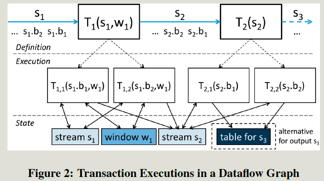
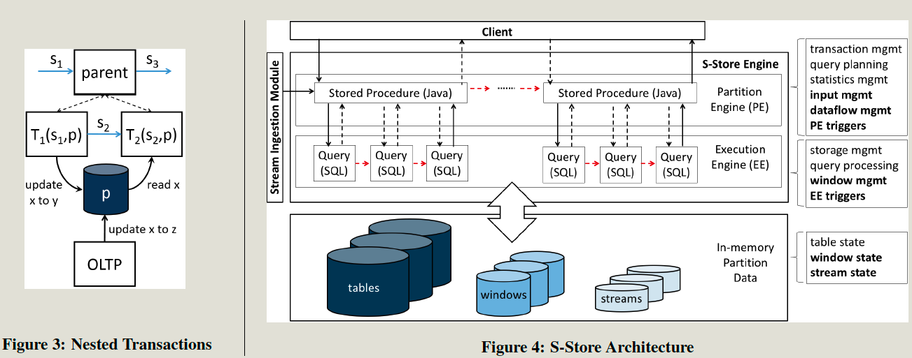

- index
{:toc #markdown-toc}

# Summary
1. 

# Questions

- 

# Introduction

## Background & Motivation

Streaming systems: **Executing SQL-lite operators on an unbounded and continuous stream of input data.**

- The second generation of the Streaming system allows users to create their own operators, which are invoked and managed by a common infrastructure.

The objective of the Streaming System is: **Reduce the latency of results.**

While the in-memory OLTP system supports ACID but lacks the **notion of stream-based processing**, such as **unbounded data, push-based data arrival, order processing, and windowing.** 

While many applications require both ACID of OLTP and stream-based processing functionalities in the streaming system. E.g:

- Groups of updates must be added automatically.
- Conducts a few ETFs to clean and integrate data.
- push-based processing on the following Tx.

## Gap

The second streaming system still don't support ACID transactions, leaving applications open to potential **inconsistencies**.

## Goal

This paper designs and implementation of S-Store, a single system for processing streams and transactions with well-defined correctness guarantees, and with low-latency comapred with client-side ordering control.

# Details

## Data Model:

- Streaming is an **ordered**, **unbounded** collection of tuples. Each of which has a timestamp. 

  Tuples with the same timestamp are a group and should be processed as a unit.( In one Tx with atomicity )

  The output of the streaming will have the same batch-ids as the input stream.

- Shared-states: 

  - public tables.
  - windows: should be shared only in consecutive executions.
  - streams.

## Processing Model

- The **computation** on stream is expressed as dataflow (DAG) of user-defined computations such as relational-style operators or others.
- **Batches** are used to set the **atomic boundaries** for each transaction, while windows are used to bound computations defined inside T. 
- **Push-based** processing model.
- **Correct Execution order** 
  - For streaming transactions:
    - **Batch-level ordering:** As for same batch, 1st Tx < 2nd Tx.
    - **Stream-level ordering**: In one stream, 1st Batch < 2nd Batch.
  - For hybird workloads (Streaming Tx & OLTP Tx)
    - Could build nested Tx for streaming Tx, such that they can be isolate from OLTP txs when all Tx access the shared public table. 

## Architecture

It build S-Store on top of H-store.

- **Streams**: Stream data are stored in a time-varying H-Store table,  and removed after being consumed.

- **Triggers**: It associated with a stream table or a window table, once new tuples are added, downstream processing will be automatically activated. ( **push-based processing** on states.)

  - Partition Engine Trigger:  Trigger the following streams Tx,
    It is to eliminate the need to return the results back to client.
  - Execution Engine Trigger: Trigger the following executons inside one Tx. 
    It is to elimnate the **communication** between EE and PE layer.

- **Streaming Scheduler**: It ensures **correct transaction ordering**. The simplest solution is to require the TE’s in a dataflow graph for a given input batch to always be executed in an order consistent with a specific topological ordering of that dataflow graph.

- **Recovery Mechanism**: It uses perodic checkpointing and command-logging mechanisms. The recovery scheme ensures **exactly-once processing.**

  - Strong recovery: exactly the same state as was present before the failure.

    Each committed txs (OLTP and streaming) are recorded in the command-log file, failure occurs, the system replays the log starting from the **latest snapshot.** 
    It needs to **disable the trigger** to prevent the redundantly executions.

  - Weak recovery: legal state which may not the exact state lost.
    Don't need to log all committed txs. lightweight. 

## Experiments

Measure throughput

Macro:

- Compare with Storm, Esper, Hstore (async & sync)
- S-Store outperform the Hsotre (Sync), In Hstore (Sync), client will manage the ordering of the execution, it will receive the previous response before seding the next request. 

Micro:

- PE triggers, EE trigegers, Recovery model.