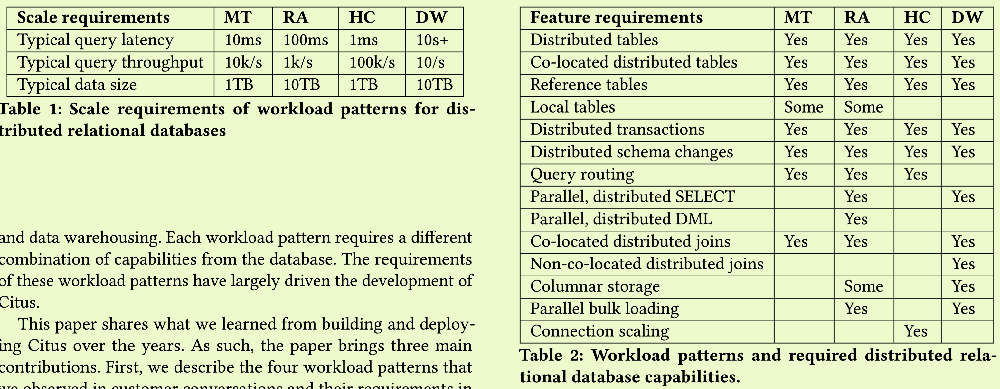
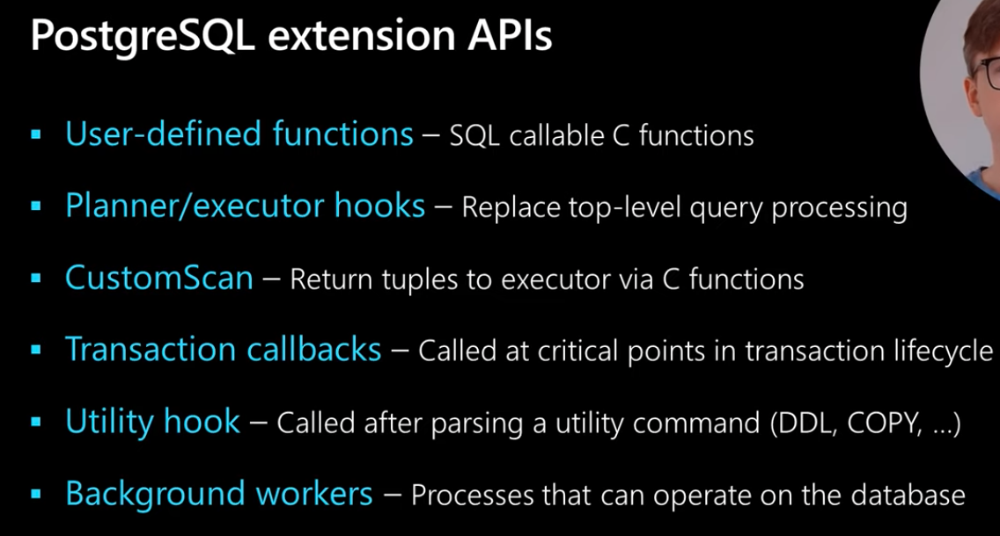
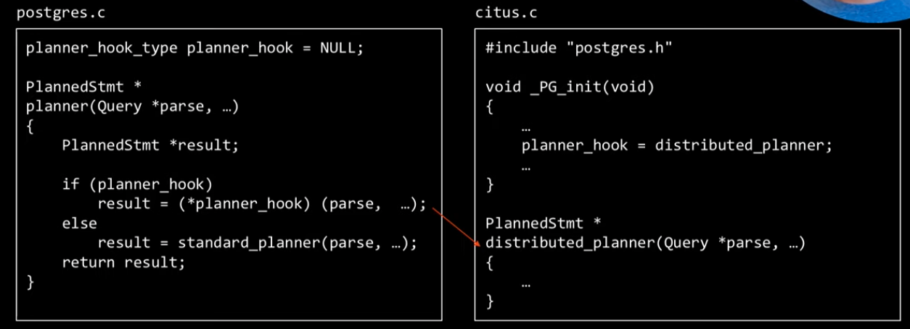

- index
{:toc #markdown-toc}
[Video](https://www.youtube.com/watch?v=X-aAgXJZRqM&ab_channel=CMUDatabaseGroup)

# Introduction

https://github.com/taminomara/psql-hooks

[video](https://www.youtube.com/watch?v=X-aAgXJZRqM&ab_channel=CMUDatabaseGroup)

PostgreSQL has good extensibility.

Traditionally, new RDBMS is implemented by

- Build a datbase engine from scratch and write a layer to provide SQL compatibility.
- Fork an opensource and build some feature on top of it.
- Build a layer between DB and application.

This paper try to build a distributed database using PostgreSQL extension APIs, and to add 

- sharding layer
- disributed query planner and executor
- distributed transactions. 

# Target Query Types

The paper said that scalling in all scenarios without performance regressions is perhaps impossible, thus it only focus on four query types. Multi-tenant (MT), real-time analytics (RA), high-performance CRUD (HC), and data warehousing (DW)

Multi-tenant: 

- serve many tenants from a single backend deployment.
- **Solutions for scale**
  - multiple database/schema inside a single database server.
  - shared database/schema with tenant ID columns (for distributed/co-location)

Real-time Analytics:(low ingestion latency)

- PostgreSQL's heap storage format allows fast data ingestion.
- **Solutions for scale**: parallel bulk loading

High-performance CRUD:(OLTP query, high througput)

- PostgerSQL MVCC's auto-vacuuming may degrade the performance if auto-vacuuming  cannot keep up.
  PostgreSQL can only have limited number of connections, process-per-connection architecture, high process overhead.
- **Solutions for scale**: 
  - sharding table to multiple servers by key.
  - -> such that multiple shards runs concurrently, auto-vacuuming is parallelized across many cores.
  - -> any server can process distributed queries.

Data warehousing: (OLTP low latency)

- **Solutions for scale**: 
  - needs parallel, distributed `select` and columnar storage, and query with optimized join etcs.

# Architecture

PostgreSQL extension infrastructure loads the shared library at run time, and the extension alter the behavior of PostgreSQL by setting certain hooks.

## Tools

## Solutions:

1. Scaling the coordinator node
   1. **Problem**: high workloads cannot handle parallelly due to single node capacity/resources.
   2. coordinator replicate table meta to all workers, and each worker can act as coordinator. Client uses load balancing to dvidde connections to all workers.
   3. each node can be coordinator, thus one connection to the cluster may creates many connections (write amplification), thus connection bottlenecked the systems. It uses connection pooling between instances via PgBouncer to **mitigate** this problem. Conneciton pool is useful because it can reduce the overhead of creating and destrying the conneciton.
   
2. Distributed table management:
   1. Co-located: 
      In table partition, it uses hash-partition to make sure same key are co-located at the same shard.
   2. rebalances:
      Citus obtains write locks on the shards.
      waits for replication to complete.
      updates distributed table metadata. From that point on, any new queries go to the new worker node.
   
3. Distributed query 
   
   
   
   1. planner: 
      1. It handle various workloads which requires different query planning strategies to scale.
      2. It iterates over four planners from lowest to highest overhead. If a particular planner can plan the query, Citus uses it. (simple query plan canot handle complicated cases such as data is distributed across many servers, needs re-partition join.)
   2. executor:
      1. We found **parallelizing queries** via multiple connections to be more versatile and performant than the **built-in parallel query capability in PostgreSQL that uses a fixed set of processes.** But this have **latency vs parallelism** trade-off. The paper use slow-start, start from one connection and increase by one each 10 ms.
   
4. Distributed transaction:

   1. it mainly uses 2pc and don't guarantee the strong distributed snapshot ioslation.

      