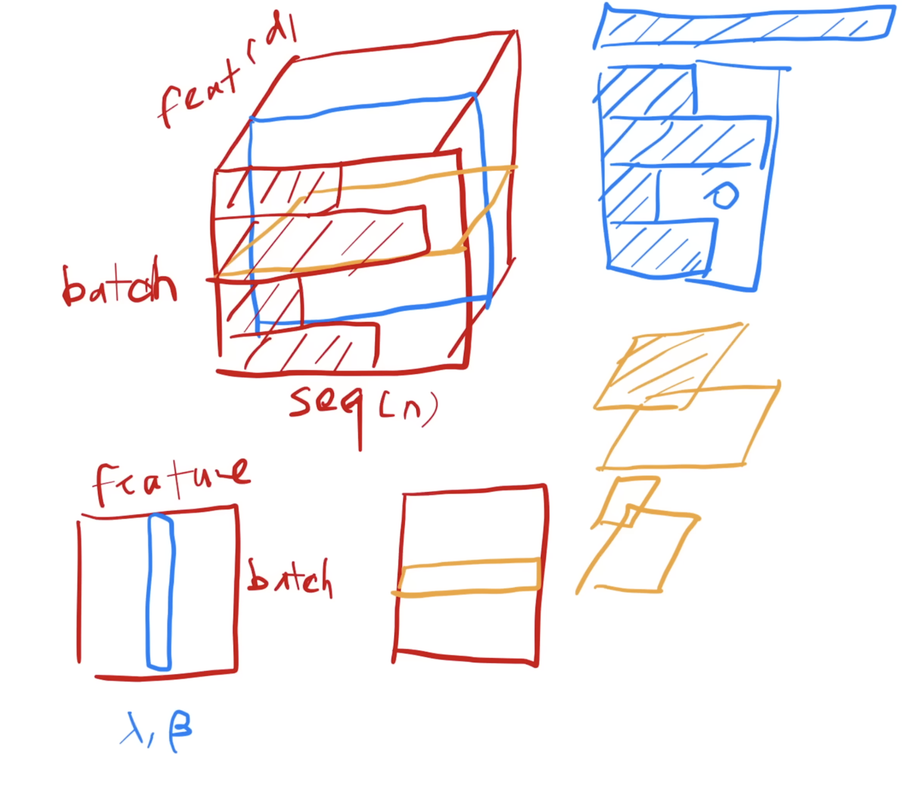
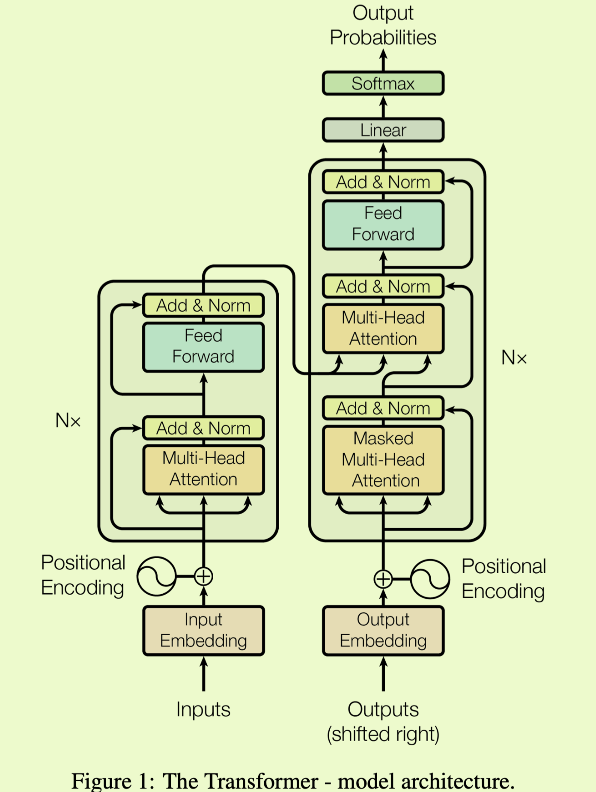
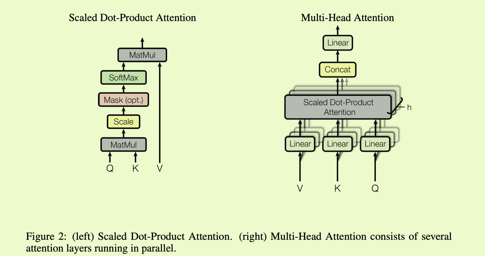
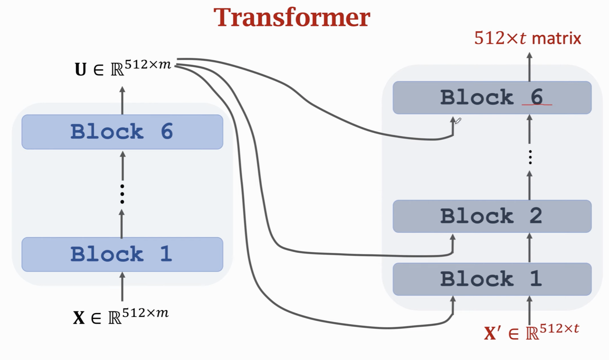

title: Attention Is All You Need
header-image: "img/postcover/post02.jpg"
categories: [A paper note]

https://github.com/hyunwoongko/transformer

Decoder uses Auto-regresisve model.

Masked multi-head attention: this is to prevent the t's output cannot includes the subsequent inputs.

Parameters: N and d

LayerNorm vs batchNorm

