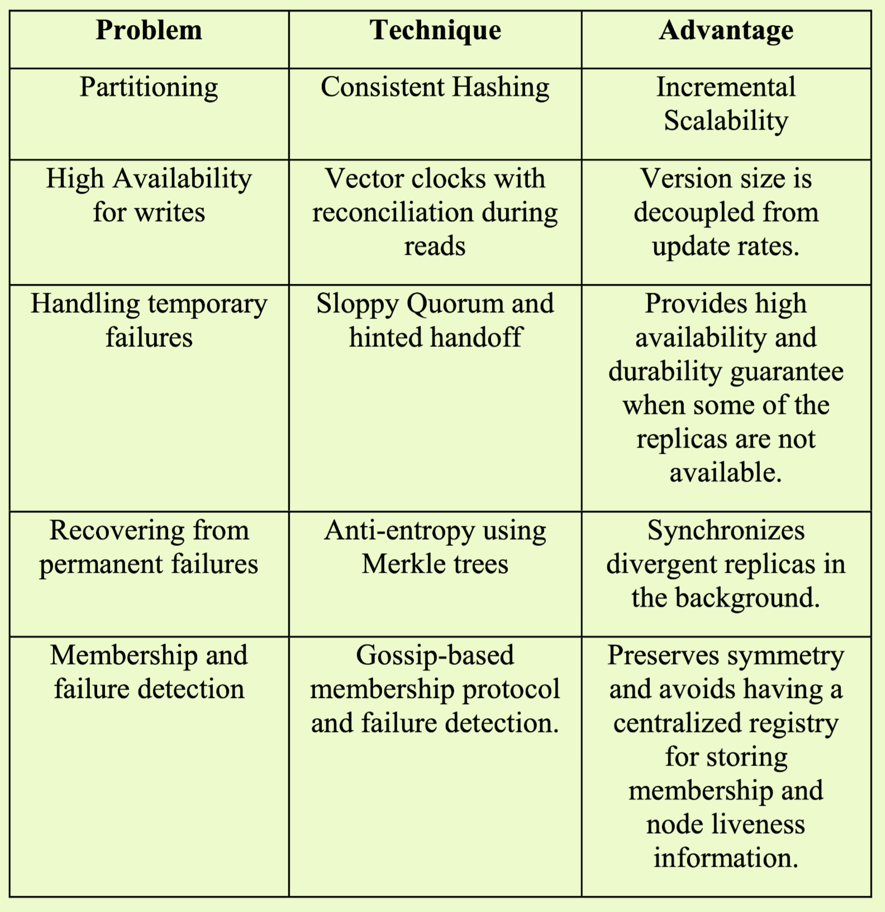

title: Dynamo Amazon Highly Available Key-value Store
header-image: "img/postcover/post02.jpg"
categories: [A paper note]

# Questions

1. why different update to the same key will be routed to different server? Figure3

   Each server in preference list can be coordinator and can handle read/write 

2. why get operation needs R responses? To collect versions?

3. In 4.6. it uses so called "sloppy quorum", if a node fail, then the replica is temrally stored to a new node. There is leader selection?

   DynamoDB employs a decentralized distributed system where each node operates independently.

# Introduction

Reliability and Scalability => depends on how the application state is managed, and the state should be always available.

Dynamo is highly availabel KV store, which 

- sacrifices consistency for better **availability** under certain failure scenarios.
- provides simple primary-key only interface, since relational database could lead to inefficiencies and limit scale and avaiability.

# Design

### System Requirements

Suitable for simple KV quewry model, store object smaller than 1MB.

ACID properties: weak consistency (for high availability), and don't provide isolation guarantees, only permits single key updates.

Efficiency: service must meet the latency requirements. SLO: To guarantee that the application can deliver its functionality in a bounded time.

### SLA

A common approach in the industry for forming a performance oriented SLA is to describe it using average, median and expected variance. At Amazon we have found that these metrics are not good enough **if the goal is to build a system where all customers have a good experience, rather than just the majority**. SLAs are expressed and measured at the 99.9th percentile of the distribution.

### Design Trade-Off

**Optimistics** replication techniques allows many changes reach to repliacs. The challenges is to decide and resolve the conflicting changes. And the conflict resolution introduces two problems: when to resolve them (in read or write?) and who to resolve them (data store or the application)?

Dynamo is designed to be eventually consistent data store, it take the following solutions:

1.  To guarantee writes are never rejected so it **resolve the conflict resolution to reads.**
2. Data store can use simple policy e,g. last write wins. Application can do a more flexible choice.

**Incremental scalability**: scale out one node at a time with minimal impact on both operators and systems.

**Symmetry**: Each node is the same.

**Decentralization**: decentralized peer-to-peer techniques over centralized control.

**Heterogeneity**: the workloads can tolerate the heterogeneity of different server, such that higher capacity node could have more workloads.

**Configurable performance, availability and durability**: User can tune N, R and W. 

# System architecture

partitioning, replication, versioning, membership, failure handling and scaling

**partitioning**: It utilizes consistent hashing with **virtual nodes** to achieve load balancing. Physical nodes can have multiple virtual nodes, allowing high-capacity nodes to have many **virtual** nodes. This ensures a more balanced workloads distribution across the physical nodes.

**replication**:

- It replicate each k-v pair to it's following N successor distinct physical nodes - preference list.
- It uses Merkle tree to fastly track the inconsistency between replicas, and sync the data on leaves of tree.

**versioning**: Dynamo DB improve the low write latency by considering eventual consistency, where put can return to the clients evenif other replicas don't see it. Some failure modes could result in the system having many version of data. So Dynamo uses vector clocks to capture causality between versions of the same object. Server. i.e., If a server Sx receives a put request, it will add version (Sx, 1) for exmaple.

**membership**: 

- it use a simple gossip-style protocol that enable each node learn about the arrival of other nodes.

**failure handling/scaling**: 

- In DynamoDB, there is no **leader election process** like in Raft or Paxos consensus algorithms. Instead, DynamoDB employs a decentralized distributed system where each node operates independently. The reason for using hinted handoff instead of immediately sending the replica to another node and electing a new leader is to ensure that the write operations are not failed due to temporary node or network failures.

