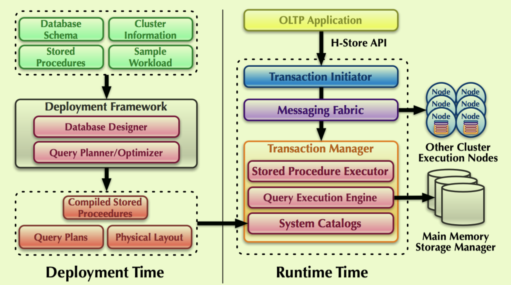

title: H-Store A High-Performance, Distributed Main Memory Transaction Processing System
header-image: "img/postcover/post02.jpg"
categories: [A paper note]

## Introduction

The paper focused on developing a **distributed** **OLTP** system running on cluster of **shared-nothing machines** where the data resides entirely in **main memory.**

## System Overview

Nodes have many sites, each site is single-threaded daemon.

Each relation is devidided into multiple partitions, each in one site.

## PROPERTIES

Estimate the values of transaction parametres, and infer the target site using the cardinality of the columns refrenced in the query.

Fast vs high availability

- **Fast**: fewer site involved, few communications.
- **High-availability**: it use non-volatile storage and reply on strategic data distribution schemes to maintain high-availability. To tolerate K nodes failure, it must store copy to many sites, thus consuming to much memory and reduce the throughput.

