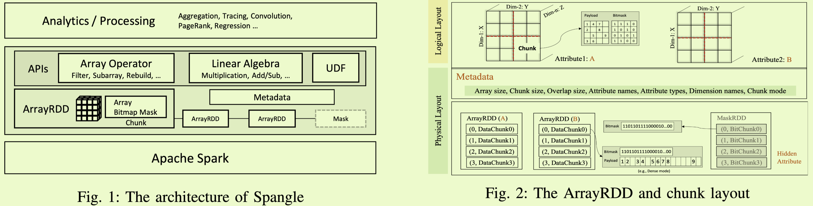

title: Spangle A Distributed In-Memory Processing System for Large-Scale Arrays
header-image: "img/postcover/post02.jpg"
categories: [A paper note]

# Summary

the paper mainly use bitmask to handle the null values and optimize the computation.

- Reduce the storage size.
- Reduce the query latency.

# Introduction

## Background/motivation

RDD: a distributed collection of objects partitioned acorss a cluster.

- Operators: transformation (map, filter), action (reduce, collect)
- Lazy execution: only action trigger the computation, 
- Fault tolerant: each stage form a pipeline and the results are persistent in memory/disk, which enable failure tolerant.

There is a strong need for algorithms dealing with large-scale matrices that do not fit into a single machine memory.

- tasks could be conduct in distributed way. 
- scalable and efficient programming model.

## Goal

The paper present array processing system.

- It extends RDD to ArrayRDD, which can represent multi-dimensional matrics, arrays and spatio-temporal data.
- It provides declarative interface to manipulate arrays.
- it uses bitmask to represent the null value
- It uses compress to compress the data.

# Data Model-ArrayRDD

ArrayRDD is corresponding to **one attribute of data** and can be split into mulitple chunks by size. Each chunk can be stored in three way: dense, sparse, super-sparse. For sparse, super-sparse, it reduce the storage cost and also reduce the look up complexity.

- For sparse and super-sparse: it uses bitmask to handle the null values. In procesisng, it firstly scan bitmask, and counting ones in bitmask from the beginning to a given position to derive the original position in a chunk
- For super-sparse chunk, the bitmask could larger then paylod, it then uses **hierachical bitmask model** to reduce the bitmask size.

# Programming Interface

It supports multiple operations such as subarray, filter, join, matrix operators. Each of them are optimized using the bitmask.