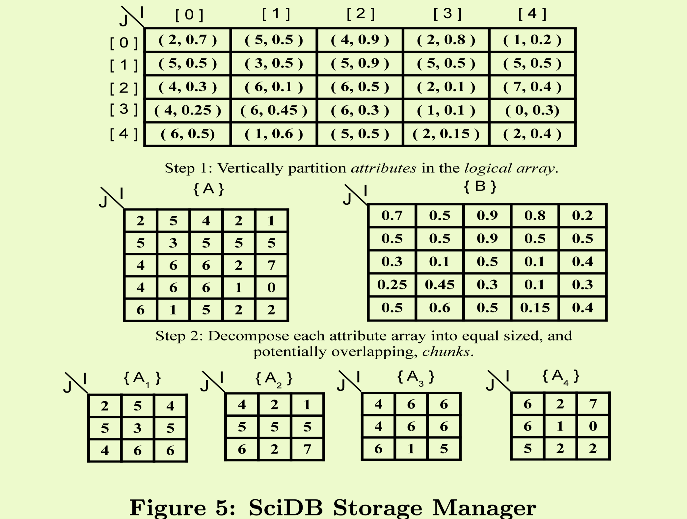

SciDB is built to support an **array data model** and query language with facilities that allow users to extend our system with new scalar data types and array operators.

Traditional RDBMS may not suitable for array data model:

- There is not need to store order information
- It requries more **flexible/extensible data management** ability.

## Array data model

- n-dimensional arrays with each cell being either **tuple or value (numerical or (currently) fixed length string data types)** 
- Can be nexted, a cell can contains anohter array data.

## Features

SciDB is Highly extensible with UDT and UDF.

## Architecture

Shard-nothing architecture with a centralized node storing nodes information, data distribution, and user-defined extensions.

### Storage Manager

logiclal metrics => physical storage: data -> partitions -> chunks.
Chunk (64MB) are the physical unit of I/O, processing, and inter-node communications.

Chunks may have overlap, which is to facilicate the operations requiring surrounding regions.

Chunks containing data values for a particular cell of the logical array are co-located on the same node.
It uses **R-Trees** to quickly identify which chunks contain data relevant to a particular subsample of the query array, , thereby facilitating fragment elimination and improving query planning.

Each chunk is compressed individually when writting to disk.

