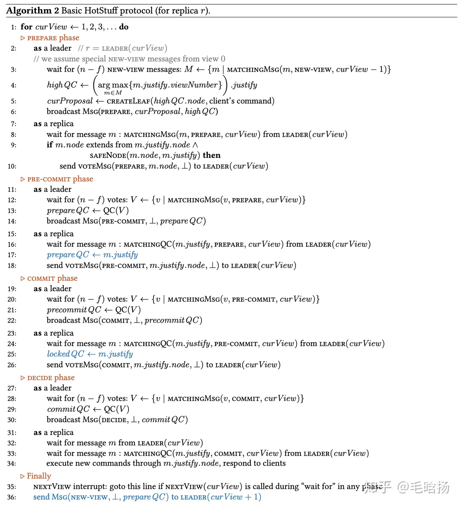

# Introduction

Three-version of HotStaff

1. Basic HotStuff
2. Chained HotStuff
3. Event-Driven HotStuff

Assume:

1. partially synchronous

Properties:

1. 1st algorithm to achieve that the communication is linearly related to the replica number.
2. low cost when view change (get a new leader)
3. separate the safety and liveness via Pacemaker

# Basic Alg

## View

each view -> one consensus

## Branch

Each replica has a tree, each leaf has one cmd to commit

Only one leader in the group.

## Quorum Certificate

 if one replica aggresses on one branch, then it will sign the branch with its local signature, create a partial signature, and send it to the leader. 

Once the leader receives n-f parietal certification. it will generate one certification. 

One view with the certification means that the view receives the most replica support.

### Three phases: 

Prepare, Pre-commit, Commit

