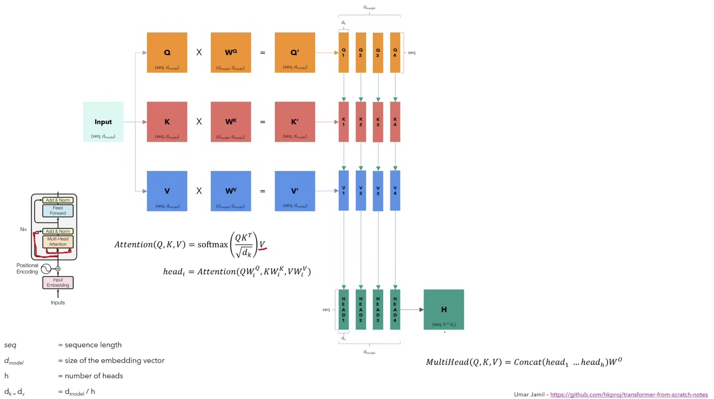
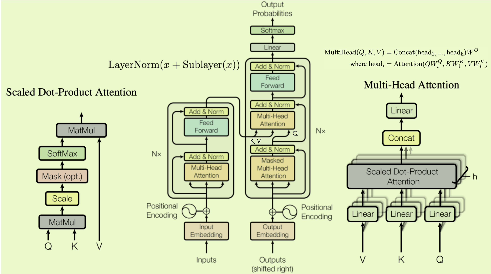

## Introduction

RNN is

- slow computation for long sentences (for loop, input word one by one )
- gradient vanishing
- difficult to access information from long time ago

Transformer solve this problems:

- Transformer is the **first transduction model** relying entirely on **self-attention** to compute **representations** of its input and output without using sequence aligned RNNs or convolution.
- The representations of a sentence have relationships of words in the sentence.

Techniques: 

- Self-attention: It wants to related word to each other in a sentence.

# Architecture

  Sentence -> word embedding + position embedding (fixed, not learned)

Encoder: word embedding + position embedding {x} -> continuous representations {z}.

Decoder: {z} -> {y}.

## Encoder Insights

**Goal:  To encode the sentence with not only its meaning or the position, but also its interaction with other words.**

**Attention**:

- **Usage**: Encoder: self-attention. Decoder: cross-attention.

- **Computation**: **Dot product** to measure the simiarlity, and to avoid large value of **dot product of QK** (which results in small gradients), it **scales** the dot products by 1/squre(d_k).
- **Benefits**: It has few parameter to tune: **N (layer number), d_model (width), h (# heads)**

**Multi-Head Attention**: It emperically finds that it beneficial to linearly project the **queries, keys and values** **h times with different**, learned linear projections to dk, dk and dv dimensions.

- Each head watch for different aspect of a word.
- Why query, keys and values?
  - They are the same in this paper.

**LayerNorm(x+sublayer(x))**: for each sample, it uses mean and variance for this sample, thus stable. While for BatchNorm, if each sample have various length (number of words in a sentence), its mean and variance are not stable.

## Decoder Insights

**Masked Attention**: Make the output at a certrain position can only depend on the words on the previous positions. (cannot see future words)

# Training (example: translation)

Inputs (english) -> encoder -> encoder outputs (K, V) used in **decoder**.

Inputs (other language) -> **decoder** -> decoder outputs -> Linear + Softmax -> prediction sentence ->  cross-entropy loss (classification tasks).

- This training step is **one time step** (better than RNN !)

# Inference 

Inputs (english) -> encoder -> encoder outputs (K, V)

For loop (Greedy search):

- Inputs just <SOS> -> decoder -> linear layer + softmax -> a prediction word, eg., ti
- Inputs just <SOS> ti -> decoder -> linear layer + softmax -> a prediction word, eg., amo.
- ...
- Until get <SOS>.

Beem search is an another way, which is faster.

