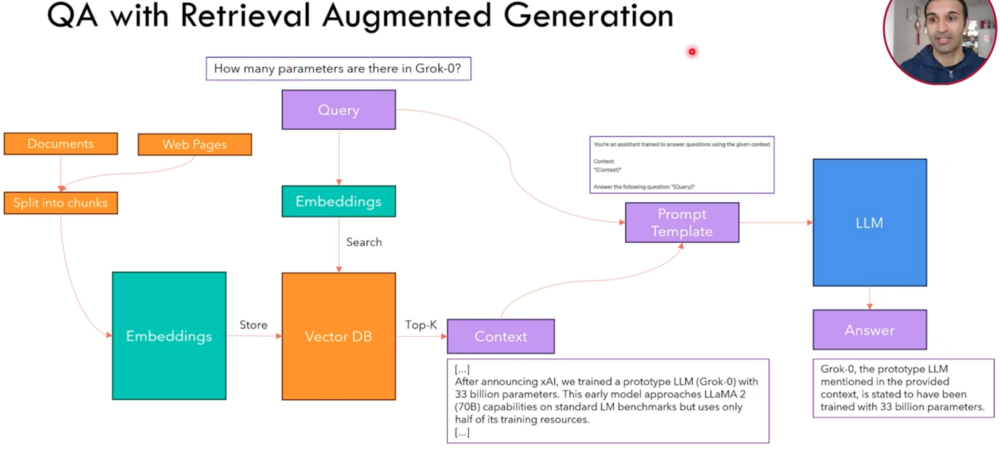
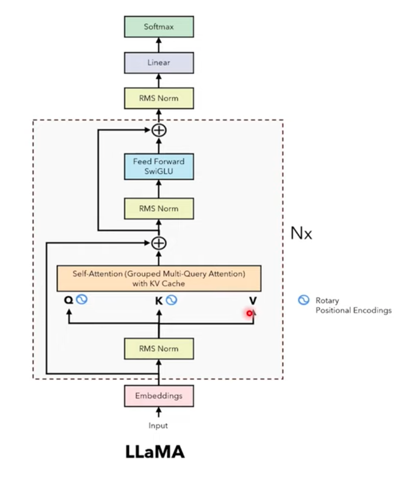
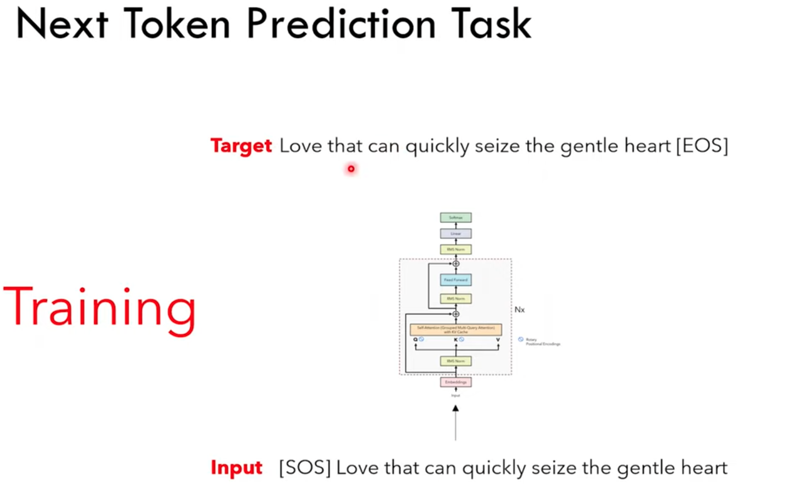

## LLM

Transformer-based neural network as language model.

Fine-tune is not additive, may break existing knowledge learned.

Promp engineering: few-shot prompting. 

# RAG pipeline

  

# LLaMA

Difference between LLaMA with Transformer.

- **internal covariate shift** make the training slower, thus, we need **layer normization** to avoid it.

  - Layer norm works since it devided the variance

  - Computing mean is costly, thus Root Mean Square Layer Norm (**RMSNorm**) avoid that.

- use relative position **representation**
  - add a distance between each two tokens

