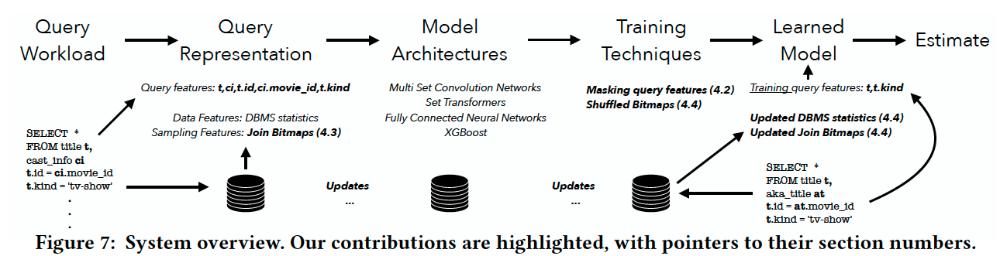

# Introduction

**Background:**

Traditional cardinality estimators use simple cardinality estimators which are **highly efficient, predictable, and can handle all types of filters**. 

While they rely on simplifying assumptions, e.g., columns or tables don't correlate, they incur large estimation errors and generate suboptimal query plans.

ML-based cardinality estimators can broadly be divided into

- data-driven:
  - model the **joint distribution** over all distributes in the database (deep autoregressive NN), 
  - better than traditional cardinality estimation since it does not rely on simplifying assumptions.
  - but is slow in inference due to the large model size, and does not support all kinds of queries.
- query driven: 
  - map query -> corresponding cardinalities using past workloads without explicitly modeling the underlying data.
  - this model is lightweight and fast, and it is easily extended to all kinds of patterns and filters.
  - but cannot generalize well to workload drift (different query patterns, data updates)

**Challenges:**

Existing methods to augment query features:

- some work use the **database's estimate of the cardinality** as an input feature to **NN**, 
- but they are not enough to ensure robustness, because models trained based on **current techniques cannot utilize those features effectively**, the reason is that the **query features are already performing well** and the model learns too much about those features and **ignores the database's estimated features.**
- Providing the NN with **data correlations** information requires **sampling**, while current sampling featurization approaches cannot capture correlations across different tables in a joint in the presence of workload drifts.

## Contribution

This paper emulates the characteristics of workload drift:

- To make the model more robust, it **masks** query information during the training such that the model can be more robust
- To capture join correlations, it develops a procedure based on the sideways information passing to provide sampling features that capture join correlations and are consistent and useful across workload drift scenarios.

# Details

