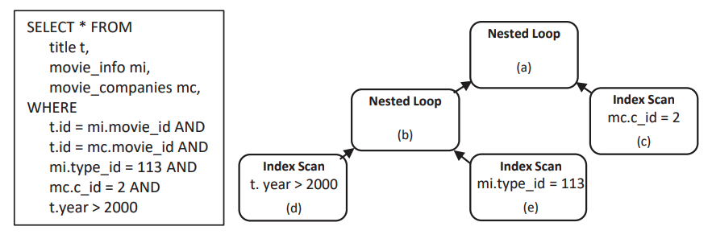

**This paper assumes**

- There are at most 30 nodes in a tree.
- There are at most 3 predictions for each column in a node.
- Only support operators such as 

The paper solves the problem of

1. existing encoding methods do not fully utilize readily available database statistics in the representation, which characterizes the data distribution. 
2. They typically have difficulty in modeling long paths of information flow in a query plan.

Contribution:

1. Tree-structured Transformer model to learn the representation of physical query plans. Thus **Improves the generalization of the learned representation.**
   1. Capture node dependencies via self-attention.
   2. Integrate histograms into plan encoding.
2. examine in cost estimation, cardinality estimation, index selection, and steering query optimizer.

Insights: Sec 4.2.1

‘one-hot’ encoding 
(1) The dimension of the one-hot vector can easily blow up for large database schema. 

(2) It is difficult to handle new categorical variables when the database updates. For example, when new columns are added, the encoding scheme has to reset to the required dimensions, and thus we have to retrain the whole machine-learning system. 

To address these limitations, we propose to use a fixed-size, dense embedding to represent each categorical variable. These embeddings will be learned automatically through back-propagation when a machine-learning model is trained for a specific database task, such as cost estimation. As such, the important features that are relevant to the database task could be reflected in the embedding space [10]. 

This setting also naturally supports inserting new variables. To insert a new category (e.g., a new table) to the representation model, we simply add a new random-initialized embedding for the variable, without affecting other learned embeddings.

Details:

Node:

- type-> em0.   Join -> em1,   column ->em2,   table -> em3.

  cat(em0, em1, em2, em3) => final em

Node + hight e

- Position -> Embeddings.
  position_embd + atree_atten_bias.
- Hight -> Embeddings.

